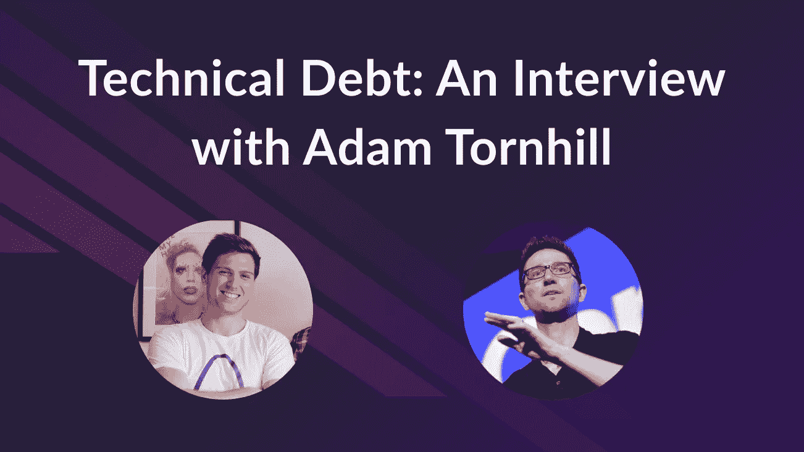

# 技术债务:亚当·托恩希尔访谈

> 原文：<https://medium.com/geekculture/technical-debt-an-interview-with-adam-tornhill-ab5ff1c35aa?source=collection_archive---------34----------------------->

上周，我们举办了一场网络研讨会，我采访了 CodeScene 的联合创始人兼首席技术官 Adam Tornhill，讨论技术债务:它是什么，为什么重要，以及如何有效地管理它。

对于这篇文章，我选择了一些我们从观众那里得到的最有趣的问题。如果你想了解更多，请查看网上研讨会的[完整版。](https://www.stepsize.com/blog/ask-me-anything-technical-debt)

**亚历克斯:我是亚历克斯，**[**Stepsize**](https://www.stepsize.com/)**的联合创始人兼首席执行官。我花了所有的时间和工程团队成员讨论技术债务，今天 CodeScene 的创始人兼首席技术官亚当和我在一起，我真的很激动。**

**Adam 写过一些书，比如*“你的代码作为犯罪现场”*和*“软件设计 X 射线:用行为代码分析修复技术债务”*，我会将这些书归类为关于技术债务主题的经典之作。我们关注你的工作已经很长时间了，现在我们有机会问你一些问题。**

**请告诉我们一些你的经历——你是如何对技术债务感兴趣并深入其中的？**

亚当:这段旅程要追溯到我以前的生活，那时我是一名软件顾问。作为这个角色的一部分，我经常被聘为技术领导或软件架构师，我的职责之一就是确保我们能够以最好的质量尽快交付。我经常发现这非常困难，因为我必须与我的业务经理和产品负责人沟通，现在是时候后退一步，偿还技术债务了。

这些对话很难进行，我尝试了不同的方法，例如，查看不同的复杂性度量和分析工具。但是很难将我的技术观点转化为对我的经理有意义的东西。

当我在这个问题上挣扎的时候，我还在学习心理学，在那里我学习了法医心理学。我有一个想法，如果我可以跟踪开发人员在代码库中的活动，我就可以用它来找出代码的哪些部分对大多数人产生了影响。

这是我 10 年前开始的地方，过去十年我一直致力于这些想法。

亚历克斯:在我们深入研究你在这 10 年中学到的一切之前，你能告诉我们为什么你认为技术债务在今天是一个如此重要的话题吗？

亚当:这可能是老生常谈，但今天每个公司都在成为软件公司。直到几年前我和一个做废金属生意的客户一起工作时，我才明白这意味着什么。他们依靠大量复杂的软件进行物流。那一刻，我真的明白了软件是如何影响每一项业务的。

其结果是人才供应:世界上开发人员的数量是有限的，即使我们有预算，我们也不能雇佣所有我们想雇佣的人。

这意味着我们必须与我们已经有的人合作来完成更多的工作，而技术债务是其中的一个关键部分。

亚历克斯:你如何定义技术债务？

亚当:技术债务有很多定义和种类:战略性的、故意的、不计后果的……但多年来我得出的结论是，知道债务来自哪里并不重要——重要的是它的影响。

我的定义是:技术债务是任何比它应该的更昂贵的代码，我们必须支付利息的代码。

**亚历克斯:我喜欢。我的工作定义是任何你认为是负担的代码，正是因为你提到的原因。**

**之前你提到过，你必须与利益相关方进行大量谈判。工程师如何帮助非技术风险承担者理解技术债务和持续处理技术债务的重要性？**

Adam:我们在做技术工作的工程师和我们的利益相关者之间有一个沟通挑战，我们使用不同的词汇，我们关注不同的事情。

当我对我的非技术经理说，嘿，看，我们需要重构这个东西，因为它的圈复杂度是 500——这对他们来说没有任何意义，他们根本不在乎。

我们，开发人员，可以尝试使用更多面向业务的指标，比如时间损失或客户影响。我们可以说，看，我们上个月的出货速度提高了 30%,而且我们的 bug 更少了——这是每个软件公司都关心的事情。

亚历克斯:当然。现在我们来谈谈技术债务的优先顺序。所有的科技债务都同样重要吗？如果不重要，你如何确定正确债务的优先顺序？

亚当:对我来说，并不是所有的技术债务都同样重要。在确定技术债务的优先级时，我会考虑三个因素:

1.  影响:这笔债务对我们的交付能力有多大影响？
2.  业务优先级:作为首席技术官，我非常关注我们的产品路线图，并希望确保我们能够实现这一目标。如果我看我的路线图，我马上就知道我们要触及哪些领域。
3.  趋势:我们在实时变得更好还是更差？趋势往往是可操作的。

亚历克斯:我们来谈谈代码质量。有许多工具可以帮助解决技术债务的不同方面。CodeScene 与代码质量工具有何不同？正确管理科技债务的完美组合是什么？

亚当:当然。我可以尝试一下。我显然会有点偏心，但我会尽力而为:)

我一直是静态分析工具的忠实粉丝，并且现在还在使用它们。我认为它们作为开发过程中的低级反馈循环是有用的，它们可以帮助捕捉特定的错误，但这些工具从来不是为了管理和优先考虑技术债务。

这就是我开始开发这个行为代码分析领域的原因，它有助于我们对科技债务进行优先排序。

现在越来越感兴趣的一个领域是代码的人员方面。对于超过 100 人的大型组织来说，组织方面变得比代码质量问题更加重要。例如:

*   我们团队中有合适的人吗？
*   是否有我们不再理解的代码部分？
*   我们当前的团队有多一致？

所有这些都是你可以从 CodeScene 中获得的信息。

然后，你有步长，这有助于更多的定性分析，并增加了背景。

为了成功地管理技术债务，在某个时候你将需要这些工具中的每一个。

**Alex:我同意，很明显，你可以从 git 数据中获得很多你无法从典型的静态分析工具中获得的信息。**

**我们经常遇到的另一个常见问题是，谁应该为技术债务负责？**

Adam:简单的答案是所有的利益相关者都要对技术债务负责，但是是对它的不同方面负责。

我看到一些公司把技术债当成技术问题。我只是认为它不会特别成功。作为开发人员，我们可能知道如何偿还技术债务，甚至可能知道债务在哪里，但是我们很少拥有自己的时间。通常是别人告诉我们应该关注什么。这就是为什么我认为业务部门获得技术债务并设定优先级是很重要的。

经理和产品人员应该帮助在发布新功能和确保开发的可持续性之间找到平衡。

亚历克斯:我喜欢应用我在文章 [**中描述的过程，即管理技术债务的完美过程**](https://www.stepsize.com/blog/the-perfect-process-to-manage-tech-debt) **。工程师负责应用男孩/女孩童子军规则:让代码比你发现的更好。这是每个工程师的责任。然后，当我们谈论中等规模的债务时，通常你会有一个团队领导，他可以去找一个产品经理，就应该包括在这个 sprint 中的债务进行对话。**

然后，产品经理有责任决定如何在维护和 sprint 中的特性之间分配工程资源。

**对于大额债务，我通常看到的是，根据公司的规模，他们有员工或首席工程师，为更大的项目提出技术建议。此外，他们的工程和产品领导层负责做出这些重大决策。**

**这个过程已经帮助许多公司更有效地处理技术问题，我们希望它和这个对话也能帮助更多的团队。**

**如果你有更多的问题或评论，请在 LinkedIn 上留下** [**me**](https://www.linkedin.com/in/alexandre-omeyer-060a0175/) **或**[**Adam**](https://www.linkedin.com/in/adam-tornhill-71759b48/)**的一行，我们很乐意继续这个对话。**