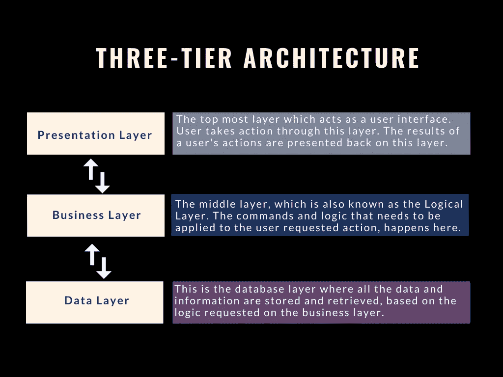
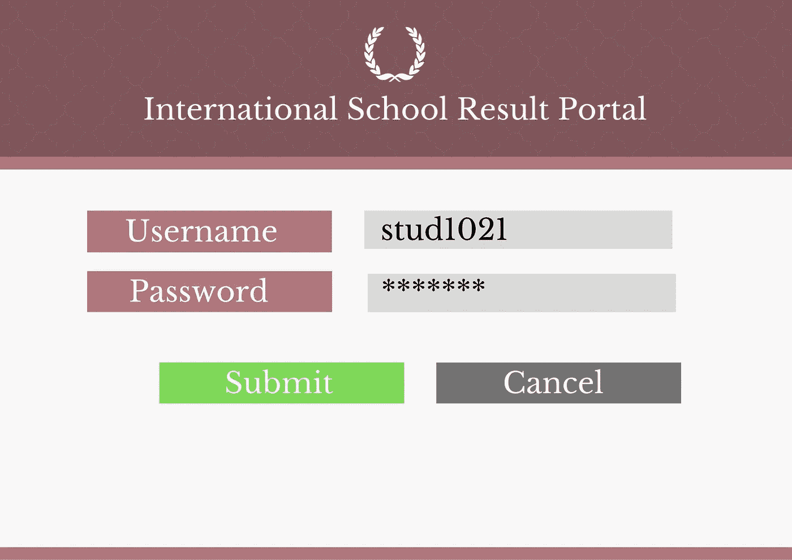
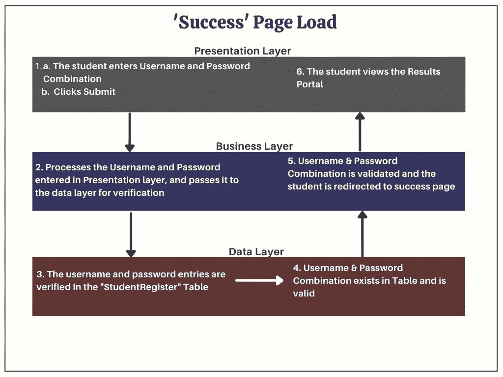
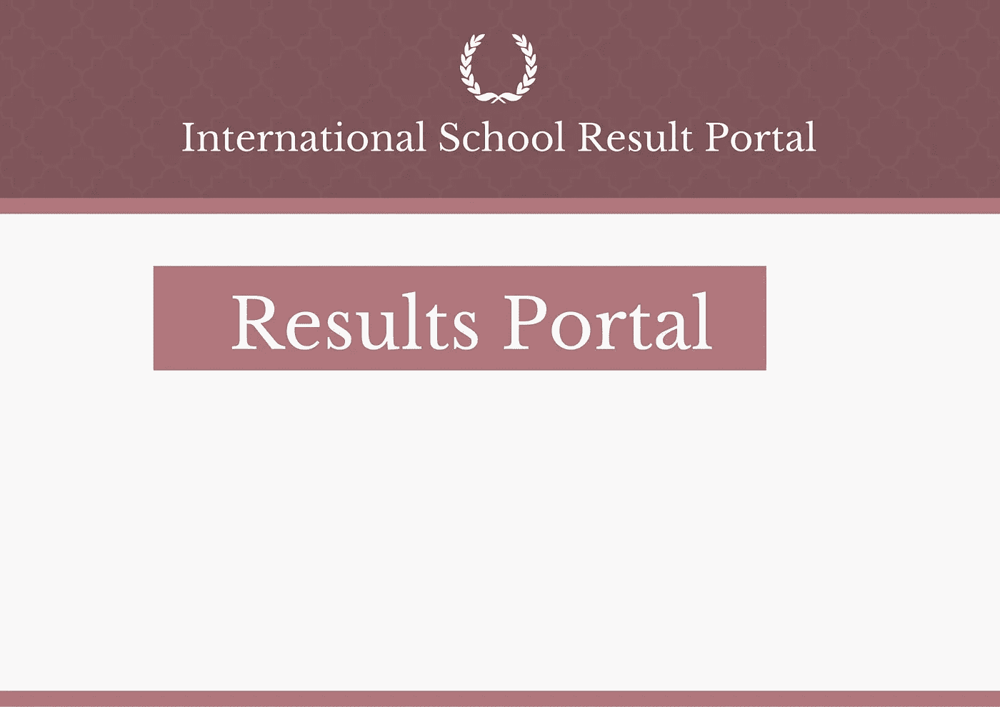
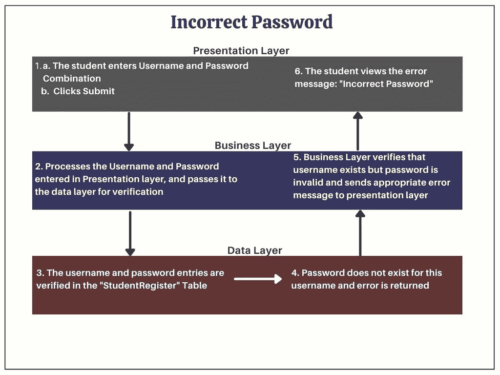
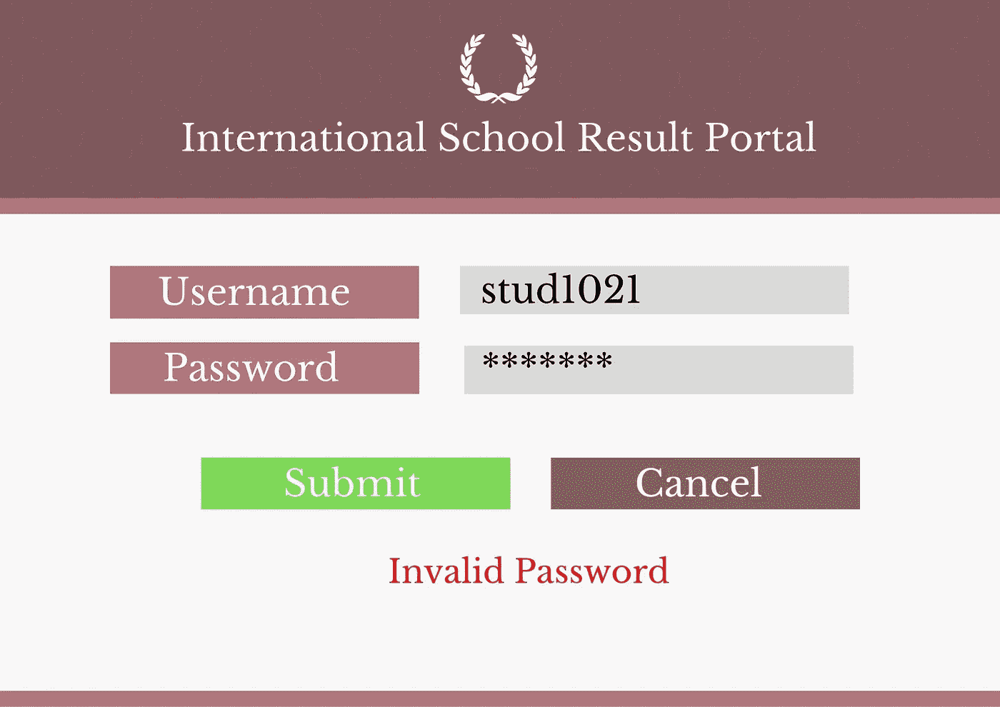
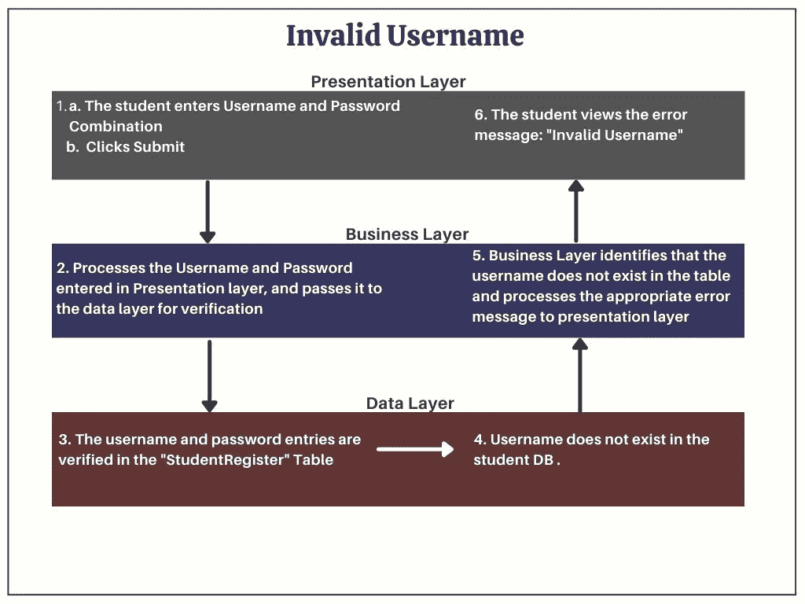
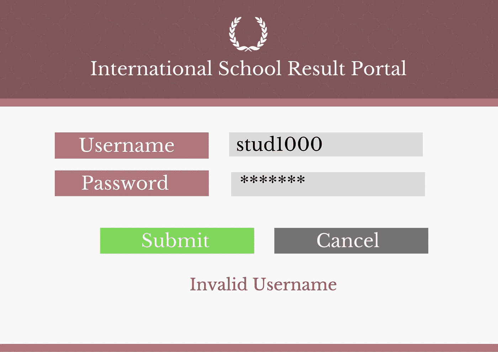

# 非常规产品人的 0 级科技吉安！

> 原文：<https://medium.com/geekculture/technical-product-owner-4b37cfdc9688?source=collection_archive---------19----------------------->

## 非常规=非技术背景

作为一个来自非技术背景的产品人，为了成为一个*有价值的“软件”产品所有者*，一个人被期望天生拥有某些技能。最基本的是:

*   出色的沟通和人际交往技巧
*   具有战略思维的分析头脑
*   强烈的商业意识和领域意识
*   能够对与产品相关的一切拥有持久的主人翁意识。是的，你要为所有出错的事情负责……开个玩笑:)(不，我不是！)

但是有一个人应该具备的重要的**【后天知识】**，那就是“**技术知识**

你注意到我称之为“知识”而不是“技能”了吗？造成这种情况的原因在文章的结尾有所强调，所以请通读。不准偷看！

同样，这种**知识对于产品所有者来说是** **而不是可选的**。为什么？因为作为一个与开发软件产品的团队一起工作的产品人员，了解我们一起工作的优秀团队(架构师/ UI/UX/开发和 QA——我说的是你们所有人)是如何赋予产品想法形状和结构的，这是一个额外的优势！)

> 在此，为任何想从技术角度开始理解软件产品的基本组件的人提供一份*0 级备忘单*！

进一步阅读了解:

*   软件体系结构
*   最基本的软件架构——多层架构
*   三层架构及示例

*什么是软件架构:*软件架构是软件产品的构建块。软件架构由一组组件组成，这些组件基于一组预定义的规则和方法相互作用。正是在这个基础上，一个产品创意得以实现和成熟。

*多层架构*:重要的是要意识到软件架构有多种类型。最合适的架构将由软件架构师根据正在构建的产品和功能来选择和决定。由于这是 0 级，我保证保持简单，并向您介绍最基本的类型:“多层架构”。更具体地说，深入到最常用的多层架构——“三层架构”

*三层架构*:顾名思义，这种架构由三层组成，这三层充当正在构建的软件产品的构建块。下面简单明了地展示了这三层是什么，以及它们的作用:

3-Tier Architecture Diagram

为了更好地理解这一点，让我们看一个简单的用例，如下所示。

*用例*:一个学校网站允许学生在他们的成绩门户网站上在线查看考试成绩。但是，为此，每个学生都需要使用有效的用户名和密码组合登录到结果门户。

User Interface for Student Login

进一步滚动，查看每层中不同场景的图示，以及用户界面的模型。

a.**登录成功**

学生输入正确的用户名-密码组合，然后单击提交。以下是在后台发生的操作。

用户名和密码组合位于“StudentRegistration”表中，因此该学生被重定向到结果门户

User Interface : Results Portal

**b .密码不正确**

学生输入的密码不正确。

逻辑层传递适当的错误消息:

Invalid Password Scenario

**c .无效用户名**

学生输入的用户名无效。

如果学生输入无效用户名并提交，那么逻辑层应该处理错误消息:“无效用户名”

这就对了——祝贺你获得基础软件架构的 0 级 Gyan。从现在开始，强烈建议您采取下一步措施来理解您的软件产品所在的架构。这种知识将使产品所有者能够更好地参与工程和 QA 团队并与之合作，以交付高质量的产品。

当*工程团队使用他们的技术技能*来实现产品时，*产品所有者将能够为改进的结果增加更多的价值，只要他们拥有所需的技术知识。*这就是为什么我在文章的前面提到，对于产品负责人来说，这是一个不可选择的知识！