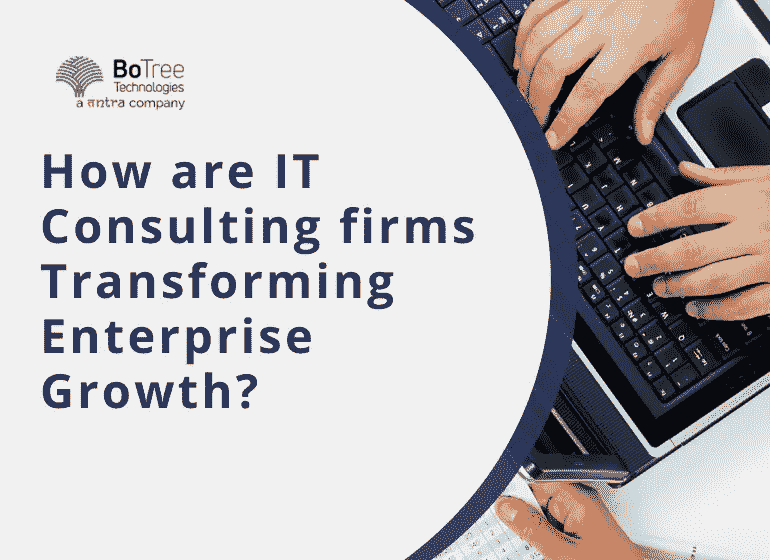

# 技术咨询公司:他们如何转变业务发展？

> 原文：<https://medium.com/geekculture/technology-consulting-firms-how-do-they-transform-business-development-6782b6bf927c?source=collection_archive---------7----------------------->

目前，如果你正在经营一家没有技术的企业，你已经错过了很多。技术在公司的业务效率和盈利能力中起着至关重要的作用。商业中 IT 服务的增长趋势表明，到 2025 年底将超过 12700 亿美元。

随着时间的推移，技术及其采用也在不断发展。一家[软件开发公司](https://www.botreetechnologies.com/) 向企业提供技术咨询，以使他们更有生产力和效率，从而提高生产力、高效协作和改善底线。

技术咨询领域经历了许多变化。因此，一些趋势来来去去。2022 年也是如此，预计还会继续。和往常一样，这些趋势中有些是好的，而另一些则不会那么好。

作为一项未申报的任务，技术咨询公司必须了解技术咨询领域的所有变化。对于一个企业软件开发公司 来说，这些知识和准备对于向客户提供适当的指导是至关重要的。

虽然每种趋势可能会产生不同的影响，但技术咨询服务应该知道什么对他们最有利。

该博客涵盖了技术咨询的好处。它还描述了 It 咨询如何帮助企业实现业务现代化。

# **什么是技术咨询？**

技术咨询是由 [IT 顾问](https://www.botreetechnologies.com/blog/what-to-consider-while-hiring-an-it-consultant/) 提供的一类服务，他们在解决复杂的业务 IT 和运营问题方面拥有广泛的经验和专业知识。专家帮助客户比以前更好地使用这项技术。

技术咨询公司为企业提供技术解决方案、框架、评估、最佳实践和后备机制，以增强其业务流程、提高生产率，并更好地预测和管理风险。

[IT 咨询服务](https://www.botreetechnologies.com/it-consulting-services)

# **为什么企业应该雇佣技术咨询解决方案？**

技术咨询服务对创业公司和大企业都有效。这有助于他们发现更新的功能，帮助他们在与竞争对手竞争时实现运营效率。公司应该利用专业的 IT 咨询公司，因为-

*   **效率提升:**
*   DevOps 或 Agile 等高效模型以及 IT 顾问的工具有助于实现重要业务流程和工作流的自动化。
*   **业务连续性:**
*   它是在危机情况下保持企业所有主要业务正常运行的能力，例如最近的全球新冠肺炎疫情危机。IT 咨询公司有助于确保您的业务连续性。
*   **数据安全:**
*   恶意攻击和漏洞会将个人数据置于危险之中。它有可能打击公司的声誉和盈利能力。科技公司为初创公司和大企业制定 IT 战略，帮助他们保护数据。
*   **节约成本:**
*   在项目的基础上雇佣 IT 咨询服务有助于节省雇佣一个固定的内部软件开发人员的成本。

# **IT 技术咨询服务如何帮助转变企业增长？**

问题是——为什么 IT 技术咨询成了一个时髦词？公司希望开发更强大、更安全、更可扩展的解决方案，以保证长期的可维护性和增长。

对于企业来说，独自承担这项任务并不容易。因此，他们经常向技术咨询服务公司寻求专业知识。

**让我们看看科技咨询公司是如何帮助企业发展的。**

1.  **更新信息技术基础设施:**

*   一家技术和咨询公司分析您当前的 IT 基础架构。它确保您使用与您的运营相关的最现代、最易于维护的解决方案。
*   市场上有很多选择。但是，您将需要一些组件的建议来了解您的业务，然后帮助您选择最佳的 IT 解决方案，以便您的业务朝着正确的方向发展。
*   顾问帮助您选择和部署使用相关解决方案的精简灵活的基础设施，从而节省成本和时间。

**2。数据分析解决方案:**

*   越来越多的企业开始意识到适当的数据分析能力的优势。对运营数据的有效分析可以为部门提供关键信息，从而改善决策。
*   技术咨询公司可以帮助企业采用基于 AI/ML 的大数据分析应用程序，这些应用程序可以帮助他们从数据库中提取更多有用的信息。
*   在专家的帮助下，公司可以放心地看到更大和更好的细节。此外，您将能够使用该技术对您的运营进行实时分析，并根据市场变化快速调整策略。

**3。保护资产:**

*   在当今时代，数据安全的重要性怎么强调都不为过。网络攻击和其他漏洞的风险持续存在，可能会使企业数据面临风险。对于存储大量客户个人数据的公司来说，这是非常危险的。
*   一家技术和咨询公司可以帮助您修改网络攻击策略。此外，它还可以帮助您保护客户和员工的数据。
*   相信您的数据的安全性总是处于风险之中总是明智的。无论您使用多少最新且合适的解决方案，您仍然容易遭受数据泄露。因此，有必要在技术咨询公司的帮助下主动处理这方面的业务。

**3。物联网连接:**

*   物联网对企业来说有很多优势。公司正在利用物联网服务来维护不断收集数据并相互交换数据的设备网络。
*   各个领域的客户使用顾问服务来管理复杂的设备网络，不断收集大量数据并相互交换。
*   合适的合作伙伴将确保您获得正确的物联网解决方案，该解决方案可以与您现有的解决方案轻松集成。

**4。为增长做好准备:**

*   过了一个点，所有的企业都努力扩大规模，发展业务。然而，扩展业务运营需要更新您的 IT 基础架构，您永远不应该独自完成这项工作，尤其是如果这不是您的核心竞争力的话。
*   一个有能力的顾问有经验在他们的扩展操作期间指导许多不同领域的企业。这样的 IT 咨询公司的专业知识可以帮助你在各自的市场中适应。

## 最后

多年来，技术咨询服务公司的成功已经影响了许多企业。他们的服务范围也发生了巨大的变化，影响到企业的许多方面。顾问提供风险评估分析、灾难恢复、采用新兴技术、云服务等服务。

技术咨询服务市场约占整个 IT 咨询市场的 20%。一个成功的咨询跟踪市场上所有的热点趋势，并为您带来最佳的解决方案。

您可以依靠有能力的顾问来建议最佳的 IT 软件解决方案，以推动您的业务发展到下一个水平。

[**今天免费咨询我们**](https://www.botreetechnologies.com/contact) 。

*最初发表于*[*【https://cllax.com】*](https://cllax.com/technology-consulting-firms-how-do-they-transform-business-development.html)*。*