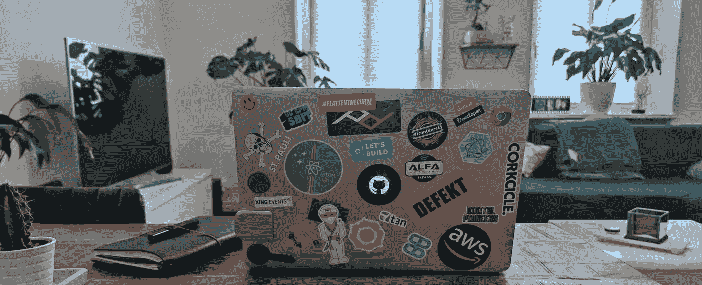

# 技术智能:从哪里开始？

> 原文：<https://medium.com/geekculture/technology-intelligence-where-to-start-d8ddc9c239f8?source=collection_archive---------55----------------------->

## 这是让你跟上时代的必要活动，但如果你从未做过，这一点就不明显了

Photo by [Alex Kulikov](https://unsplash.com/@burntime?utm_source=unsplash&utm_medium=referral&utm_content=creditCopyText) on [Unsplash](https://unsplash.com/s/photos/mac?utm_source=unsplash&utm_medium=referral&utm_content=creditCopyText)

当我环顾四周时，技术情报是一项似乎被 IT 工作者忽视的活动。**技术情报基本上包括阅读技术文章，了解最新技术，以及**发生了什么……