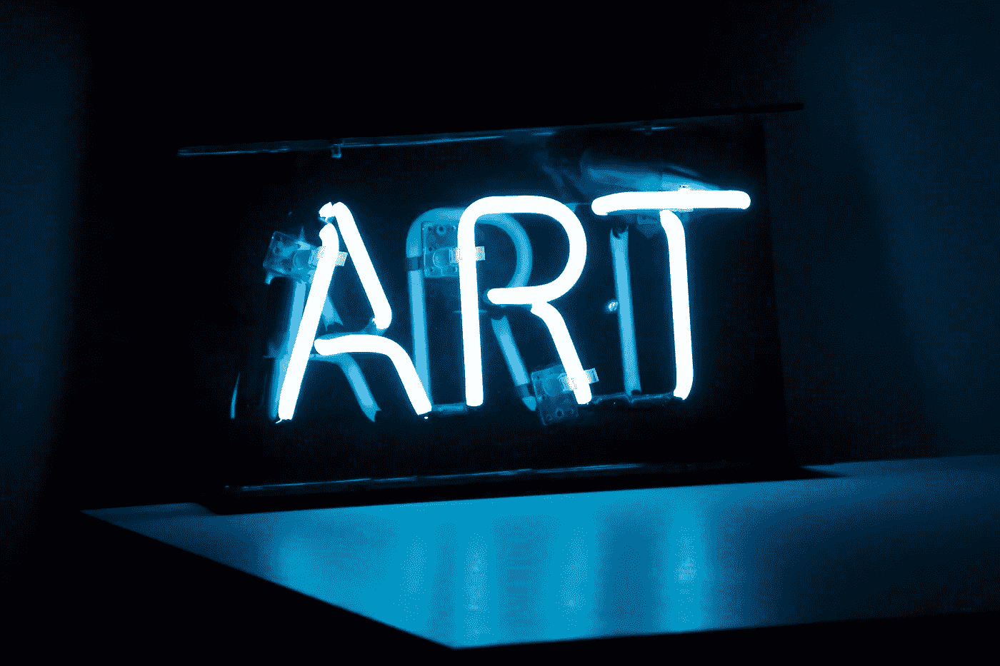
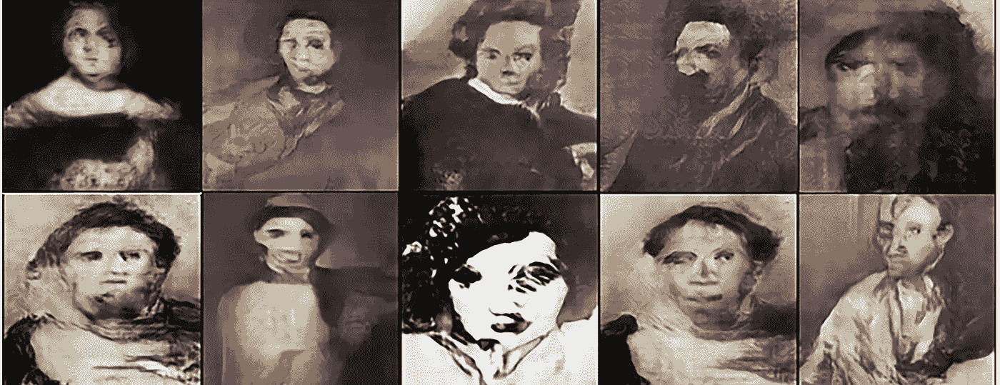
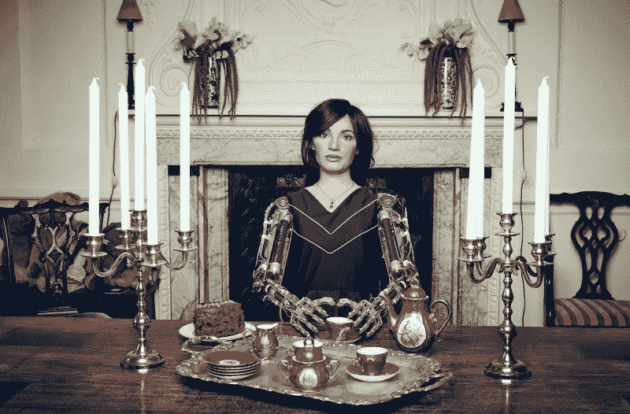
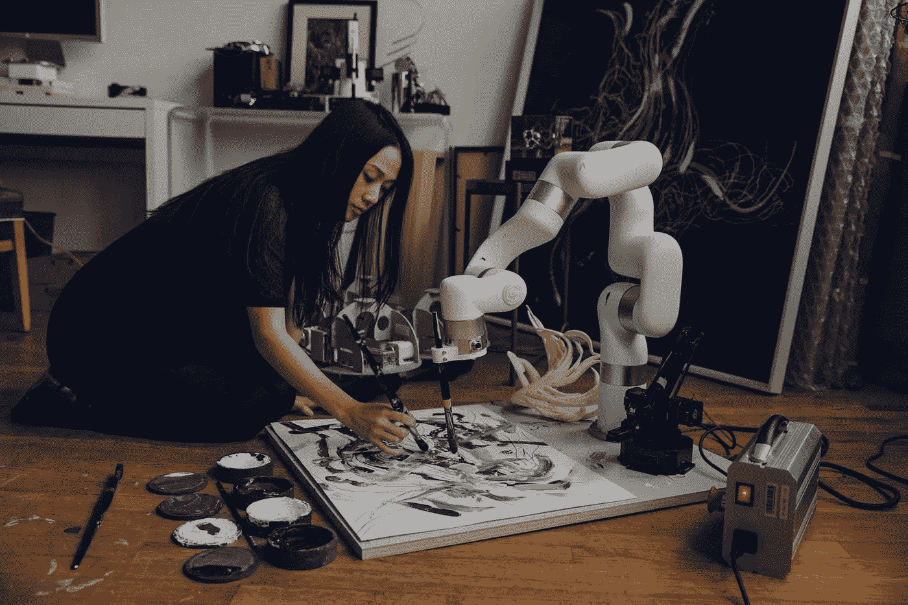

# 技术正在改变艺术的制作、展示和销售方式

> 原文：<https://medium.com/geekculture/technology-is-changing-how-art-is-made-displayed-and-sold-d0fb9a469948?source=collection_archive---------24----------------------->

疫情及其随后的封锁迫使艺术家们寻找创新的方式来展示和销售他们的作品。虽然许多人欢迎技术，如人工智能(AI)和艺术品分销中的物联网(IoT)，但他们对其产生艺术的能力持怀疑态度。他们认为这样的作品将缺乏创造力，通常会不合时宜。这里有一个例子来挑战这种信念。

马库斯·杜·索托伊是牛津大学的数学教授，也是几本书的作者，他承认他用一种算法为他的一本书生成了 350 个单词。令人兴奋的是，没有人注意到这些文字是人工的。他的编辑也不知道。本文阐述了技术和艺术的结合将如何为艺术品的创作、展示、保护和货币化带来创新的方式。也许它会启发你从[人工智能即服务](https://itrexgroup.com/services/artificial-intelligence/)中受益，让你的想法变成现实。

# 数字艺术和技术的历史

融合视觉艺术和技术的第一次尝试可以追溯到 60 年代，当时纽约的艺术家与贝尔实验室的科学家和工程师合作[创造装置并提供卓越的表演](https://www.tate.org.uk/art/art-terms/e/experiments-art-and-technology-eat)。

他们使用了当时创新的无线声音传输和视频投影技术。当谈到科技与艺术相结合的有影响力的艺术家时，安迪·沃霍尔立即浮现在脑海中。他是 1985 年第一批在 Amiga 电脑上创作数字绘画的人之一。不幸的是，这件作品丢失了，直到 2014 年才被沃霍尔的一位粉丝找回。从那以后，现代技术继续影响着艺术家创作、展示和出售他们作品的方式。

当新冠肺炎来袭时，艺术界举步维艰。美国艺术协会对艺术工作者进行了调查，以评估疫情对这个行业的影响。研究显示，95%的艺术相关活动被取消，24%的组织被迫裁员。然而，65%的受访者仍在设法提供内容。让我们看看技术如何影响艺术领域，并帮助它克服疫情带来的挑战。

# 新技术是如何用于艺术创作的？

## 艾与艺术创作

佳士得艺术拍卖公司最近以 432，500 美元的价格出售了其第一件人工智能生成的艺术品。这幅画是一张模糊的脸，名为《埃德蒙·贝拉米的肖像》。生成敌对网络(GANs)通常用于产生这种类型的扭曲和怪异的意象。乍一看，这样的作品可能看起来很奇怪，但一些人类艺术家故意创造了类似的艺术。想想弗朗西斯·培根的畸形画像，比如对亨丽埃塔·莫赖斯的一幅画像的三次研究。

Source: [Americanscientist.org](https://www.americanscientist.org/article/ai-is-blurring-the-definition-of-artist)

人工智能生成的艺术也可以非常类似于人类的创作。一个例子是 [AICAN](https://aican.io/) 工具，它对 10 万幅著名艺术家的画作进行了训练，如勃鲁盖尔和伦勃朗。还有很多其他[创造性的人工智能应用程序来帮助艺术家创作画作](https://aiartists.org/ai-generated-art-tools)。

为了理解艺术家如何使用 GANs 制作图像和视频，我们可以看看 Amir Zhussupov 的作品。这位来自哈萨克斯坦的艺术家根据自己的兴趣选择不同的数据集来训练 GAN。Amir 依赖于代码，但仍有大量工作需要手工完成。以下是 Amir 告诉 STIR 的话:“为了我过去一个月一直在做的(GAN)模型，我必须清理、校正颜色、裁剪和对齐 17，000 多幅画。所以我实际上一直生活在 Photoshop 里面，哈哈！”下面的作品是阿米尔基于 GAN 的作品，灵感来自著名的科幻小说和恐怖艺术家 HR Giger。

艺术和人工智能强有力结合的另一个例子来自雷菲克·阿纳多尔。这位艺术家使用了 50 万张图像、来自洛杉矶爱乐乐团档案馆的数千份音频记录和数百个视频来训练一系列算法，以组合所有这些数据并提供图像，他后来在华特迪士尼音乐厅放映了十天。

这里还有一个来自 ITRex 的例子。一位著名的艺术家联系我们，希望建立一个由人工智能驱动的工具，该工具可以根据艺术家现有的作品以及启发我们客户的其他艺术家的作品来生成绘画。ITRex 团队使用神经网络来学习艺术家的商标，并据此生成画作。

## 艺术创作中的机器人

艺术行业中机器人的例子在复杂程度上各不相同，从遵循明确指令绘制彩色线条的迷你机器人，到能够模仿人类创作艺术的自给自足的机器人艺术家。

艺术家朱利安·阿登纳和迈克尔·哈斯创造了一个机器人，它在画布上移动，留下一条彩色的轨迹。这件艺术品被安装在柏林美术馆的墙上。随着机器人不断移动，它每天都在变化，添加颜色以回应[哈斯的创作理念](https://www.smithsonianmag.com/arts-culture/7-ways-technology-is-changing-how-art-is-made-180952472/)，*“创作的过程理想上是无止境的。”*

再来看一个更复杂的机器人技术在艺术领域的例子，机器人艺术家 Ai-Da 拥有人类的特征和机器人手臂系统。这个由人工智能驱动的机器人可以分析她面前的图像，并命令她的手臂运动来绘制草图。艾大[参加了世界上第一个专为艾艺术家举办的展览](https://time.com/5607191/robot-artist-ai-da-artificial-intelligence-creativity/)。

Source: [Time.com](https://time.com/5607191/robot-artist-ai-da-artificial-intelligence-creativity/)

有时，艺术家使用机器人来辅助艺术创作，而不是依赖它们自主工作。艺术家 Sougwen Chung 设计并开发了一个帮助她绘画的机械臂。它连接到钟的脑电波数据，从而影响机器人的行为方式。Chung 认为这是一种真正的人机合作关系，她受到启发共同创作。在前疫情时代，钟在一个画廊里与她的机器人在现场观众面前表演。她以每幅超过 131，000 美元的价格出售最终的画作。现在，她将自己的合作作品从工作室传入展览空间。

Source: [Washingtonpost.com](https://www.washingtonpost.com/business/2020/11/05/ai-artificial-intelligence-art-sougwen-chung/)

## AR 和 VR 如何帮助艺术家

游戏和娱乐业是扩展现实的第一批受益者。很快，个别艺术家、博物馆、画廊也转向 VR 和 [AR 开发公司](https://itrexgroup.com/services/augmented-reality-development/)。

增强现实在艺术领域的早期应用之一是日本艺术家 Nubumichi Asai 的作品。他召集了一个由技术专家和化妆师组成的团队，开发了一个在移动的脸上投射图案的应用程序。该软件可以检测人脸，并严格按照其轮廓进行投影。

另一个令人兴奋的虚拟现实在艺术领域的应用是[谷歌的倾斜画笔](https://www.tiltbrush.com/)，它允许艺术家沉浸在自己的创作中，从不同的角度观看。他们可以画出漂浮在空中的大型物体，而不用注意重力。

谈到最近 VR 和 AR 在艺术领域的应用，一家扩展现实艺术制作公司 [Acute Art](https://acuteart.com/) 与奥拉维尔·埃利亚松[合作，将他的艺术作品带入艺术爱好者的个人空间](https://www.theartnewspaper.com/2020/05/14/olafur-eliasson-brings-the-northern-lights-or-a-blazing-sun-into-your-bedroom)。埃利亚松擅长在作品中模仿自然现象和户外。现在，在增强现实的帮助下，用户可以将北极光、太阳、彩虹、云彩或任何其他自然现象投影到他们的客厅中。

## 艺术创作中的传感器和物联网

这项技术使艺术家能够从不同地点收集数据，并将其投射到他们的作品中。一个例子来自圣何塞国际机场[举办的 eCLOUD](https://www.sanjoseca.gov/Home/Components/FacilityDirectory/FacilityDirectory/2543/1396?npage=2) 。这幅作品类似于一朵云，当它读取实时天气数据时，聚碳酸酯瓷砖从透明状态变为不透明状态。

俄罗斯艺术家 Dmitry Morozov 提供了另一个在艺术中使用传感器技术的有趣例子。莫罗佐夫创造了一个蓝牙连接的便携式工具，可以捕捉污染数据，并将其转化为草图。该设备基于传感器，可以测量灰尘和不同的目光，如二氧化碳、一氧化碳和甲烷，并将这些数据转化为电压，通过算法在画布上以不同的形状和颜色显示出来。

莫罗佐夫回想起他受启发创造这个工具的那一刻，*“我在想，我能用传感器、一台小型打印机和莫斯科污染的空气做些什么呢？”现在，由于他的作品，人们可以看到哪个城市地区比其他地区污染更严重。讽刺的是，图像越亮，空气污染越严重。*

Source: [Wired.com](https://www.wired.com/2014/07/a-clever-device-that-turns-polluted-air-into-art/)

# 技术改变了艺术的展示方式

## 虚拟博物馆之旅

由于疫情，许多国家进入封锁状态，参观博物馆变得不可能。随着现代艺术技术的发展，你可以坐在沙发上看展览。Google Arts and Culture 与全球 2500 多家画廊和博物馆合作，让艺术爱好者通过虚拟旅行沉浸在艺术世界中。现在人们可以在华盛顿的国家艺术画廊看到 1740 年到 1895 年间美国时装的历史。然后前往巴黎，在奥赛博物馆欣赏法国著名艺术家的作品。然后虚拟旅行到荷兰，在阿姆斯特丹的国立博物馆见证荷兰黄金时代令人难以置信的艺术作品，包括伦勃朗和维梅尔的作品。

## 实时流

这项技术广泛应用于零售领域。现在，由于 COVID，展览和音乐会的直播流也越来越受欢迎。2020 年底，英国著名歌手杜阿·利帕直播了她的演唱会，并取得了巨大成功。据这位歌手的团队称，来自不同国家的大约 500 万名观众在 T2 实时观看了这一活动。仅中国就吸引了近 200 万游客。

像音乐会一样，展览也可以借助新的艺术技术进行流式传输。一个例子来自加拿大。三家加拿大画廊[与一家技术合作伙伴联手组织了一场以著名画作《韦恩·格雷兹基 99 号》为特色的现场直播](https://teradek.com/blogs/articles/andy-warhol-in-the-digital-age-where-art-meets-live-streaming)。一个画廊展出原画，而另外两个则展示复制品。这个直播捕捉到了艺术品和观看者。所以，当参观者来到有原画的画廊时，他们会和原画一起被拍摄下来，然后被传送到另外两个画廊。通过这种方式，实时流不仅展示了这幅画，还展示了那些相互交流和闲逛的人们。

## 物联网系统

除了创作艺术，[物联网技术解决方案](https://itrexgroup.com/services/iot-development-consulting/)可以帮助博物馆工作人员保护画作，同时改善游客体验。艺术领域常见的物联网应用包括:

*   保存艺术品:绘画对湿度和光线很敏感。长时间暴露在潮湿和阳光直射下会导致腐烂和变色等问题。得益于技术，博物馆可以通过安装物联网传感器来实时测量温度、光线和其他相关因素，从而保护他们的艺术品。

这些传感器的读数使博物馆工作人员能够调整相关参数，以保存画作并尽量减少修复工程。物联网技术在艺术领域的另一个好处是保护设施不漏水。博物馆可以在展示区附近的水管上放置传感器，以发出任何泄漏信号，使工作人员能够在问题造成损害之前解决问题。

*   为博物馆工作人员提供有用的统计数据:物联网传感器可以让博物馆工作人员了解哪些艺术品最受游客欢迎。传感器可以实时跟踪装置周围的存在密度，以发现需求中的艺术品。传感器的另一个令人兴奋的应用是测量游客的心率和呼吸，以检测他们对绘画的情绪反应，并确定哪些绘画引起了最大的反应。
*   改善导航:位于战略位置的信标可以与游客的智能手机通信，发送通知并引发行动。例如，如果游客下载了博物馆的应用程序，信标可以触发应用程序讲述一个关于特定绘画的故事。这种传感器还可以通过告诉游客他们最喜欢的绘画或艺术品的位置来改善导航。

# 科技促进艺术品交易

## 在线平台

在线拍卖平台为艺术家提供了又一个营销工具。对于初学者来说，一个看似简单的选择是在亚马逊的专区出售他们的作品。但是，这个平台有它的卖家审批流程。

艺术家需要满足可能超出预期的特定生产量。最重要的是，他们的作品可能被放在艺术类之外，让顾客很难找到。已经获得认可的艺术家可以在更专业的媒体上出售他们的作品，如[佳士得](https://www.christies.com/calendar)和 [Artnet](https://www.artnet.com/auctions/all-artworks/2) 艺术品拍卖。

一家创意技术工作室转向 ITRex，为粉丝互动开发一款基于 AR 的营销应用[。这个解决方案将允许艺术家通过用他们的艺术作品装饰虚拟房间来推广他们的作品。](https://itrexgroup.com/case-studies/ar-marketing-app-for-artisits/)

粉丝们可以参观他们最喜欢的艺术家的房间，并与朋友分享他们的经历。粉丝们也可以在不可替代的代币(NFT)市场上购买选定的物品。

## 用于艺术符号化和加密交易的区块链

区块链是艺术领域使用的另一项创新技术。一个例子是交易加密收藏品。 [CryptoPunks](https://www.larvalabs.com/cryptopunks) 平台提供 10，000 个独特的可收藏角色。以太坊区块链上的任何人都可以拥有一个角色。当该项目开始时，人们可以免费获得一个角色，并拥有所有权证明。他们只需要一个以太坊钱包。一万个小混混很快全部认领。现在，用户可以根据平台上的指示出价和出售角色。

这里有一种更具创新性的销售艺术的方法。总部位于伦敦的初创公司 Maecenas，[在 2018 年向艺术行业引入了符号化](/security-token-offering/art-tokenization-what-is-it-how-does-it-work-fb2e31bfb822)的概念。这项技术允许艺术家将他们的作品分成几部分。每一部分都可以单独出售和拥有。一个买家可以购买一幅画的几个部分，甚至几幅画的几个部分，创造一个多样化的投资组合。

2018 年，梅塞纳斯销售了安迪·沃霍尔画的 14 把小电椅。当时，这幅画的价值为 170 万美元，但区块链的拍卖引起了过度的关注，使这幅画的价值飙升至 560 万美元。

# 技术提高艺术品安全性

艺术品盗窃统计表明[每年有超过 50，000 件](https://www.artworkarchive.com/blog/victim-of-art-theft-do-these-5-things)艺术品被盗。幸运的是，科技也可以帮助艺术领域。人工智能和物联网传感器可以识别博物馆地面上未经授权的存在，并检测艺术品伪造，以及其他有趣的应用。

*   检测赝品:有证据表明人工智能有潜力在绘画中发现赝品。Steven 和 Andrea Frank [能够在一位艺术家的艺术品上训练卷积神经网络(CNN)](https://spectrum.ieee.org/this-ai-can-spot-an-art-forgery) ，然后在一幅所有权有争议的画作上运行该算法，以查看它是否符合该艺术家的风格。这对夫妇面临的主要问题之一是缺乏培训材料。他们可以通过从可用的艺术品中生成瓷砖(一幅画的较小碎片)来克服这一点。使用这种算法，这对夫妇可以正确地将画作归属于伦勃朗、梵高和其他艺术家。
*   门禁:博物馆可以在门上和窗户上放置物联网传感器，以发出无声或大声的信号，使保安人员能够对入侵做出反应。此外，传感器可以放置在有价值的艺术品周围，如果有人触摸它，就会发出警报。
*   占用感测:当博物馆对游客关闭时，可以放置存在识别传感器来检测运动。

# 技术和艺术修复与重建

基于人工智能的艺术技术可以帮助恢复绘画。就在最近，荷兰国立博物馆[用 AI 还原了*伦勃朗*](https://www.artnews.com/art-news/news/rembrandt-ai-restoration-1234596736/)的《守夜人》。这幅创作于 1642 年的艺术品被转移到阿姆斯特丹的市政厅，那里的官员决定从画的两侧切下大块的嵌板，以适合他们喜欢的位置。2019 年，Rijksmuseum 投入了数百万美元来构建和培训一种人工智能工具，该工具可以以原始风格重建缺失的部分。当被问及为什么博物馆选择了艾，而不是聘请一位艺术家来完成这件作品时，主持这个项目的高级科学家罗布·埃德曼(Rob Erdmann)回答说，*“让一位艺术家通过查看小复制品来重现[缺失的作品]没有什么错，但我们会看到艺术家的手在那里。相反，我们想看看我们是否能在没有艺术家的帮助下做到这一点。这意味着转向人工智能。”*

在另一个有趣的例子中，人工智能可以[重现隐藏在毕加索一幅画作下的风景](https://www.smithsonianmag.com/smart-news/two-scientists-used-ai-reconstruct-hidden-picasso-painting-180977492/)。当这位艺术家缺钱时，他倾向于在他的作品上画画。研究这个蹲着的乞丐的管理员注意到下面还有另一个图像。安大略美术馆发布了这件被遗忘的艺术品的 x 光照片，使科学家能够使用人工智能和 3D 打印来重建这件作品。

# 艺术与技术的关系:未来会发生什么

一些人仍然对新技术和艺术的未来持怀疑态度。著名艺术评论家、普利策奖获得者杰里·萨尔茨认为人工智能生成的艺术是“无聊和乏味的”。尽管有些人持悲观态度，但这篇文章展示了现代技术在艺术领域的许多应用。它可以在项目生命周期的不同阶段支持艺术家。而说到 AI，它(目前)还不具备和人类一样的创造力，但却有它独特的用法。例如，经过适当的训练，人工智能可以模仿过去一位着名画家的风格，而不像人类那样添加自己的风格。

在艺术中运用技术时，我们需要解决一些问题。例如，在在线流媒体中，支付知识产权使用费成为一件复杂的事情。一些现场直播音乐会在了解版税如何在这种背景下运作后，已经分配了要支付的款项。标准许可框架也仍然缺失。另一个问题是谁拥有人工智能生成的艺术的版权。

尽管有这些障碍，技术拓宽了我们的视野，无论我们是创作还是单纯地欣赏艺术，本文提到的所有例子都巩固了艺术和技术之间的关系。如果你有一个用技术提升你的工作室、博物馆或艺术研究的想法，不要犹豫[联系](https://itrexgroup.com/contact-us/)。

*原载于 2021 年 11 月 12 日*[*https://itrexgroup.com*](https://itrexgroup.com/blog/art-and-technology-changing-how-art-is-made-displayed-sold/)*。*