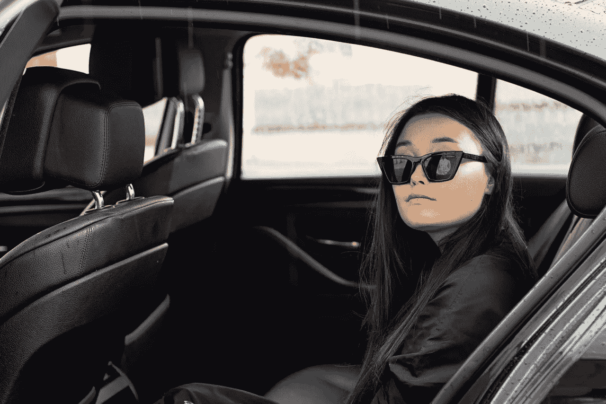

# 自动驾驶汽车背后的技术栈:一项调查

> 原文：<https://medium.com/geekculture/technology-stack-behind-a-self-driving-car-a-survey-b6e9aaa00cf3?source=collection_archive---------19----------------------->

关于自动驾驶汽车的一切

Photo by [Mikhail Nilov](https://www.pexels.com/@mikhail-nilov?utm_content=attributionCopyText&utm_medium=referral&utm_source=pexels) from [Pexels](https://www.pexels.com/photo/fashion-person-sunglasses-woman-8872885/?utm_content=attributionCopyText&utm_medium=referral&utm_source=pexels)

# 什么是自动驾驶汽车？

自动驾驶汽车，也称为自动驾驶汽车，是一种在没有人类驾驶员帮助的情况下，使用传感器，摄像头，雷达，超声波和人工智能在站点之间导航的车辆。汽车在没有针对其用途进行修改的道路上，在没有人干预的情况下行驶到指定的位置。

*以下是一些自动驾驶汽车的例子:*

*   **Waymo** :谷歌的自动驾驶汽车项目 [Waymo](https://waymo.com/) ，现在是它的企业，开发能够安全地将人从 A 点运送到 b 点的无人驾驶车辆。迄今为止，无人驾驶行驶了 800 多万英里，它的 360 度感知系统可以识别 300 码以外的人、其他汽车、自行车、道路建设和其他危险。
*   **Zoox** :当其他公司修改现有的具有自动驾驶能力的车辆时， [Zoox](https://zoox.com/) 正在从头开始开发他们的自动驾驶车辆。这些汽车正在被制造成机器人乘车工具。Zoox 汽车类似于现有的运输服务，如优步或 Ola。因此，客户可以使用智能手机上的应用程序来呼叫 Zoox 汽车。
*   **AutoX** : [AutoX](https://www.autox.com/) 打造基于零售的自动驾驶汽车。由于专注于在线杂货，用户现在可以通过智能手机选择商品并送货上门。

# 它们是如何工作的？

传感器、摄像头、致动器、雷达、复杂的算法、机器学习应用程序和强大的处理器用于运行自动驾驶车辆中的软件。基于遍布汽车的各种传感器，无人驾驶汽车能够生成并维护其周围的地图。另一方面，雷达传感器跟踪周围汽车的运动。摄像机用于检测交通信号、阅读路标、跟踪其他车辆和观察行人。激光雷达(光探测和测距)传感器通过从汽车周围反射光脉冲来评估距离，查看道路边界，并识别道路标记。停车时，车轮中的超声波传感器会检测障碍物和其他车辆的存在。一旦完成，复杂的软件分析所有的传感数据，计算路线，并向汽车的执行器发送指令，这些执行器控制加速，制动和转向。该软件遵循交通规则，并借助硬编码规则、预测模型、避障算法和物体识别来解释障碍物。

 [## 理解机器学习的自动驾驶仪

### AutoML 是一个描述在现实世界中实现机器学习的自动化端到端过程的术语…

aichapters.com](https://aichapters.com/understanding-the-autopilot-of-machine-learning-automl/) 

# 车辆自主的 6 个级别

汽车工程师协会(SAE) 将驾驶自动化分为六个类别，从 0(完全手动)到 5。(完全自主)。美国交通部已经批准了这些标准。

*以下是车辆自主的六个级别*:

## 0 级(无驾驶自动化)

级别 0 表示车辆是手动操作的。现在路上的车很大一部分是 0 级车。一名人类驾驶员始终控制着这一类别的汽车。但是，有一些机制可以帮助驾驶员平稳驾驶。

## 1 级(驾驶员辅助)

这是自动化程度最低的。这款车配备了单一的自动驾驶辅助系统，例如转向和加速。自适应巡航控制使车辆与下一辆车保持安全距离，被列为 1 级，因为人类驾驶员监督驾驶的其他方面，如转向和制动。

## 2 级(部分驾驶自动化)

人为错误是几乎所有车辆事故的根本原因，使用[高级驾驶辅助系统](https://www.sciencedirect.com/topics/engineering/advanced-driver-assistance-systems)可以避免这种错误。这就是第二级的意义所在。ADAS 的作用是减少汽车事故的频率，以防止受伤。ADAS 可以控制车辆的转向和加速。由于人类坐在驾驶座上，可以随时控制汽车，自动化程度低于自动驾驶。二级技术包括[超级巡航](https://www.cadillac.com/ownership/vehicle-technology/super-cruise)和[特斯拉自动驾驶](https://www.tesla.com/autopilot)。

## 3 级(有条件驾驶自动化)

3 级汽车能够进行环境监控，并能够为自己做出智能判断，例如加速超过一辆缓慢行驶的车辆。然而，它们仍然需要人工干预。如果系统不能完成任务，司机必须保持清醒，准备好接管。

## 4 级(高驾驶自动化)

如果出现任何问题或系统出现故障，四级车辆可以做出反应，这是区分四级和三级的重要特征。关于这一点，大多数时候，这些汽车不需要人接触。但是，个人仍然可以手动覆盖系统。尽管这些车辆能够自动驾驶，但在监管和基础设施改善之前，它们只能在有限的区域内自动驾驶。这被称为地理围栏。因此，道路上的大多数 4 级汽车都是为拼车设计的。例如，法国企业 NAVYA 已经在美国生产和销售 4 级穿梭巴士和出租车，它们完全依靠电力运行，最高时速为 55 英里。

## 第 5 级(完全驾驶自动化)

由于人类驾驶任务已经消除，5 级车辆将不需要任何人类干预。他们不需要方向盘或油门/刹车踏板。这种汽车不需要地理围栏。他们可以去任何地方，完成一名训练有素的人类司机所能完成的所有任务。

# 无人驾驶汽车的好处

*   **基础设施支出的减少**:随着无人驾驶汽车的出现和交通堵塞的减少，基础设施改变的需求将会减少，因为交通会自行处理。
*   **节能**:燃料消耗对每个人来说都是个问题，主要是因为汽油价格每年都会大幅波动。自动驾驶汽车可以更容易地观察、评估和监管汽油消耗的速度，从长远来看，可以大大节省系统运营商的资金。
*   生产率的提高:由于没有交通堵塞，乘客们花在开车上的时间会减少，每个人都有更多的时间来实现两个职业目标。在上班的路上，乘客可以在车内阅读或睡觉。它将最大限度地减少长时间旅行带来的疲劳，因为旅行者可以在车内舒适地放松，从而完成更多的工作。
*   **缩短运输和交付时间**:有了自动驾驶卡车，从一个州到另一个州的传统货运拖车将不会因为疲劳而停下来，从而大大缩短运输时间。
*   **公共交通**:无人驾驶汽车有可能扩大公共交通选择，因为几乎每个人的自动驾驶汽车都可以用来将乘客从一个地方运送到另一个地方。当你去上班的时候，不要把你的车停在车库里，你可以用它在特定的区域运送其他乘客来赚钱。随着自动驾驶汽车在交通系统中的集成，车主将获得新的收入来源。由于停车位将被释放出来，它们可以被改造用于其他目的，如建设公园或学校。

# 无人驾驶汽车面临的一些挑战

*   **激光雷达**:个人脑袋里可能出现的一些问题如下:如果几辆自动驾驶汽车在同一条路上行驶，它们的激光雷达信号会不会相互干扰？如果有大量无线电频率可用，频率范围是否足以允许自动驾驶汽车的大规模制造？除此之外，我们还应该注意激光雷达通常是多么昂贵。
*   **天气状况**:自动驾驶汽车在大雨中行驶会发生什么？当路上有积雪时，车道分隔带就消失了。如果车道标志被水、油或冰覆盖，摄像头和传感器将如何跟踪它们？
*   **事故责任**:自动驾驶汽车发生事故谁负责？

# ML 算法如何实现无人驾驶汽车

自动驾驶汽车的机器学习算法有四种类型。

*   **回归算法**:回归技术专门用于预测事件。自动驾驶汽车中采用的三种主要类型的回归算法是神经网络回归、贝叶斯回归和决策森林回归。在回归分析中计算两个或多个变量之间的联系，并在不同的尺度上比较变量的影响。回归算法使用环境的重复特征来创建特定图像和图像内特定对象的位置之间的关系的统计模型。通过图像采样，统计模型可以给出快速的在线检测。
*   **分类算法**:ADAS 获取的图片包含了周围环境的大量数据。该数据必须被过滤以识别具有特定项目类别的照片。这就是模式识别或分类算法发挥作用的地方。这些算法旨在消除不寻常的数据项。在对项目进行分类之前，有必要识别数据集合中的模式。通过模式识别算法以各种方式组合线段和圆弧，以形成用于检测物品的基本属性。自动驾驶汽车中最常用的一些模式识别算法包括 [PCA](https://towardsdatascience.com/a-one-stop-shop-for-principal-component-analysis-5582fb7e0a9c) 、[贝叶斯决策规则](https://www.analyticsvidhya.com/blog/2021/05/an-intuitive-introduction-to-bayesian-decision-theory/)和 [KNN](https://towardsdatascience.com/machine-learning-basics-with-the-k-nearest-neighbors-algorithm-6a6e71d01761) 。
*   **聚类算法**:聚类算法非常擅长从数据点确定结构。ADAS 收集的图片可能会模糊不清，或者分类算法可能会错过某个项目。这通常不能将其分类并报告给系统。聚类方法是通过基于质心和分层建模策略开发的。所有聚类方法都涉及利用数据中的底层结构来有效地将数据组织成具有最高相似性的组。自动驾驶汽车最流行的两种聚类方法是 K-means 和多类神经网络。
*   **决策矩阵算法**:主要用于决策制定，旨在系统地发现、分析和评估属性和其中包含的信息之间的关系。 [AdaBoosting](https://towardsdatascience.com/understanding-adaboost-2f94f22d5bfe) 和 [Gradient Boosting](https://machinelearningmastery.com/gentle-introduction-gradient-boosting-algorithm-machine-learning/) 是自动驾驶汽车中最常使用的决策矩阵技术。

如果你觉得这篇文章有帮助，那么请把它发给其他人。

## 如果你喜欢这篇文章，下面是我的博客文章，你可能会喜欢:

https://youtu.be/OSwuhYfMwWY ✅learn 过着社交焦虑的生活⇾

## [Python 和 R:数据科学哪个编程更好？](https://aichapters.com/python-or-r-which-programming-is-better-for-data-science/)

## [机器学习的 5 大编程语言](https://aichapters.com/top-5-programming-language-for-machine-learning/)

## [数据科学在金融领域的 7 大应用](https://aichapters.com/top-7-applications-of-data-science-in-finance/)