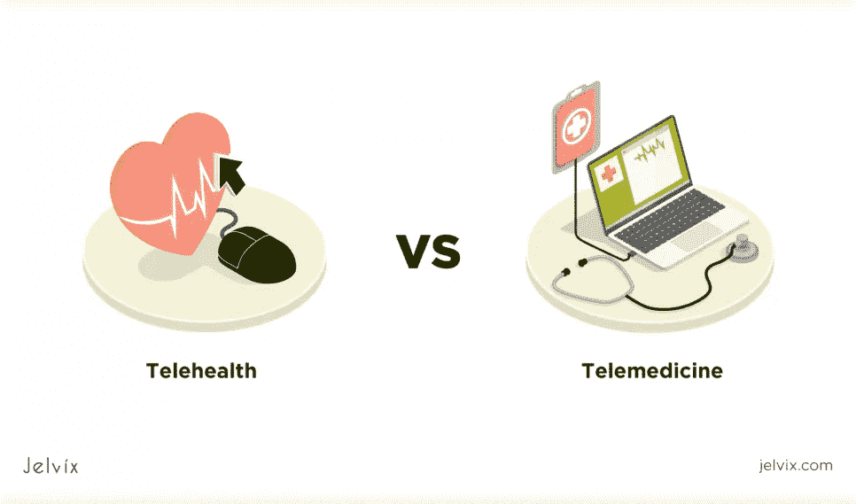
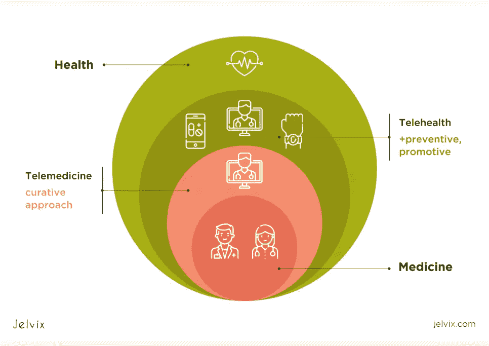
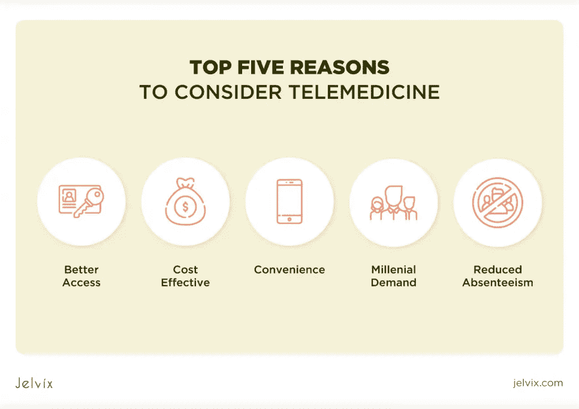
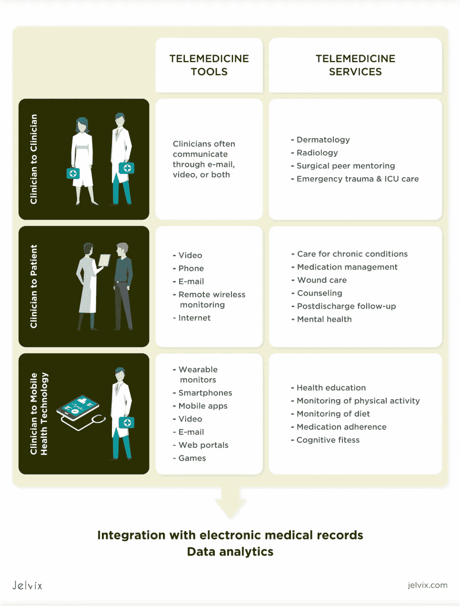
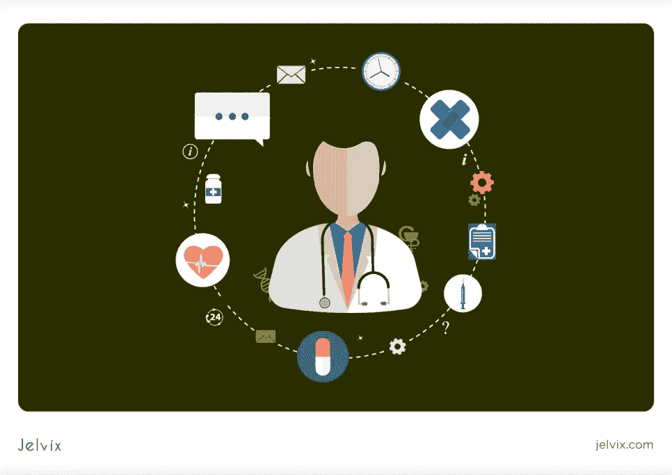
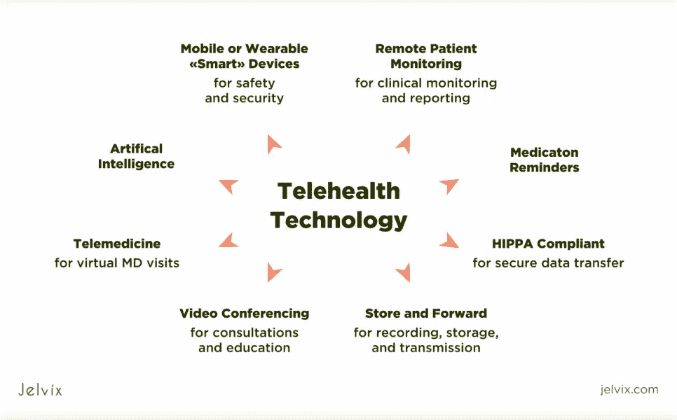
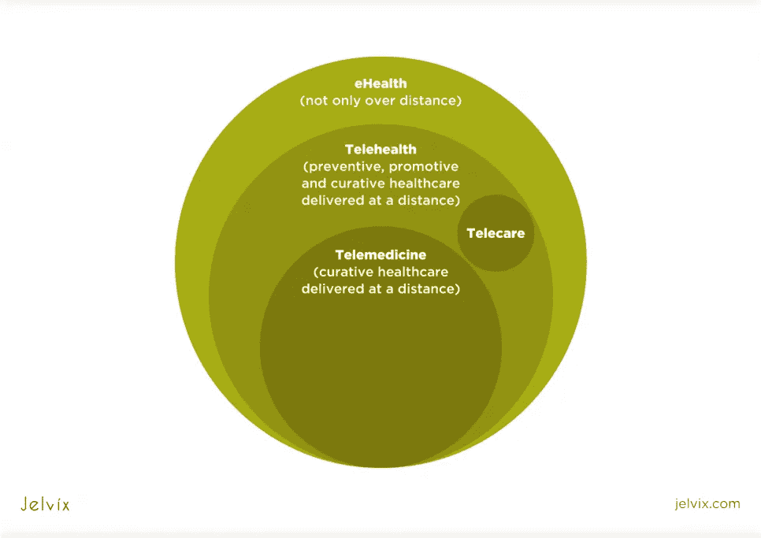
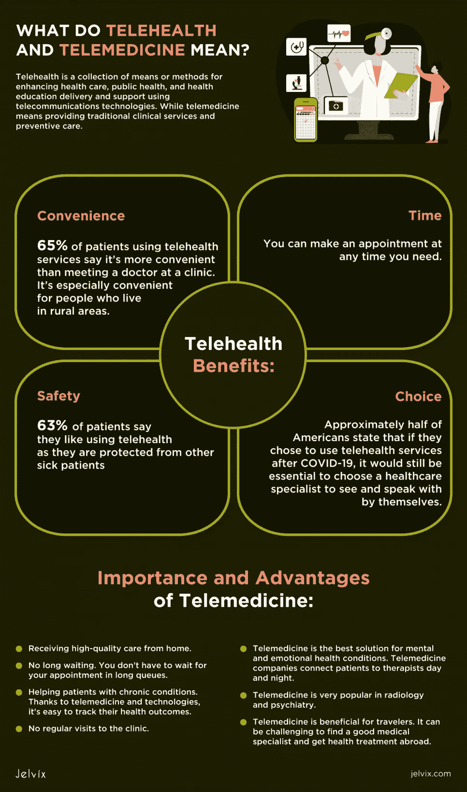

# 远程医疗与远程医疗:有什么区别？

> 原文：<https://medium.com/geekculture/telehealth-vs-telemedicine-whats-the-difference-63fabb861ed5?source=collection_archive---------13----------------------->

如今，由于技术的发展，许多病人和医生使用远程医疗和远程医疗。这些远程医疗服务方便、实惠且有益。普通患者很难理解远程医疗和远程保健之间的区别。人们倾向于认为它们是同义词。这两个术语都意味着通过技术获得医疗保健。尽管如此，这两者之间还是有细微的差别。

本文解释了远程医疗和远程保健的含义以及如何正确使用这些术语。

# 远程医疗和远程医疗意味着什么？

首先，让我们仔细看看这些术语。两者都有前缀“tele-”这意味着使用一些通信设备来执行医疗保健服务。但是，你不应该认为所有的远程医疗服务都是远程医疗。

现在我们应该分析不同的来源是如何定义这些术语的。

# 远程保健与远程医疗

根据卫生资源服务管理局的说法，远程医疗是“使用电子信息和电信技术来支持远程临床医疗保健、患者和专业健康相关教育、公共卫生和卫生管理。”它指出，远程保健包括非临床医疗服务，而远程医疗意味着只提供传统的临床服务。

T2 世界卫生组织声明远程医疗也包括预防保健。互联健康政策中心提到，远程医疗使用不同的技术和策略来提供远程健康和教育服务。

提到[加州远程健康资源中心](https://www.caltrc.org/)，“远程健康是利用电信技术增强医疗保健、公共健康和健康教育提供和支持的手段或方法的集合。”

[美国远程医疗协会](https://www.americantelemed.org/)将远程医疗和远程保健视为图像传输、使用患者门户网站的医疗咨询、视频会议、远程控制、生命体征监测和应用程序。

远程护理是另一个相关术语。它意味着技术的使用，如健身应用程序、跟踪工具和提醒。

# 远程保健和远程医疗的区别

首先，远程保健是一个比远程医疗更广泛的术语。远程保健涉及非医疗服务，而远程医疗仅提供远程医疗护理。虽然，认为远程医疗归结为诊断是错误的。它目前已经扩展到监测慢性病和精神健康。

**远程医疗技术**

远程医疗可以使用任何能够存储、分析和共享信息的技术。远程保健技术是一个广泛的范畴。它包括实践管理系统、患者门户和移动医疗应用。

**远程医疗技术**

远程医疗包括为医生使用电信系统。这有助于通过视频或静态图像看到他们的病人。例如，如果病人居住的地区没有放射科医生，放射科医生可以阅读病人的检查结果。例如，如果你喉咙痛，你可以与医生进行视频预约。

医生检查你的问题，并提供治疗方案。视频咨询好处多多。你的医生可以直接从你那里听出所有症状，而不是在你上次咨询医生后很久他/她才收到的邮件。另一个医生可以通过你的医生的视频连接看到健康检查的结果。这使得医生能够快速评估你的问题并开出治疗处方。

# 远程医疗的类型

*   **存储转发远程医疗**意味着与另一位专家共享必要的患者信息和图像。它在放射学、皮肤科和眼科很受欢迎。如果存储转发远程医疗有一个适当的结构，它可以提供更好的服务。
*   **远程监控**是指使用各种技术进行远程监控。患者的设备收集所有必要的健康信息，如血压或体温。它允许医疗专家远程跟踪患者的生命体征。远程监控有助于治疗慢性病患者，如糖尿病患者。
*   **实时远程医疗**为有需要的患者提供紧急医疗建议。借助视频会议软件，医疗服务提供者和患者可以实时面对面交流。这对病人很有帮助，因为他们不需要花时间旅行。在线咨询有助于专家立即做出诊断。这是常见的管理慢性疾病，初级保健和后续访问。

# 新冠肺炎期间远程医疗的重要性

冠状病毒疫情迫使医生寻找遥远的方式提供医疗保健。在这种情况下，远程医疗似乎是最好的解决方案。它最大限度地减少了与医疗机构、医生和其他病人的接触。因此，它阻止了病毒的传播。

在中国，在线调查帮助专家提供远程医疗服务。因此，远程医疗市场在危机期间有所增长。

# 新冠肺炎疫情期间的远程医疗市场增长

美国远程医疗公司经历了医疗保健需求的增长。与前一年相比，它们在疫情期间表现出高增长。这对市场产生了积极的影响。

**未来远程医疗市场的规模将如何变化？**

[Statista](https://www.statista.com/statistics/938551/telemedicine-market-size-forecast-united-states/) 预测，到 2022 年，远程医疗的总规模将增长到 220 亿美元。未来市场很可能每年都在增长。远程医疗的普及和对它的需求正在上升。

# 远程医疗的重要性和优势

尽管由于冠状病毒危机，远程医疗的普及和重要性有所增加，但即使在新冠肺炎危机后，83%的患者仍希望使用它。这并不奇怪，因为远程医疗有很多优点。

*   **在家接受高质量的护理。在某些情况下，甚至有可能得到一份书面处方。你只需要一部带好相机的智能手机，因为你可能想给你的医生看照片。**
*   不再等待。另一个好处是你不必排长队等候预约。此外，你既不花时间也不花钱去诊所。仍然有必要去诊所，但远程医疗可以帮助消除一些没有亲自预约的诊断。
*   **帮助慢性病患者**。例如，糖尿病对公共健康构成严重威胁。远程医疗公司努力帮助这些患者跟踪他们的健康状况。由于远程医疗和技术，很容易跟踪他们的健康结果。
*   **远程医疗是精神和情感健康状况的最佳解决方案**。远程医疗公司日夜联系患者和治疗师，这通常是非常有益的，因为仅仅是电话交谈和视频通话就能让他们感觉好得多。
*   **远程医疗在放射学和精神病学领域非常流行**。没有必要让医生在场做 x 光检查。在精神病学领域，电话或视频聊天使提供远程护理变得容易。
*   **不定期就诊。**有了远程监控，就不需要去看医生做体检了。无论您身在何处，您都可以联系您的医生并检查您的治疗计划。
*   **远程医疗有益于旅行者。人们在旅行时会面临健康问题。找到一个好的医学专家并在国外获得健康治疗是一件很有挑战性的事情。与保险公司争论也会带来很多麻烦。根据《旅行医学杂志》进行的一项研究，大约 60%的旅行者热衷于远程医疗和远程保健。**

# 如何使用远程医疗

首先，你需要下载一个特定的应用程序，比如 LiveHealth。您也可以在初级保健医师办公室或从您的雇主处获得远程医疗号码。那么你应该在联系医生之前分享症状和病史。患者将收到健康评估和说明。

# 最佳远程医疗平台和应用

如今，远程医疗为患者提供了不同的远程医疗方式。你可以使用任何设备，如智能手机或笔记本电脑，来见医生。远程提供者将患者与专家联系起来，以便他们能够交流。

doxy.me 和 AMC Health 等远程医疗应用允许医生和患者通过视频聊天进行互动。他们可以分享照片，讨论症状和治疗方法。远程医疗是即时可用的，一天 24 小时都可以使用。医疗实践管理软件，如 Greenway，也提供远程医疗。

DrChrono Medical Billing 等医疗结算平台确保保险公司获得付款。您选择的远程医疗平台应该与之前使用的医疗服务配合良好。

# 远程医疗的例子

不是所有的视频会议都是远程医疗。例如，如果视频会议是在病人和医生之间进行的，这就是远程医疗。如果是在高级外科医生和医学生之间，那么它就是远程医疗，因为这项服务是非临床的。

你不能认为所有的存储转发服务也是远程医疗。如果医生是看着病人的 x 光片做出诊断，那就是远程医疗。如果我们正在考虑根据学术出版物做一个报告，那就不是了。

您也可以将大多数移动医疗服务视为远程医疗，因为它们允许医生和患者相互交流，以治疗和预防疾病。

# 远程保健的目标

*   **解决医生短缺问题。**远程医疗让小医院的患者可以联系大医院的专家。因此，生活在农村和偏远地区的人们可以更容易地获得高质量的医疗保健。
*   **远程医学教育与培训。**由于远程医疗技术的发展，像 BoardVitals.com 这样的许多组织都提供医疗保健教育。医生使用在线教育平台和[手机应用](https://jelvix.com/services/mobile-app-development)来发展他们的专业技能，并为重要的考试做准备。
*   **患者互动。**科技让患者轻松掌控健康。他们可以通过观看有益的视频或使用移动应用程序管理健康来接受医疗保健教育。它允许患者保持健康，改善他们的情绪状态，监测慢性疾病。
*   **与供应商沟通。**医务人员可以通过远程医疗平台协作和共享信息，为患者提供最佳治疗。远程医疗平台有助于获得专家的咨询，并在缺乏医疗服务提供商的地区为患者提供医疗服务。

# 远程保健福利

远程医疗是每个想在家接受基本医疗保健的人的最佳选择。对住在农村的人来说特别方便。患者不需要坚持医疗专家的典型时间表。他们可以在任何需要的时候预约。私人保险公司，如医疗保险，提供远程医疗服务，这样病人可以节省金钱和时间。远程医疗的主要目标是为患者提供高质量的医疗服务。

**远程健康普及**

Updox 公司进行了一项调查，发现使用远程医疗的美国人数正在增加。根据调查，自疫情冠状病毒爆发以来，2000 名成年人中有 42%的美国人使用过远程医疗。82%的人说他们喜欢使用远程医疗。调查还解释了患者的偏好如何影响他们使用远程医疗的决定。

*   **方便。** 65%使用远程医疗服务的患者表示，这比去诊所看病更方便。44%的人认为远程医疗使预约变得很容易。51%的人说，如果他们在新冠肺炎之后继续使用远程医疗，方便将是最关键的因素。
*   **安全。** 63%的患者表示他们喜欢使用远程医疗，因为他们可以免受其他患者的伤害。
*   **选择。**大约一半的美国人表示，如果他们在新冠肺炎之后选择使用远程医疗服务，选择一位医疗保健专家亲自就诊和交谈仍然是必不可少的。49%的人希望有人给他们指派一名专业人员。

**男性和女性偏好**

调查显示，自新冠肺炎疫情启动以来，更多的男性(47%)比女性(38%)更喜欢使用远程保健。男性(41%)和女性(28%)选择远程保健是因为其成本效益。72%的男性和 54%的女性表示，他们喜欢使用远程医疗，因为他们不必联系其他病人。

**远程医疗患者的年龄很重要**

患者的年龄在选择使用远程医疗时也起着重要的作用。自疫情开始以来，18 至 44 岁的美国人(52%)比 45 岁以上的人更有可能使用远程医疗。55 岁以上的患者声称，如果他们不需要下载任何特殊的移动应用程序或程序，他们使用远程医疗会更方便。

**为什么远程医疗变得如此重要？**

美国人口正在增长和老龄化。美国人更有可能患上慢性病，这导致医疗保健需求的增加。此外，缺乏有执照的医疗保健提供者。远程医疗技术可以提高医疗保健系统的效率，并最大限度地提高提供者的生产力。

# 远程健康预测

Updox 公司的首席执行官 Michael Morgan 表示，继新冠肺炎之后，远程医疗将对商业至关重要。考虑到当前患者的偏好，虚拟医疗将改变提供医疗保健的方式。如今，医疗保健专家已经在寻找现代方法来增加患者的参与度，并在患者和他们值得信赖的医生之间建立有效的联系。

# 远程医疗的例子

远程健康服务包括咨询、视频会议、健康短信、健康教育等。在新冠肺炎疫情期间，医疗保险远程保健服务的范围扩大了。

**患者门户。**初级医疗诊所可能有在线患者门户网站。这些门户网站是电子邮件的安全替代品。它们允许共享机密的健康信息。该门户允许:

*   和你的医生谈谈；
*   请求处方药物补充；
*   阅读测试结果和早期访问的简历；
*   计划未来的约会和设置提醒。

**在线医生预约**。在一些诊所，与医生进行虚拟预约是可能的。当患者无法亲自去看医生时，他们可以从普通医生那里获得持续的医疗保健。其他在线预约包括通过网络拜访护士。通常，这种服务类似于诊所提供的服务。

登录到 web 服务后，您应该回答一系列问题。然后，医生可能会开处方，给出关于家庭护理的建议，或者建议其他医疗帮助。

**远程监控。不同的技术允许医生远程监控病人的健康状况。以下是此类技术的一些示例:**

*   **网络或移动健康应用**允许上传健康信息并与医生分享。例如，糖尿病患者使用这种应用程序来跟踪碳水化合物和葡萄糖。他们利用这些信息来报告他们体内的血糖水平。
*   **用于测量和无线传输健康数据**的装置，如肺功能或血压。
*   **可穿戴技术**自动记录和传输信息，如身体活动、心率和睡眠时间表。
*   **家庭监测设备**让老年人注意到自己健康状况的变化。

# 远程医疗与远程保健服务

人们倾向于认为远程医疗是一种远程保健。如果你想更好地理解这两种服务的区别，你应该从远程医疗的角度考虑远程医疗。它们包括视频会议、存储转发服务、移动医疗等。

# 远程医疗还是远程医疗？

现在，你可以更清楚地看到远程医疗和远程健康之间的区别。远程保健涉及许多不同的服务。它们包括各种学科，如精神病学、心脏病学、家庭健康等。

远程医疗是一个比远程保健更窄的术语；所以，比较好理解。它仅限于通过电信技术提供临床保健服务。基于视频的会面让医生可以做病人和医生在常规诊所做的一切事情。唯一的区别是，它们实际上不在同一个地方。远程医疗提供更广泛的管理、教育和其他非临床服务。

简而言之，如果你不能将某件事归因于远程医疗，那么它就是远程医疗。远程保健意味着“远程护理”，而远程医疗意味着“远程护理”

*最初发表于*[*【https://jelvix.com】*](https://jelvix.com/blog/telemedicine-vs-telehealth)*。*