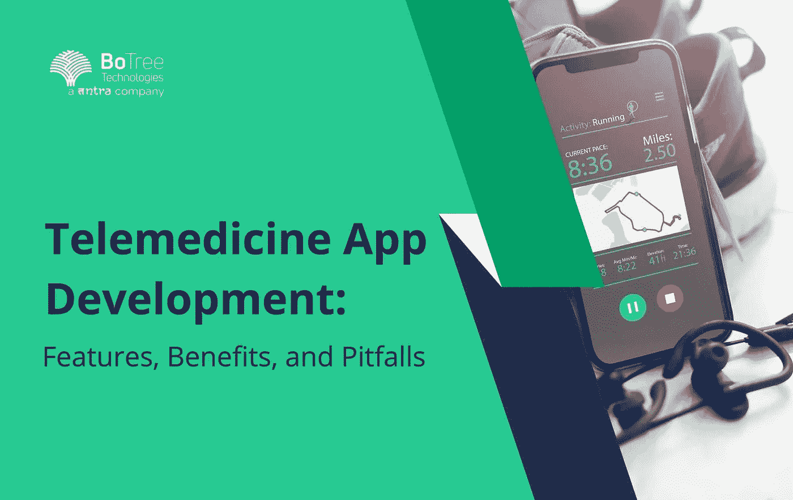

# 远程医疗应用程序开发:特点、优势和需要注意的陷阱

> 原文：<https://medium.com/geekculture/telemedicine-app-development-features-benefits-and-pitfalls-to-be-watched-out-19513774749f?source=collection_archive---------22----------------------->

根据美国医院协会的数据，76%的美国医院现在使用远程医疗应用来治疗他们的病人。可悲的是，一些人没有意识到他们有资格获得这种服务，因为他们不知道他们有权获得什么，或者不知道他们的病情可以远程治疗，而不是被送入急诊室。如果你有兴趣了解远程医疗应用程序开发是关于什么的，这篇文章就是为你准备的！

# 远程医疗简介

移动医疗应用程序开发解决方案(如远程医疗)是一种利用技术为患者提供护理的医疗机构。这可以包括远程诊断、监测和治疗疾病或伤害。术语“远程医疗”被广泛用作“远程医疗”的同义词，特指在医疗服务中使用电信技术。

自发明以来，远程医疗已被用于常规患者护理(处方补充服务)和拯救生命的干预措施，如通过视频会议进行急诊室就诊。

# 什么是远程医疗 App 开发？

由于远程医疗是一种远程通信形式，患者可以在远处与医生和专家联系，这使他们不必长途跋涉或在诊所等待预约就可以与其他人进行咨询。远程医疗用于许多不同的事情，例如诊断和治疗癌症或糖尿病等疾病。它还可以帮助人们更好地管理自己的健康，为当地可能找不到的专家提供帮助。稍后我们将讨论如何开发远程医疗应用程序以及相关软件的主要特性。

# 远程医疗软件开发的好处

类似 teledoc 的应用程序开发有很多好处。以下是几个例子:

1.  **降低成本**:

*   使用第三方[医疗保健应用程序开发公司](https://www.botreetechnologies.com/healthcare-app-development)可以降低运营您的诊所的成本，并节省购买设备的费用。
*   此外，如果您正在与一家多年来一直提供患者护理的经验丰富的公司合作，他们可能会帮助提供关于如何简化流程和确保一切顺利运行的建议。

**2。效率提升:**

*   有趣的是，通过将办公室内部的一些工作外包到另一个地方(甚至跨越大洲)，需要帮助的人可以更容易地获得他们的服务，而无需各级员工采取任何额外措施来满足他们的需求。
*   这意味着，由于预约之间的等待时间或高峰时段的其他干扰而导致的延迟会更少。

> **阅读更多:**[**health tech 如何帮助患者构建尖端解决方案**](https://www.botreetechnologies.com/blog/how-healthtech-helps-to-build-cutting-edge-solutions-for-patients/)

# 远程医疗软件的主要特点

1.  **视频聊天**:

*   [移动医疗应用开发解决方案](https://www.botreetechnologies.com/case-studies/caregiver-app)提供了远程医疗软件最明显的功能，即与患者进行远程交流。这可以通过视频或音频来实现，让你在任何时间从世界的任何地方亲自看到你的病人。

**2。远程患者监护(RPM)** :

*   RPM 是另一个至关重要的功能，它允许医疗专业人员远程监控患者的进展，而无需他们每天到办公室进行测试或治疗。
*   它还支持在一个项目中一起工作的医生和护士以及其他医疗保健专业人员之间的远程会诊。这些专业人士可以是营养师或心理学家，专门研究与阿尔茨海默氏病、老年人抑郁症(由于缺乏动力而难以起床)和食欲不振有关的心理健康问题。

# 开发远程医疗应用程序——从想法到创造的过程

[移动健康应用开发](https://www.botreetechnologies.com/blog/top-mobile-healthcare-app-development-trends/)并不像看起来那么简单。这需要大量的时间和努力。该应用程序应开发的基本要求，并易于患者使用。

然而，开发过程是软件工程中最关键的部分。这是一个分几个阶段的结构化、系统化和文档化的过程。

1.  **构思阶段**:

*   在构思阶段，开发人员识别问题并集体讨论可能的解决方案。

**2。需求阶段**:

*   在需求阶段，他们在需求规范文档中捕获所有的想法(包括你的)。他们还必须定义应用程序的功能性和非功能性需求。

**3。设计阶段**:

*   在设计阶段，应用程序开发人员为您的应用程序创建一个蓝图或原型，用于测试它是否符合您的预期，然后再进一步开发。

**4。编码阶段**:

*   编码阶段是开发人员根据上一步创建的设计文档，使用适当的编程语言为您的应用程序编写代码的阶段。

# 检验阶段

测试阶段是软件开发过程的最后阶段。它通常在产品开发完成后，向客户发布前进行。在这里，您通过独立执行每个特性，然后作为一个单元一起执行，来检查所有特性是否按计划工作。

测试阶段包括两个重要的子阶段:

1.  单元测试
2.  集成测试

单元测试检查单个代码单元的错误，而集成测试检查软件是否与系统的其他部分配合良好。

# 远程医疗移动医疗应用开发—最佳实践

1.  **使用专门的团队:**

*   远程医疗应用程序开发团队应由各自领域的专家组成，他们相互之间密切合作。这将确保项目从头到尾顺利运行。你也会得到更好的结果，因为他们对制作一个 app 的各个方面都有充分的了解。

**2。使用敏捷方法:**

*   [敏捷开发](https://www.botreetechnologies.com/blog/top-reasons-adopting-agile-software-delivery-approach/)比瀑布方法更受青睐，因为这允许公司在不牺牲质量或可靠性的情况下更快地在产品或服务上添加功能(因为软件可以很容易地改变)。

**3。使用测试驱动的方法:**

*   测试对于创建可靠的软件应用程序是至关重要的，因为当用户开始使用它们时，它有助于在错误变成大问题之前识别它们。如果你不能解决错误，这可能会让用户失去兴趣，尤其是在使用阶段出现问题的时候。

> **阅读更多:**[**12 大最受欢迎的医疗保健应用示例**](https://www.botreetechnologies.com/blog/most-popular-healthcare-applications-examples/)

# 在开发您的产品时，需要注意哪些陷阱

# 远程医疗应用？

在开发类似 teladoc 的应用程序时，有一些陷阱需要注意。这些是:

1.  **开发成本:**

*   从零开始建立一个远程医疗平台是昂贵的。上市时间也可能很长，您需要确保技术在投放市场之前已经准备好，以便人们在使用它之前不会等待太久。最好的办法是确定自己的能力。
*   你可以聘请一家可信的[软件开发公司](https://www.botreetechnologies.com/) 来满足你的需求。远程医疗应用程序的成本取决于特性和功能的数量以及用户数量。小公司可能有开发产品的预算，而大公司有一个完整的部门专门负责这项工作。

**2。用户体验**:

*   用户体验也是设计新产品或服务时需要注意的一个重要问题，因为它会影响用户与系统的交互方式，以及他们在使用(或不使用)系统时的感受。
*   这些因素不能被忽视，因为糟糕的用户体验会阻止人们使用医疗技术产品！

**3。安全:**

*   您的应用程序提供的安全级别也需要解决。你的病人的详细资料有多安全？你的 app 容易被黑吗？你不想拿你病人的隐私冒险。

# 谁能帮你创建一个远程医疗应用程序？

建立一个远程医疗系统不是一件简单的任务。它需要广泛的知识、理解和技术专长。对于满足您业务需求的移动医疗应用程序开发，您需要专业的[软件开发公司](https://botreetechnologies.medium.com/top-10-custom-software-development-companies-in-2022-5045e31cadd3)的帮助，他们可以为您提供所有必要的材料和服务。

# 总结想法

我们希望这篇文章能让你更好地理解远程医疗应用程序的开发，它的好处，以及充分利用这项技术的技巧。我们也希望您对开发您的应用程序并将其送到患者手中感到兴奋！

[**联系我们**](https://www.botreetechnologies.com/contact) **今天免费咨询。**

*原载于 2022 年 9 月 29 日 https://www.botreetechnologies.com***。**