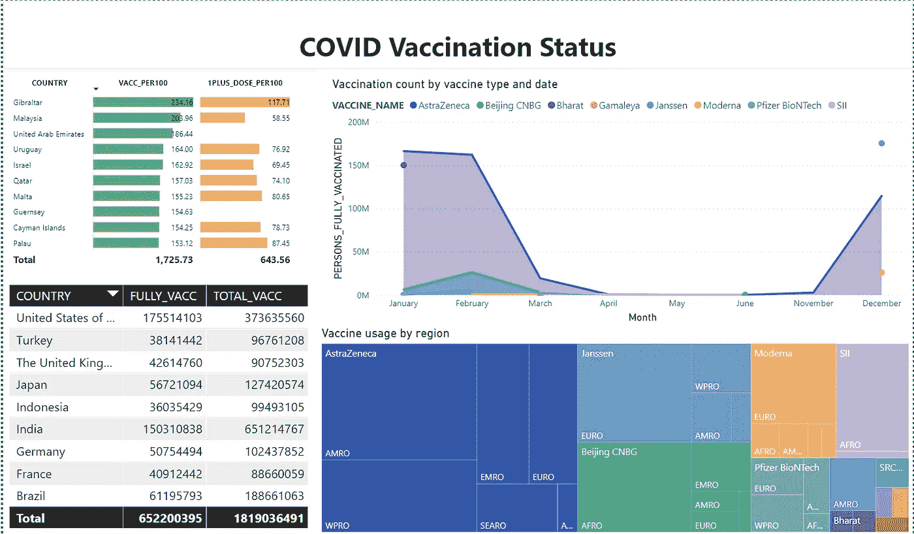
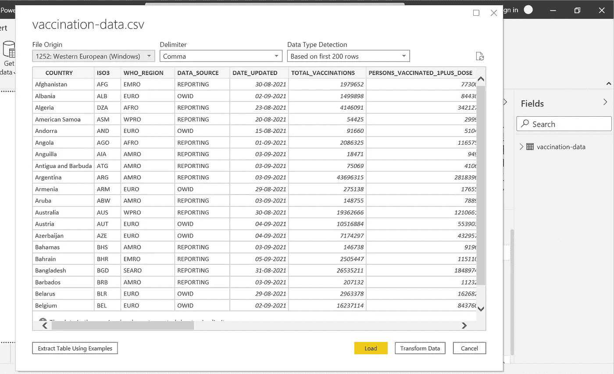
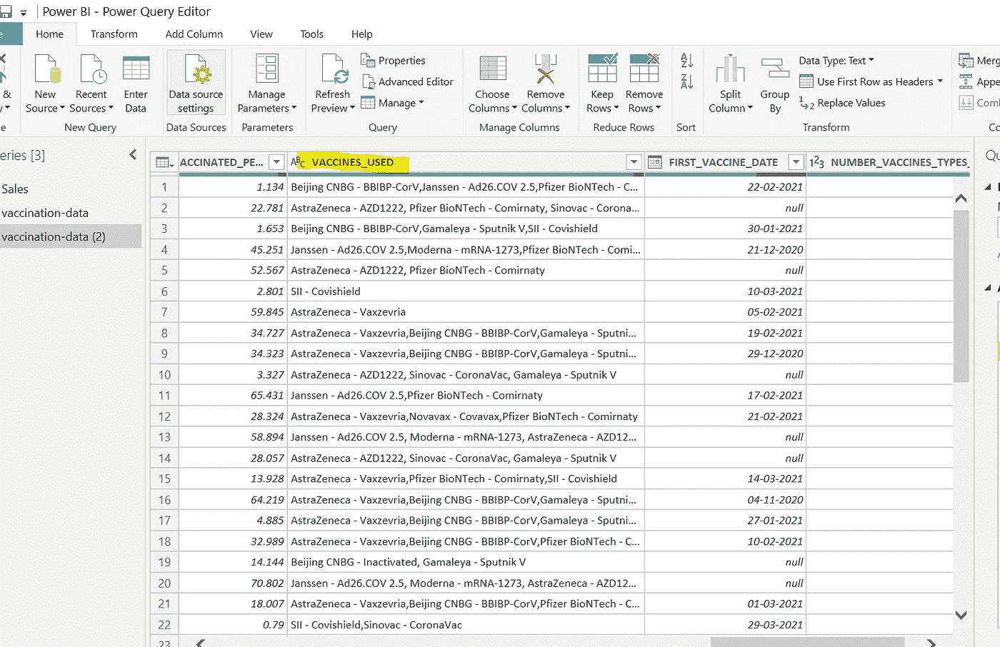
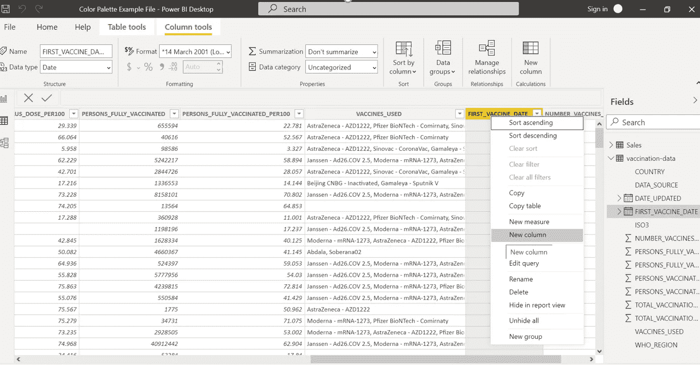
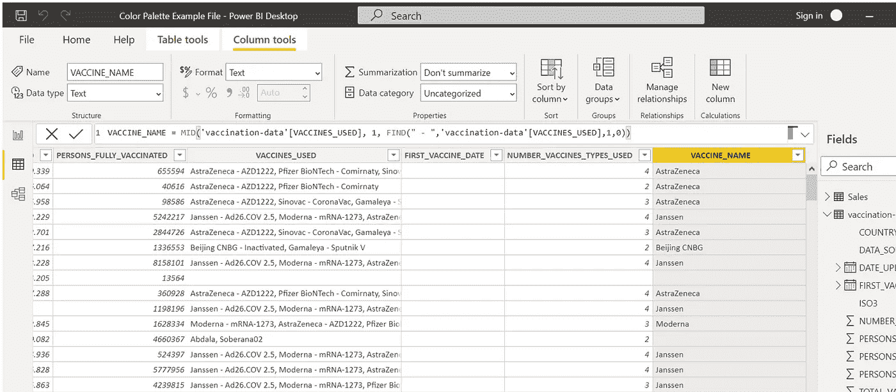
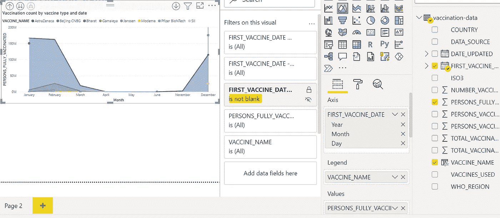
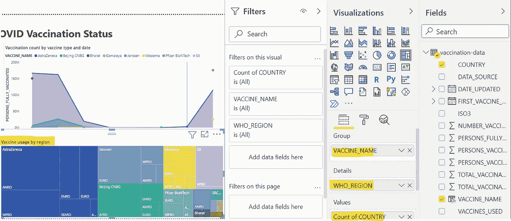
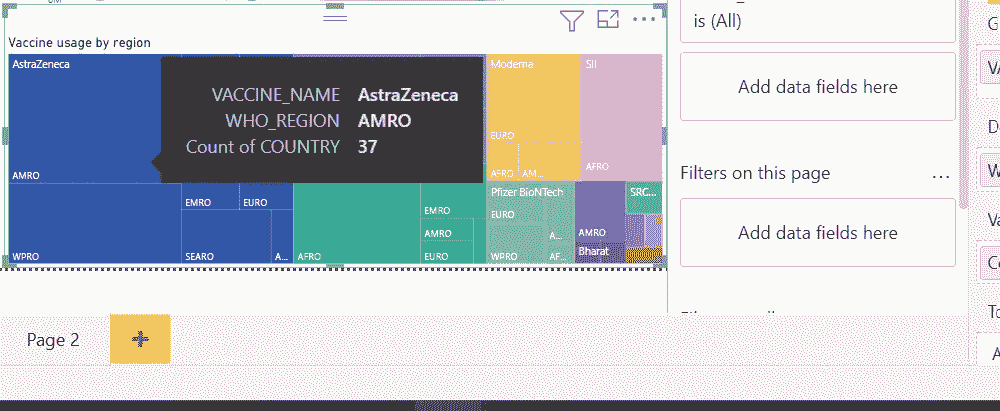
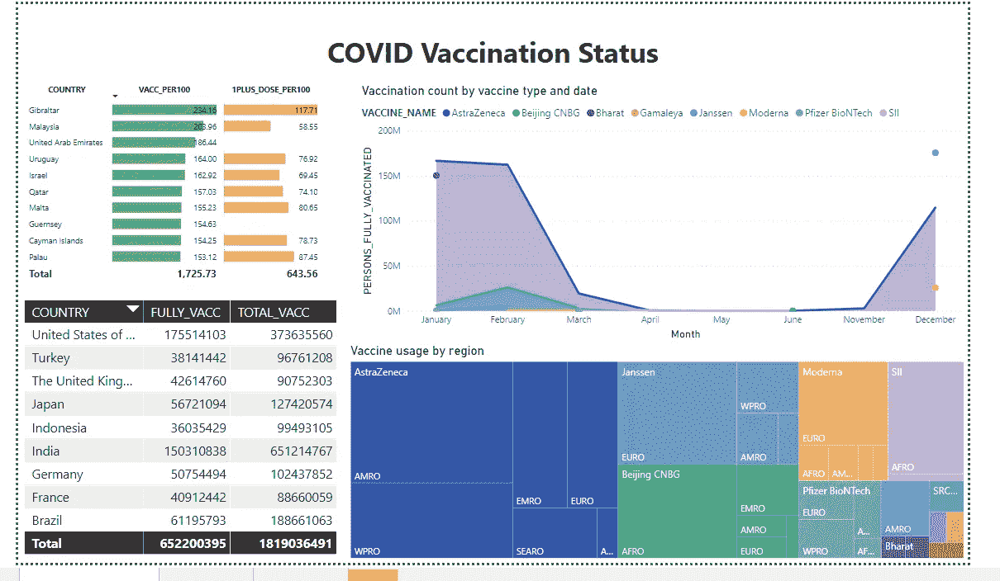
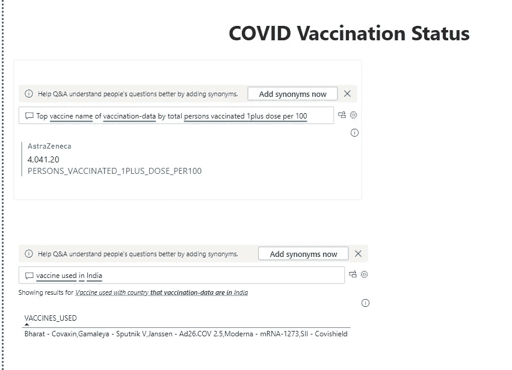

# 使用 Power BI 讲述令人信服的见解

> 原文：<https://medium.com/geekculture/tell-compelling-insights-using-power-bi-409e89fe0c84?source=collection_archive---------42----------------------->

# 无论是使用交互式仪表盘来整合关键指标，还是使用丰富的报告来连接来自工作负载的数据集，Power BI 都是处理业务数据、可视化和实现更智能的数据驱动型决策的重要工具。

# 三种味道的力量 BI

*   Power BI 桌面— windows 桌面应用程序
*   Power BI 服务—在线 SaaS ( *软件即服务*)服务
*   Power BI mobile —适用于 Windows、iOS 和 Android 设备的应用

# 使用 Power BI 的 5 个理由

您如何知道 Power BI 是否适合您或您的组织？以下是选择 Power BI 的七个理由:

1.  不需要专门的培训。您将获得大量的视觉效果、设计模板和定制内容，通过简单的设置快速获得洞察力。微软官方文档足够了，而且质量很好。
2.  实时信息。仪表板会随着数据的推送或流入而实时更新，这使查看者能够快速解决问题并发现机会。任何报告或仪表板都可以显示和更新实时数据和图像。流数据的来源可以是工厂传感器、社交媒体源或任何可以收集或传输时间敏感数据的来源。
3.  简化出版和发行。分析师将报告和可视化上传到 Power BI 服务，而不是通过电子邮件发送大文件或将它们放在共享驱动器上。每当基础数据集更新时，它们的数据都会刷新。
4.  能够定制安全功能。报表开发人员可以设置行级安全(RLS)访问筛选器，以确保查看者只看到与他们相关的数据，从而降低人们看到他们不应该看到的信息的风险
5.  人工智能。Power BI 用户可以访问图像识别和文本分析，创建机器学习模型，并与 Azure 机器学习集成。

我将展示一个小用例，我将使用官方的世卫组织 covid 疫苗接种数据集构建一个 Power BI 仪表板。( [A](https://covid19.who.int/info/) 可用[此处](https://covid19.who.int/info/))

步骤 1:打开 Power BI Desktop，单击“获取数据”并选择导入 csv 数据集。

第二步:点击转换数据。我们可以在这里改变数据的结构，如更改任何列名、修改列数据格式、添加或删除列或者创建计算列或度量。

步骤 3:添加 DAX 公式以派生新列

下面的 DAX 将从“VACCINE_USED”列中提取疫苗名称

VACCINE _ NAME = MID(' VACCINE-data '[VACCINE _ USED]，1，FIND(" —"，' VACCINE-data '[VACCINE _ USED]，1，0))

第 4 步:对于第一个视觉效果，我们将选择一个面积图，并选择如下所示的列。它将告诉我们一段时间内使用的疫苗类型。如你所见，“阿斯利康”是全世界使用最多的疫苗。

我将添加另一个视觉效果，这是一个树形图，它将按地区显示疫苗使用情况，如欧洲、WPRO、AMRO 等。

我们可以覆盖视觉以查看工具提示，并查看与该特定图块相对应的数据。

**这些区域由世卫组织指定*

我将再添加两个表格图像，显示每 100 人接种疫苗数排名前 10 位的国家(左上角图像)和总接种疫苗数排名前 10 位的国家(左下角图像)。

我们可以清楚地看到，这两个图像显示了不同的国家顺序。我们在这里得到的一个关键见解是:**较大的国家(人口众多)，虽然在接种疫苗总数上名列前茅，但较小的国家在为其大多数公民接种疫苗方面超过了前者。**

第五步:我们可以使用 QA visual 的附加 AI 功能，以正常的文本格式编写问题，并智能地获得答案。

上面的例子只是 Power BI 所能做的很小一部分。当一个人在企业级注册，获得 Power BI Pro 许可证，为他们的组织添加专用容量，并使用额外的 Microsoft Azure 服务时，有许多功能可用。

我使用过 Power BI 的几个功能，这些功能带有 Pro 许可证，例如将内容发布到其他工作区、共享仪表板、订阅仪表板和报告、与拥有 PRO 许可证的用户共享。

> 任何对数据分析和可视化感兴趣并希望了解更多相关知识的人都可以在 LinkedIn 上与我联系。([找我](https://www.linkedin.com/in/shefali-bisht/)！我喜欢分享我的经验，也愿意与志同道合的专业人士交流。