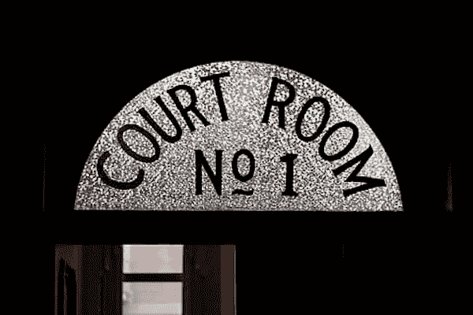

# 初创公司和新兴公司的十大法律陷阱

> 原文：<https://medium.com/geekculture/ten-legal-pitfalls-for-startups-and-emerging-companies-943f268c55a0?source=collection_archive---------9----------------------->

Image credit: [Piqsels](https://www.piqsels.com/en/public-domain-photo-zwrdv)

## **#1 延迟寻求法律建议**

首先，从一开始就投入良好的法律帮助！许多创业公司认为他们完全可以在律师身上省钱。或者，他们聘请一名缺乏处理初创企业普遍面临的问题的经验的律师。找一个擅长起草和审查普通商业合同以及组建公司的律师尤其有用。

试图在早期钻法律的空子可能会导致日后的麻烦。许多创业公司都付出了代价。例如，如果有一位律师告诉你，可以签署一份 16%可转换债券的交易合同，这将是非常危险的。缺乏经验的律师在审查合同时可能不会完全理解细则，因为他们缺乏创业公司惯用的协议类型的经验。此外，他们起草的合同可能没有充分的保护措施。

## **#2 缺乏合适的合同**

依赖非正式的协议或谅解不是经营企业的可持续方式。这种非正式协议的条款必须成为正式的、签署的法律文件。通常很难想象未来可能会出什么问题，尤其是当涉及到由密友创办的初创公司时。然而，如果关系变得令人担忧，出现纠纷，你不会有太多的法律追索权的方式引用双方之间的相互理解。

Image credit: [Piqsels](https://www.piqsels.com/en/public-domain-photo-skmul)

## **#3 未进入 NDA**

创业公司需要宣传他们的公司，以帮助它成长。这需要分享商业理念，其中一些可能是敏感信息。至少，所有员工都应该与公司签署一份保密协议。对于创业公司来说，与专业顾问和创业公司共享重要信息的其他人签订保密协议是一个好主意。

## **#4 知识产权保护不足**

尽早获得适当的版权、专利和商标保护可能会改变以后的游戏规则。如果你的创业依赖于一项新颖的发明或一个独特的商标，这一点尤其正确。发明者可以注册专利，版权在联邦一级注册。相比之下，商标持有者可以在州或联邦一级注册商标。如果一项发明不是内部完成的，并且知识产权没有分配给初创企业，发明者可以在发生法律纠纷时主张知识产权。

## **#5 不遵守员工/人力资源程序**

在美国，所有公司都必须遵守许多雇佣法。各州实施了更多的就业法。初创公司可能认为这种行政文书工作是多余的，会分散主要业务任务的时间，但未能遵循适当的员工协议可能会导致问题。

这些要求可能包括支付最低工资、实施反骚扰和反歧视政策，以及填写适当的人力资源文件。例如，公司的所有员工在雇用时都必须填写 I-9 表格，以证明他们有资格在美国合法工作。公司通常必须有员工手册，其中包含公司的各种政策和行为准则。

## **#6 违反税法**

由于缺乏适当的法律指导或规划，违反税法的行为经常在无意中发生。创业公司可以减少税务问题的一个方法是向美国国税局提交 83(b)选举表格。创业公司必须在 83(b)选择表格上声明日期、购买价格和股东购买股份的数量。

## **#7 按照导致错误激励的时间表发行股权**

股权奖励可以激励创始人和忠诚的员工。他们还促进对公司长期增长和发展的奉献。然而，如果授权时间表的结构使得股权授予过快，实际上可能会与这一目标背道而驰。

## **#8 有错误的法定名称**

解决这个问题可能已经太晚了，但是为你的创业公司选择一个正确的名字可以避免潜在的法律问题。这往往表现为商标侵权问题。建议在美国专利和商标局网站上进行在线搜索，以确保没有以贵公司名称注册的联邦商标。除了商标问题之外，法律风险还可能来自于选择一个令人不快或给公众造成错误印象的名称。

## **#9 向投资者夸大其词**

初创公司的创始人对他们建立的企业充满热情，自然会向投资者大力推销。然而，创业公司需要小心触犯法律。具体来说，根据美国州或联邦证券法或其他反欺诈法，向投资者做出夸大的声明可能会导致责任。夸大增长预测或向投资者做出严重误导的承诺可能会导致法律问题。

## **#10 缺乏合法许可和执照**

最后，但同样重要的是，要有适当的许可证和执照，以避免法律问题。弄清楚许可证和执照的要求可能是一件痛苦的事情，所以有律师的帮助可能是一种增值。