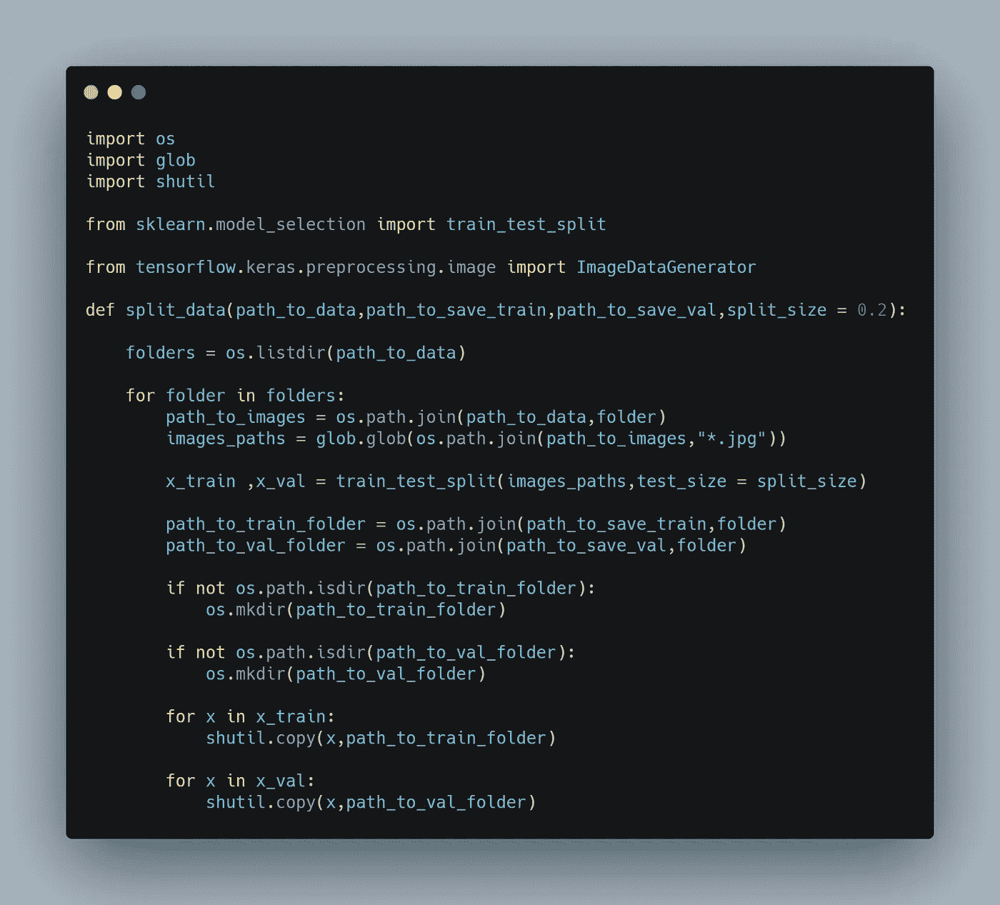
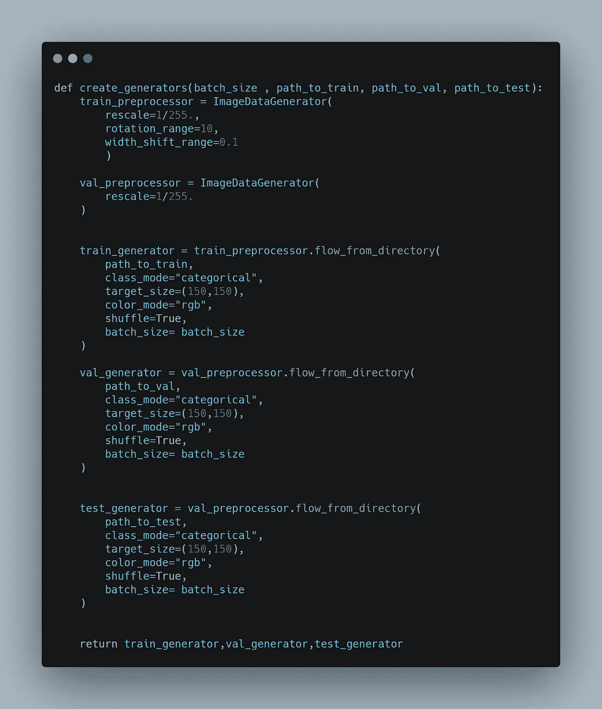
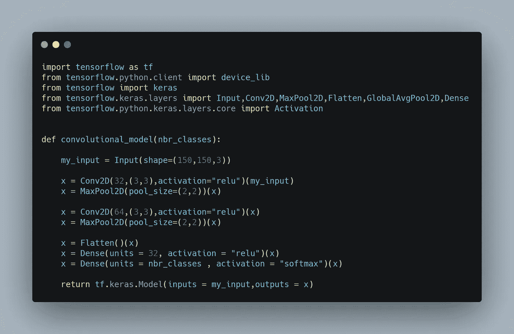
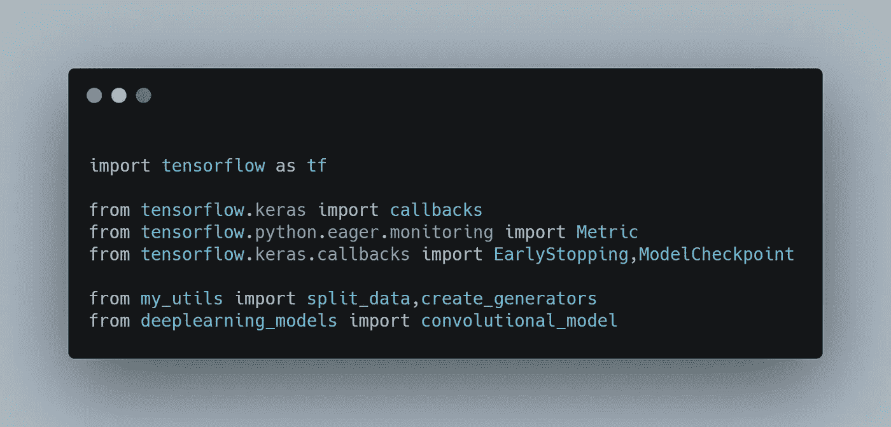
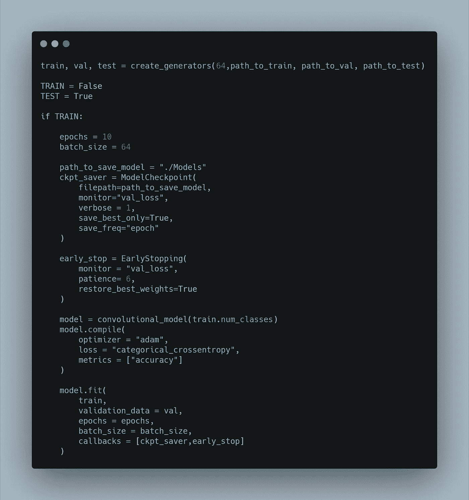
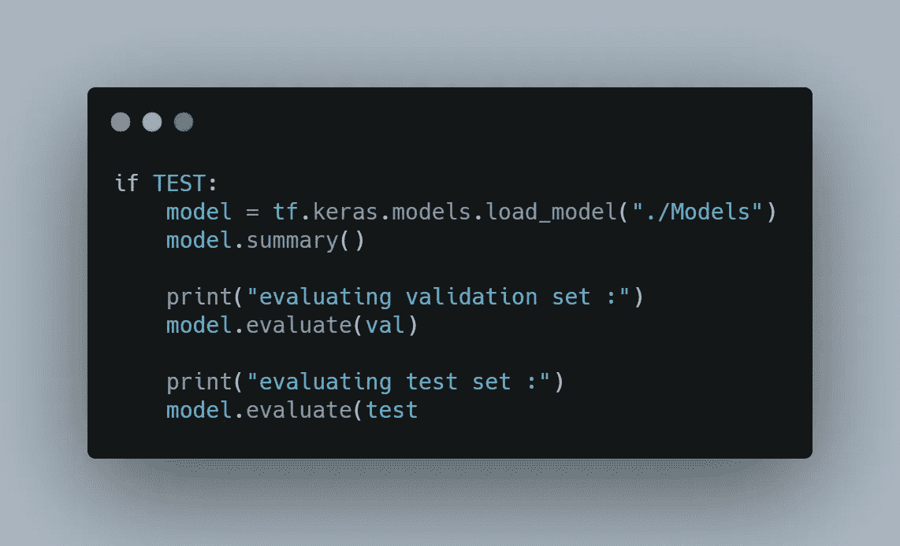
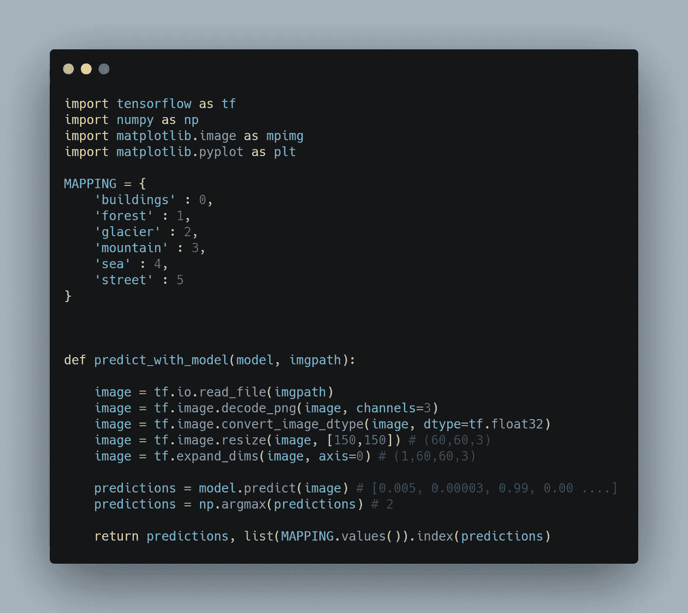

# 用于多标记图像分类任务的张量流 CNN

> 原文：<https://medium.com/geekculture/tensorflow-cnn-for-intel-image-classification-task-2f6326e83ea?source=collection_archive---------16----------------------->

Photo by [Pietro Jeng](https://unsplash.com/@pietrozj?utm_source=medium&utm_medium=referral) on [Unsplash](https://unsplash.com?utm_source=medium&utm_medium=referral)

## 用 TensorFlow 建立一个简单的 CNN 并使用数据扩充

卷积神经网络(CNN)诞生于 1990 年，源于 Yann LeCun 及其团队基于人脑视觉皮层功能的研究[1][2]。由于它们能够获得的优异性能，尤其是在图像识别领域，即使在今天，CNN 也被认为是模式和图像识别领域的“最先进水平”。Yann LeCun 在 2019 年因其工作获得了图灵奖。

今天，建立一个卷积网络并获得良好的结果是相对简单和容易的。我们将在这个简短的指南中了解如何使用这样的网络来解决英特尔图像分类任务，您可以在以下链接中找到:[https://www . ka ggle . com/puneet 6060/Intel-Image-Classification](https://www.kaggle.com/puneet6060/intel-image-classification)。

## 资料组

普内特.班萨尔。(2019 年 1 月)。英特尔图像分类，第 2 版。检索于 2021 年 11 月 16 日，来自[https://www . ka ggle . com/rtatman/r-vs-python-the-kitchen-gadget-test](https://www.kaggle.com/puneet6060/intel-image-classification)。

## 数据准备

在下载数据集的 zip 文件并提取它之后，要做的第一件事是组织所有的图像。训练图像都在“seg_train”文件夹中。我们将创建一个包含子文件夹“train”和“val”的新文件夹“training”。然后，让我们编写代码，将“seg_train”中的图像分割到这两个新的子文件夹中。

我们将要定义的 *split_data* 函数将有 3 个输入参数，原始文件夹的路径和两个新的子文件夹的路径。

Split your data into T*rain and Val folders*

既然我们已经清理了我们的文件系统，我们可以使用我们的数据来实际创建训练、验证和测试集，以馈送到我们的网络。TensorFlow 为我们提供了 *ImageDataGenerator* 类以非常简单的方式编写基本的数据处理。

训练集预处理器将执行输入图像像素的缩放，将它们除以 255。 *rotation_range* 和 *width_shift_range* 通过修改图像的一些特征来进行一些数据扩充。请注意，验证数据的预处理器没有数据扩充特性，因为我们希望保持不变，以便更好地验证我们的模型。

然后，我们使用这些处理器通过 *flow_from_directory* 函数从目录中读取数据。注意此功能可以自动计算出每张图片的标签，因为它会将*森林文件夹*等中的所有图片标记为*森林*

其他需要指定的是图像的路径、图像的大小、3 个 RGB 通道、数据混洗、批量大小，并指定我们正在谈论的类别。

Use generators to create the actual datasets

## 模型定义

最后，我们继续定义卷积模型。为了保持本指南的简单，模型将仅由定义输入图像大小的*输入层*构成。然后将有几个*卷积层*，后面是*最大池*层。最后，两个*密集层*，其中输出神经元的数量等于要分类的类的数量，以便 softmax 函数返回概率分布。(*展平*层用于将多维输入张量展平为一维)

Let’s define the deep learning model

**培训**

导入必要的库:

Import the necessary libraries

在训练步骤中，我们将使用回调*模型检查点*，它允许我们不时地保存在每个时期找到的最佳模型(根据验证损失进行评估)。如果在*耐心=x* 次后没有改善，则*提前停止*回调用于中断训练阶段。我们照常编译和拟合模型。记得包括两个回调。

Training phase with callbacks definition

## 评价

现在让我们加载我们保存的最佳模型。我们可以使用 *summary()* 函数再次检查我们的模型架构。然后让我们在验证集和测试集上评估这个模型！

Model evaluation

## 预测

既然模型已经被训练和保存，我们可以用它来预测新的图像！
在函数 *predict_with_model* 中，我们必须首先做一些无聊的预处理步骤，以调整输入图像的大小，使其为 150x150，以便将其输入网络。
预测函数将返回各种类别的概率分布，使用 *argmax* 函数，我们将返回最有可能的类别。我们可以使用字典映射将获得的数字转换为最终的标签！

Let’s predict new images!

## 结束了

马尔切洛·波利蒂

# 文献学

[1] Y. LeCunn e 团队:用反向传播网络进行手写数字识别，NeurIPS 会议，(1989 年)

[2]大卫·H·哈贝尔:我们关于猫皮层的第一篇论文，牛津网站，(1959 年)