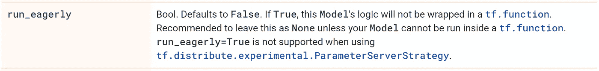

# 张量流悲伤故事

> 原文：<https://medium.com/geekculture/tensorflow-sad-story-cf8e062d84ba?source=collection_archive---------1----------------------->

我已经使用 Pytorch 好几年了，并且一直很喜欢它。它清晰、直观、灵活、快速。然后我遇到了一个在 TensorFlow 上做我新的计算机视觉项目的机会。这就是这个故事开始的地方。

Image by author

TensorFlow 是一个被广泛使用的成熟框架。不会那么糟的，我对自己说。鉴于谷歌的工程资源和 ML 专业知识，我期望他们会得到它的权利。现在，在与 TensorFlow 一起工作了一年之后，我可以说这是一个由维护不良、缺乏指导和错误代码组成的混乱组合。下面是我遇到的一些事情。

作为免责声明，重要的是要提到我不是张量流专家，这不是一个全面的概述，有些事情可能并且肯定会逃过我的注意。

# 装置

乐趣从安装开始。作为先决条件，需要安装 NVidia CUDA 和 cuDNN 库。出于某种原因，它特别困扰我的 cuDNN 下载一个人必须注册并登录在英伟达门户网站。接下来，安装的 CUDA 和 cuDNN 版本必须匹配 TensorFlow 版本，否则无法使用。而且[那个匹配表](https://www.tensorflow.org/install/source#gpu)即使你知道它的存在也很难找到。这些依赖性是问题的持续来源。实验很难升级和降级，对我来说一些库经常丢失。

除了`tensorflow`本身，还有一个额外的 python 包`tensorflow-addons`，人们经常使用。它应该用于不常用的代码等。，但实际上对于总是安装这两个软件的开发人员来说，这只是多余的将代码分成两部分。当然，版本必须完全匹配，这也有一个表格。

最后，还有`tensorflow-gpu`。尽管我尽了最大的努力，我还是不明白为什么它在 pip 上仍然有一个持续更新的[包](https://pypi.org/project/tensorflow-gpu/)，它的版本与`tensorflow`的版本相同，尽管它的[已经在 2 年前退役了](https://www.tensorflow.org/install/gpu)。

安装是艰难的，但嘿，你必须为即将到来的事情而努力。

# 急切的执行是一个骗局

在我了解真正渴望执行这句话之前，来自官方 v2 文档的这句话实际上让我充满了希望

> TensorFlow 2.0 急切地执行(就像 Python 通常做的那样)，在 2.0 中，图形和会话应该感觉像实现细节。

Image by [artificialintelligencememes](https://www.facebook.com/artificialintelligencememes).

急切执行的主要问题是它通常比图形模式运行得慢。对于我的 CNN 模型，急切执行慢了 5 倍。这立即使它成为一个最好的调试工具——谁会想要默认运行它呢？

在 TensorFlow 文档中，可以找到[这个澄清](https://www.tensorflow.org/guide/eager#benchmarks):

> 对于计算密集型模型，如在 GPU 上进行 ResNet50 训练，急切执行性能可与`[tf.function](https://www.tensorflow.org/api_docs/python/tf/function)`执行相媲美。但是对于计算量较少的模型来说，这种差距会变得更大，对于有大量小操作的模型来说，优化热代码路径还有很多工作要做。

尽管承诺了相当的性能，但我测量的 5 倍速度下降确实是 ResNet50 的。但是我也使用了自定义头和自定义损失，这显然是太多的渴望处理。Keras 团队意识到了这些问题，他们的默认执行模式是图形模式。他们甚至明确地不建议使用急切:

注意，Keras 是 TensorFlow 的主要推荐 API。然而，TensorFlow 2.0 允许自己骄傲地宣称，默认情况下它们会急切地执行。

# tf.data.DataSet API 一塌糊涂

在 TensorFlow v2 中构建数据管道的推荐方式是 tf.data.DataSet API。它表面上看起来很漂亮，具有“直观”的模块化结构和承诺的性能改进。但是尝试了很多天之后，我很失望。

我在本文中处理的 ML 任务是一个基本的图像分类问题。使用旧的[序列](https://www.tensorflow.org/api_docs/python/tf/keras/utils/Sequence) API 用于相同的图像加载和增强管道实现了相似的 GPU 利用率，甚至比 tf.data.DataSet 稍快

Image by [fossa](https://imgflip.com/user/fossa) from [imgflip](https://imgflip.com/tag/suffer).

但更糟糕的是，众所周知，使用 tf.data.DataSet API 非常困难，调试起来也很困难。需要维护的一件看似不必要的事情是必须显式指定的参数类型。如果使用 tf.py_function，您还需要指定输出中的张量形状，这在文档中没有很好地解释，并且您几乎肯定要花费时间来找到它。

对于处理函数，需要在 tf.function、tf.py_function 和 tf.numpy_function 之间做出决定。tf.function 是编译版本，根本不支持急切执行。但是 tf.py_function 可能会很慢，因为每次调用都会锁定 python GIL。不客气。

# API 复制

猜猜我们需要多少个 2D 卷积层实现？显然，根据 TensorFlow dev，7 是正确的数字:

1.  [tf.nn.conv2d](https://www.tensorflow.org/api_docs/python/tf/nn/conv2d)
2.  [tf.keras.layers.Conv2D](https://www.tensorflow.org/api_docs/python/tf/keras/layers/Conv2D)
3.  [TF . compat . v1 . layers . conv2d](https://www.tensorflow.org/api_docs/python/tf/compat/v1/layers/Conv2D)
4.  [TF . compat . v1 . layers . conv2d](https://www.tensorflow.org/api_docs/python/tf/compat/v1/layers/conv2d)
5.  [tf.layers.Conv2D](http://tensorflow.biotecan.com/python/Python_1.8/tensorflow.google.cn/api_docs/python/tf/layers/Conv2D.html)
6.  [tf.raw_ops。Conv2D](https://www.tensorflow.org/api_docs/python/tf/raw_ops/Conv2D)
7.  [tf.contrib.slim.conv2d](https://www.kite.com/python/docs/tensorflow.contrib.slim.conv2d)

其中一些是低级和高级 API，一些是由第三方开发的，还有一些已被弃用。但是请注意，在各自的文档页面上没有提到这些内容。

这种重复在 TensorFlow 中随处可见。因此，很难知道使用哪一个功能是正确的，差异是什么，以及一些功能之间是否兼容，但与其他功能不兼容。这不是一个理论上的问题，开发者必须每天花费他们宝贵的脑力在这个愚蠢的活动上，从 7 个函数中选出正确的函数。

# 草率开发

下面是我遇到的其他几个问题的集合。

1.  [ImageDataGenerator](https://www.tensorflow.org/api_docs/python/tf/keras/preprocessing/image/ImageDataGenerator) ，TensorFlow 增强库，不像所有现代库那样允许本地随机播种。相反，它使用全局 numpy.random.seed()。大量使用全局种子[会使可重复实验的开发](https://github.com/numpy/numpy/pull/9906#discussion_r146428000)变得复杂，尤其是在多线程的情况下。
2.  _epoch_end()上的[序列](https://www.tensorflow.org/api_docs/python/tf/keras/utils/Sequence#on_epoch_end)数据 API 方法没有 epoch 作为参数。对于几个版本来说,[甚至不叫](https://github.com/tensorflow/tensorflow/issues/35911),所以相比之下，一个缺少的参数可能看起来像一个小麻烦。从这种情况下，您可以了解 TensorFlow 中的测试覆盖率(比它应该的要小得多)。
3.  TF 的 GPU 内存管理不好。首先，默认情况下，无论实际的模型大小如何，模型初始化时都会占用所有的内存。幸运的是，有一个配置选项允许分配的内存按需递增。但接下来有一个真正的问题，分配的 GPU 内存[在使用](https://github.com/tensorflow/tensorflow/issues/36465)后无法释放，释放内存的唯一方法是杀死进程。Facepalm。
4.  TF 训练日志总是包含几个模糊的警告消息。根据不同的版本，会有不同的警告。我个人不喜欢日志中的警告信息，并试图解决它们。但在这种情况下是不可能的，因为通常是一个 TF 函数投诉另一个 TF 函数。他们真的应该选择一种不同的交流方式。
5.  最后，model.predict()函数[泄漏 RAM 内存](https://github.com/keras-team/keras/issues/13118)。它不是生产推理的主要 API 调用吗？TF 不是应该至少对制作有好处吗？

# 结论

换成 Pytorch 就行了。

# 版本

本文基于 TensorFlow 2.3.0 到 2.5.0。