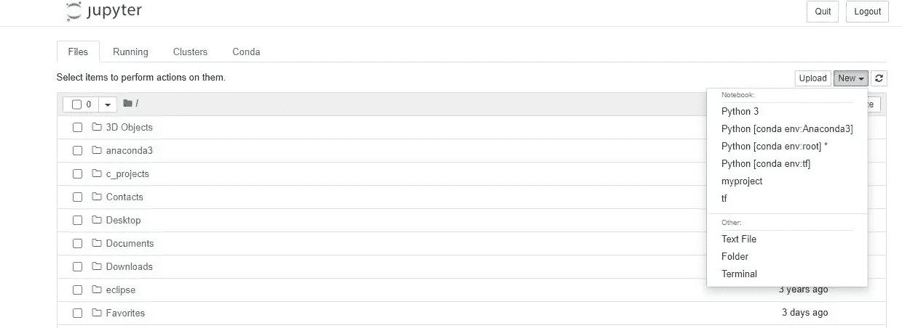
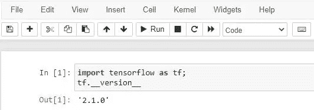

# 使用 Anaconda/Jupyter 笔记本设置 TensorFlow

> 原文：<https://medium.com/geekculture/tensorflow-set-up-with-anaconda-jupyter-notebooks-a93ebf9ab02d?source=collection_archive---------24----------------------->


Photo by [Hitesh Choudhary](https://unsplash.com/@hiteshchoudhary?utm_source=medium&utm_medium=referral) on [Unsplash](https://unsplash.com?utm_source=medium&utm_medium=referral)

[**TensorFlow**](https://www.tensorflow.org/) 已经成为深度学习领域最常用的框架之一，提供了用 python 训练模型的能力，提供了样板代码的封装，并帮助在云上部署应用程序。用 Jupyter 笔记本设置 TensorFlow 一直是我在尝试使用它时面临的问题之一，所以我整理了一系列步骤供参考(以防有一天我的记忆崩溃)。

# Anaconda 提示

在 anaconda 中，用户可以通过两种方式添加库和执行其他操作。选择完全取决于用户，取决于他们对命令行或 GUI 的舒适度。因此用户可以使用用户界面——Anaconda Navigator 来完成这个
。
使用 Anaconda 提示符——命令行工具。

这两种方法各有利弊。鉴于我最近对黑白窗口的痴迷，我尝试使用 anaconda 提示符(或 anaconda CLI)。

# **虚拟环境**

简要概述一下，虚拟环境只是提供了一个单独的环境，您可以在其中使用指定版本的库进行应用程序开发。它可以防止代码执行中出现与命令弃用或新版本发布相关的问题/错误。

要创建虚拟环境，命令如下:

```
(base) C:\Users\Aditya> conda create -n myEnvironment 
```

可使用以下命令激活环境: ***conda activate*** 。发布该命令，用户可以看到**基**变为 **<环境名>** 表示环境改变。

```
(base) C:\Users\Aditya> conda activate myEnvironment
(myEnvironment) C:\Users\Aditya>
```

您可以使用命令 *conda deactivate* 退出环境

```
(myEnvironment) C:\Users\Aditya> conda deactivate 
```

要删除环境，请使用:

```
(base) C:\Users\Aditya> conda env remove -n myEnvironment
```

# **使用 Anaconda 设置 TensorFlow 环境**

现在我们已经完成了虚拟环境的 CRUD，对于 tensorflow，用户可以使用下面的命令集创建一个虚拟环境。

```
# Creating tensorflow virtual environment 
(base) C:\Users\Aditya\> conda create -n tf tensorflow#Activate the environment 
(base) C:\Users\Aditya\> conda activate tf 
```

它安装所需的一组库来启动 Tensorflow。要测试是否安装了库，我们可以运行以下命令作为基本的健全性检查:

```
(base) C:\Users\Aditya> conda activate tf (tf) C:\Users\Aditya>python
Python 3.7.9 (default, Aug 31 2020, 17:10:11) [MSC v.1916 64 bit (AMD64)] :: Anaconda, Inc. on win32
Type "help", "copyright", "credits" or "license" for more information.
>>> import tensorflow as tf;
>>> tf.__version__ # Checking the version of the library.
'2.1.0'
```

# **最后的亮点:设置 Jupyter 笔记本使用 Tensorflow 虚拟环境**

既然我们已经安装了库，我们需要确保我们能够使用 Jupyter Notebook 的虚拟环境。

安装 **nb_conda** 以便在使用 Jupyter 笔记本时能够更改内核。这将帮助用户更改 jupyter 笔记本登录页面上的内核选项。

```
conda install -c anaconda nb_conda
```

现在，即使安装了这个，你可能也看不到 tf 作为 Jupyter 笔记本的内核选项。该错误是由于虚拟环境没有 IPython 内核造成的。因此，我们需要为虚拟环境设置一个 IPython 内核。在 anaconda 提示符下，使用以下命令在您的虚拟环境中设置 IPython 内核。

```
conda install -c anaconda ipykernel
```

现在，当您运行 Jupyter 笔记本电脑时，您应该能够在 anaconda 环境中看到 tensorflow 虚拟环境选项:



Jupyter Notebook

您应该能够将 TensorFlow 导入到您的 Jupyter 笔记本中。



# 结论

Jupyter notebooks 本身就是一个实现数据分析和构建机器学习模型的惊人应用。在对数据进行快速分析时，使用 Tensorflow 和其他 ML 框架的能力更进了一步。

这是我很久以来第一次尝试写技术文章。欢迎任何评论、反馈和建设性的批评。可以在推特[@ aditya 1791](https://twitter.com/Aditya1791)&[LinkedIn](https://www.linkedin.com/in/adityarao17/)上找到我。