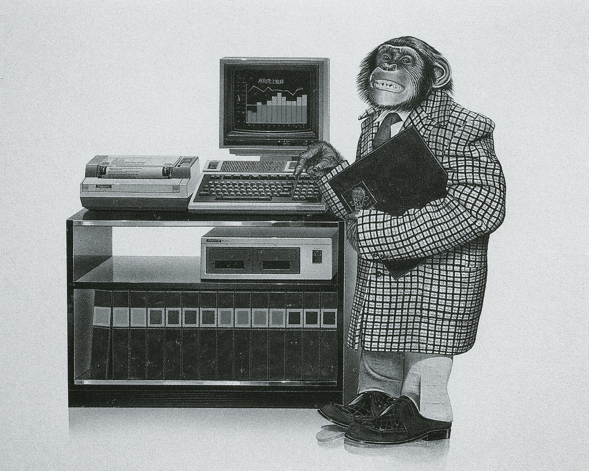

# 终端仍然是最好的计算机接口

> 原文：<https://medium.com/geekculture/terminal-is-still-the-best-computer-interface-9f882ced93ad?source=collection_archive---------12----------------------->

Akira Terasawa, 1983

在任何现代惊悚片中，你肯定会看到一个戴着兜帽的极客，在黑屏后面疯狂地敲键盘。

这似乎很复杂，这个角色被视为一个超级英雄，能够按照自己的需要操纵世界。

现实中只是一个终端和一个键盘。用这种方法在电脑上工作的人打字不会那么快。具有低得多的窗口变化帧速率。