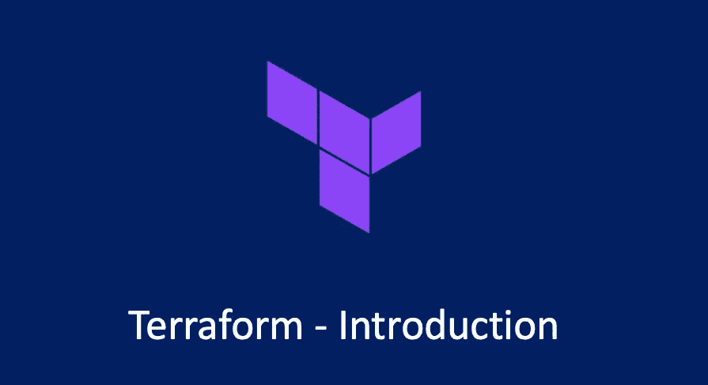

# Terraform —简介

> 原文：<https://medium.com/geekculture/terraform-introduction-7789bd7e911f?source=collection_archive---------5----------------------->

## Terraform 简介

基础设施即代码(IaC)，是开发人员或开发运维工程师编写代码以实现他们期望的基础设施或服务器最终状态的地方。例如，在 AWS 中创建应用程序负载平衡器、EC2 实例和 EBS 卷。

Terraform 是 HashiCorp 开发的代码为的开源基础设施软件工具。它使用户能够…