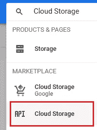
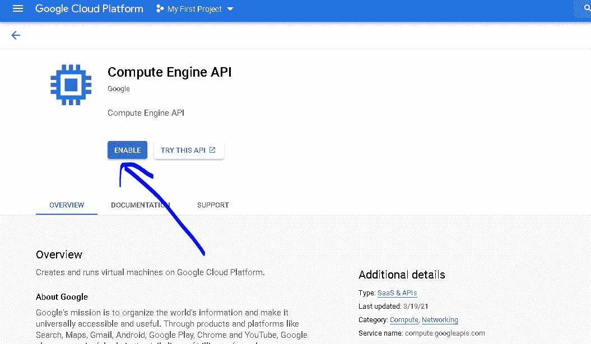
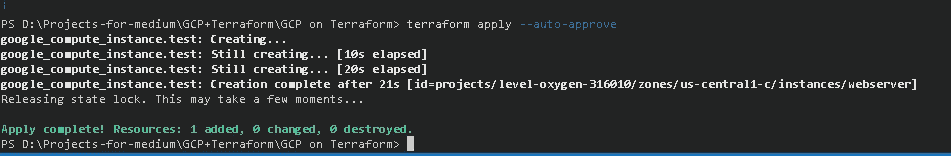
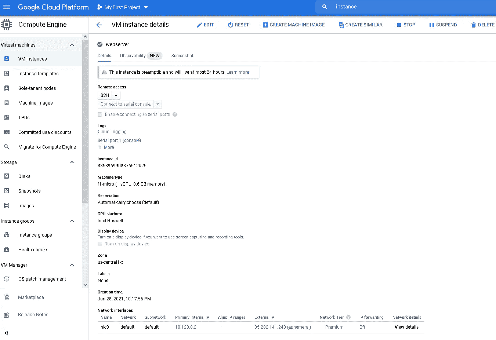
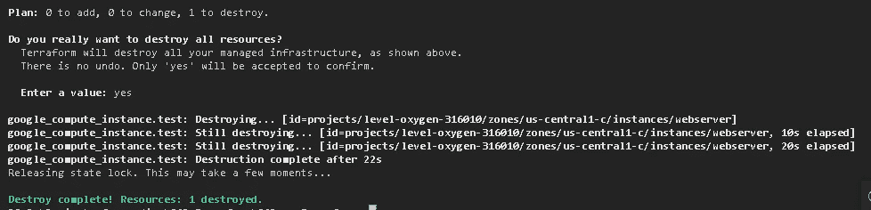

# 在 GCP 使用 Terraform 部署 web 服务器

> 原文：<https://medium.com/geekculture/terraform-on-gcp-creating-a-webserver-762a20bb5424?source=collection_archive---------16----------------------->


Picture by [David Aquino](https://hackersandslackers.com/author/david/)

在这个项目中，我们将学习如何使用 GCP 的 Terraform，但也使用 bash 脚本在实例(f1-micro)上创建一个 Apache 服务器。

本项目中使用的以下产品和服务概述:


> **地形**
> 
> Terraform 是一款开源的云无关基础设施代码工具，提供一致的 CLI 工作流来**管理数百项云供应商特定的服务**。Terraform 将云 API 编码成声明性的配置文件。大多数受欢迎的云提供商，如 GCP|AWS|Azure，都提供了自己版本的基础架构代码工具:

*   云部署经理-GCP
*   云的形成
*   Azure 资源管理器- Azure

> **其好处:**

*   它无缝调配基础架构
*   它可以轻松更新基础设施
*   它毫不费力地摧毁了基础设施
*   它只需点击一个按钮就可以检查代码错误
*   It 部门在部署之前规划好基础架构
*   它跟踪状态文件中的记录

你可以在这里找到所有相关的地形 GCP 模块。

# **第一步:-**

有一些外部包管理器可以用来在 Windows 上安装 Terraform。我最喜欢的是[巧克力](https://chocolatey.org/)。它使得安装、删除和更新软件像一行命令一样简单，Terraform 也不例外。

要用[巧克力](https://adamtheautomator.com/install-chocolatey/)安装 Terraform，执行以下步骤:

1.  以管理员身份打开 CMD/PowerShell 提示符，使用安装页面中的命令安装 Chocolatey。
2.  一旦完成，运行最后的`choco install terraform -y`来自动同意在你的设备上安装它。

该命令运行后，您将得到类似如下的内容:

```
Chocolatey v0.10.13
2 validations performed. 1 success(es), 1 warning(s), and 0 error(s).
Installing the following packages:
terraform
By installing you accept licenses for the packages.
Progress: Downloading terraform 0.12.6... 100%
terraform v0.12.6 [Approved]
Downloading terraform 64 bit from 'https://releases.hashicorp.com/terraform/0.12.6/terraform_0.12.6_windows
Download of terraform_0.12.6_windows_amd64.zip (15.32 MB) completed.
--SNIP--
```

# 第二步:-

我们需要一个 IDE 来编写 GCP 的地形配置和模块。我将使用我最喜欢的 [Visual Studio 代码](https://code.visualstudio.com/download) &打开 Ctrl + ~打开里面的终端，并创建一个名为“GCP 地形”的文件夹

P 先决条件:

*   GCP 服务帐户密钥和路径位置中的文件
*   GCP 项目 ID，可以运行 *gcloud 项目列表*来查找
*   为使用 terraform 构建的资源设置默认区域
*   为使用 terraform 构建的资源设置默认区域

# GCP 服务帐户

我们将需要一个具有**计算管理(角色/计算管理)**权限的 **GCP 服务帐户**，以及位于“GCP 上的地形”文件夹中的服务帐户的 **JSON 文件。**

# Terraform 后端铲斗

我们需要在 GCP 内部创建一个存储桶，以便将其用作远程后端，并在其中存储我们的状态文件。

# 云存储 API 已启用

我们选择我们的根项目，在搜索框中键入**云存储 API** ，并选择**云存储 API &计算引擎 API**



如果 API 被禁用，我们单击**启用**按钮将其启用。

“GCP 的地形”文件夹内:

首先，我们将定义远程后端的配置:

让我们创建`provider.tf`,它帮助您定义您的 terraform 要使用哪个提供程序，我们还将定义默认区域& zone，在我们的示例中，我们添加了以下内容:

我们还需要

这让 Terraform 知道要查询什么资源以及 Terraform 中资源的名称。

**名称**:GCP 境内虚拟机的自定义名称。

**Machine_types** :这基本上是 CPU | RAM & GPU 的组合，帮助我们选择 GCP 上可用的不同类别的实例，完整列表可以在这里[找到](https://cloud.google.com/compute/docs/machine-types)。

**标签:**添加网络标签。

**Boot_disk:** 选择要使用的映像(在我们的例子中，我们将使用缺省值)

**metadata _ startup _ script:**将您的启动脚本添加到自定义安装依赖项中。

调度:因为这将是一个临时的机器，我把它变成了可抢占的。如果您决定这样做，automatic_restart 必须等于 false。

网络接口:这有助于我们定义虚拟机应该使用的网络。

网络:你的虚拟机应该使用什么 VPC。

**access_config** :留空，因为它会自动创建一个外部临时 ip。

# 最后，我们需要一个启动脚本

启动脚本是非常简单的 bash 脚本。它允许实例更新包并安装 Apache Web 服务器，然后我将更改推送到 startup.sh 脚本。完成后，将文件路径添加到 Terraform 配置文件，如上例所示:

# 是时候使用 Terraform 命令部署我们的资源了:

```
$ **terraform init**
```

这将初始化和安装必要的插件，使 terraform 运行。

确保**验证**您目录中所有 terra form**文件的语法**

```
$ **terraform validate**
Success! The configuration is valid.
```

然后，我们将规划我们的 terraform 基础设施，以确保使用此代码部署哪些资源，如下所示:

审查代码后，我们将最终做 terraform 应用-自动批准接受和部署在 GCP 上的上述 terraform 文件中声明的资源。



(可选)通过转到 GCP 控制台进行确认。



# 确认安装了 Apache

导航到“EXTERNAL_IP ”,如果启动脚本成功，您将看到您的 web 服务器！

是时候摧毁我们用以下方式建造的一切了:

```
$ **terraform destroy**
.
.
   Enter a value: yes
```



谢谢你花时间看我的帖子，请鼓掌！如果你喜欢，评论和分享。我是一名 DevOps 爱好者，我练习技能，学习，努力帮助他人，共同成长&你可以关注我:[https://www.linkedin.com/in/mynameisameed/](https://www.linkedin.com/in/mynameisameed/)