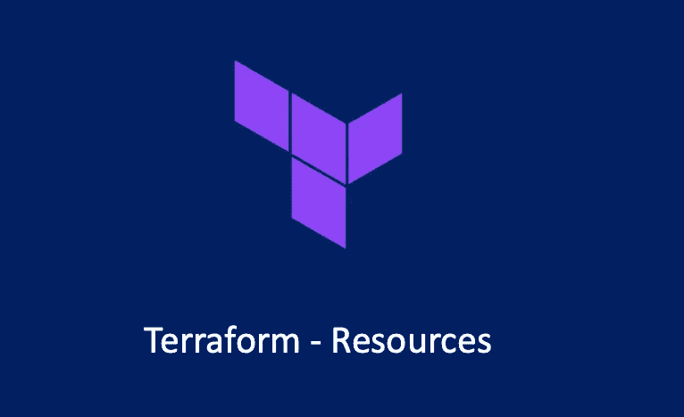

# 地形—资源

> 原文：<https://medium.com/geekculture/terraform-resources-2e174c4bc1ce?source=collection_archive---------2----------------------->

## 地形最重要的部分

在 Terraform 中，资源是 Terraform 最重要的部分。资源由`resource`块定义。资源可以定义一个或多个基础设施资源对象，例如 VPC、虚拟机或 DNS 记录、咨询键值对数据等。

# 资源语法