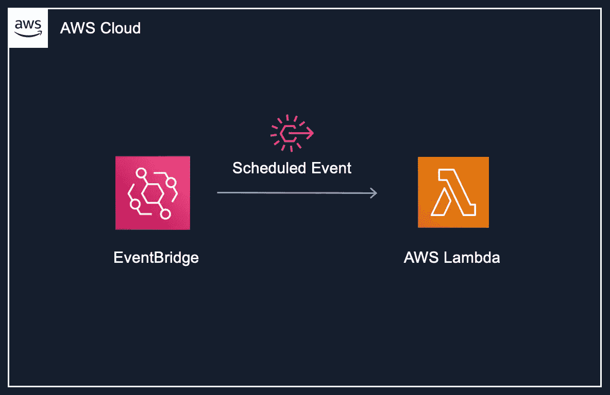

# 预定 Lambda 函数的地形设置

> 原文：<https://medium.com/geekculture/terraform-setup-for-scheduled-lambda-functions-f01931040007?source=collection_archive---------2----------------------->

如果您希望使用 cron 表达式来调度 Lambda 函数，那么您来对地方了！

**模块**

首先，建立一个传递变量的模块，比如 schedule (cron expression)参数。