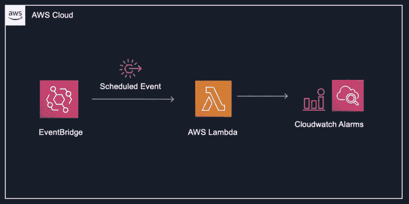

# 用于批量启用/禁用警报的平台结构

> 原文：<https://medium.com/geekculture/terraform-structure-for-enabling-disabling-alarms-in-batches-5c4f165a8db7?source=collection_archive---------5----------------------->

你有没有遇到过想要批量禁用或启用多个 AWS CloudWatch 警报的情况？也许是在计划的维护周期中，也许是在重构架构的某些组件时？

在本文中，让我们讨论如何使用 AWS Lambda 和 Events Bridge 来自动化和安排启用或禁用…