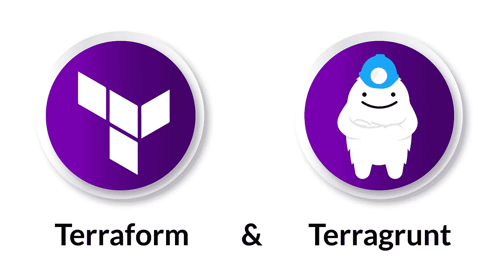

# Terragrunt 备忘单

> 原文：<https://medium.com/geekculture/terragrunt-cheat-sheet-bedafbf9d61f?source=collection_archive---------1----------------------->


Photo by [Abonyi Kevin](https://unsplash.com/@abonyikevin?utm_source=medium&utm_medium=referral) on [Unsplash](https://unsplash.com?utm_source=medium&utm_medium=referral)

这是关于 Terragrunt、Terraspace 以及它们之间的最后一战的三集系列的第二篇文章。

> 第一集:[从 Terralith 到 terra service with terra form](/geekculture/from-terralith-to-terraservice-with-terraform-acf990e65578)
> 第二集:Terrgrunt 小抄(本文)
> 第三集: [Terraspace 小抄](http://bit.ly/3o2DrMV)

今天我将展示一个具有以下特征的 Terragrunt 项目:

*   **多环境**:测试& QA
*   **多账户**:开发和测试的不同账户
*   **多地区**:准备在不同地区之间拆分账户和项目

显然，最后，您应该能够根据您的需要相应地更改需求。

本概述的范围是向您介绍 Terragrunt 背后的核心概念和结构。在我的公共存储库中，我已经添加了一些模块之间的依赖关系。目标是提供类似于真实用例的东西。

> 资源库链接:
> https://bit.ly/3maXDL0



[2]-[3]

# 什么是 Terragrunt？

Terragrunt 是一个基于 Terraform 的框架，带有一些现成的新工具。感谢一些新文件 **。hcl* 和新的关键字，你可以非常容易地跨 terraform 模块共享变量。

# 存储库结构:


Photo by [Külli Kittus](https://unsplash.com/@kyllik?utm_source=medium&utm_medium=referral) on [Unsplash](https://unsplash.com?utm_source=medium&utm_medium=referral)

在这个项目中，我将使用以下代码创建一个 VPC 和一个 EC2 实例:

*   两个有依赖关系的不同模块
*   两个不同的账户
*   两种不同的环境

一个 makefile 来统治他们，一个 makefile 来寻找他们，一个 makefile 来带来他们，并在黑暗中绑定他们。

> 资源库链接:
> https://bit.ly/3maXDL0

```
terragrunt
├── Makefile
├── modules
│   ├── vpc
│   │   ├── main.tf
│   │   ├── output.tf
│   │   ├── variables.tf
│   │   └── versions.tf
│   └── ec2
│       ├── ec2.tf
│       ├── iam.tf
│       ├── output.tf
│       ├── variables.tf
│       └── versions.tf
├── dev_account
│   ├── account.hcl
│   └── eu-central-1
│       ├── test
│       │   ├── vpc-service
│       │   │   └── terragrunt.hcl
│       │   ├── ec2-service
│       │   │   └── terragrunt.hcl
│       │   └── env.hcl
│       └── region.hcl
├── test_account
│   ├── account.hcl
│   └── eu-central-1
│       ├── test
│       │   ├── vpc-service
│       │   │   └── terragrunt.hcl
│       │   ├── ec2-service
│       │   │   └── terragrunt.hcl
│       │   └── env.hcl
│       ├── qa
│       │   ├── vpc-service
│       │   │   └── terragrunt.hcl
│       │   ├── ec2-service
│       │   │   └── terragrunt.hcl
│       │   └── env.hcl
│       └── region.hcl
└── config.hcl
```

第一个文件夹是“*模块”*，有两个子文件夹:

*   “vpc”:用于创建 VPC 的 AWS 模块
*   “ec2”:用于创建 EC2 实例的模块

对于每个帐户，您有这样的结构:

*   " *dev_account"* :包含所有属于同一个账户的东西。
*   " *eu-central-1"* :我们希望按服务部署一些模块的区域。
*   "*测试*":在明确定义的区域中定义的环境。

和两项服务:

*   "*VPC-service*":VPC 模块。
*   " *ec2-service* ":指的是" ec2 "模块，它依赖于" *vpc-service* " *。*

*注:**test _ account】*中有相同的结构，有两个环境“test”和“qa”。

如果您想要扩展文件夹树，您需要复制和粘贴或创建一个具有相同逻辑的新文件夹，并检查文件。

## 那 **呢。hcl* 文件？

它们的主要部分用于定义不同深度级别的变量。例如，如果你想为一个给定的区域创建一些特定的变量，你可以把它们添加到" *region.hcl"* 文件中，然后你就可以引用你的服务，作为被调用模块的输入变量。

**的简要描述。hcl"* 文件:

*   config.hcl :它定义了必须如何创建 TF 后端和 TFstate。该文件由多个帐户共享。
*   *account.hcl* :账户特定的变量。例如帐户 id
*   *region.hcl* :区域特定的变量。例如，一些定制标签
*   *env.hcl* :环境的特定变量，例如我们希望所有服务都包含的 ec2 实例的类型

**那些 **的范围***。hcl" 文件只需**写一次，就可以在不同的服务中重用**。

为了运行所有命令，GitHub repo 中存在一个 Makefile 来简化管道中的采用。你可以很容易地扩展它，或者创建一个全新的 bash 脚本！

# 利弊:


Photo by [Martin Sanchez](https://unsplash.com/@martinsanchez?utm_source=medium&utm_medium=referral) on [Unsplash](https://unsplash.com?utm_source=medium&utm_medium=referral)

**++强项:**

*   使用 *dependency* 关键字在不同服务之间轻松共享变量(ec2-service 使用 vpc-service 的输出变量)
*   您使用自定义关键字 *locals* 共享和使用变量
*   更有结构，我喜欢！
*   自动为每个服务生成不同的 TFState
*   多人能够在不同的环境中工作，而不会因为合并冲突而头疼

**— —弱点:**

*   对我来说最重要的是，你不能从一个服务中引用多个模块。相反，您需要创建一个新的模块，包含所有的资源和对其他模块的引用。对我来说，这个选择**很有意义**，因为它迫使你避免架构错误。
*   你重复多次 **。hcl* 文件，如果你需要添加更多的复杂性水平缩放(环境-区域-帐户)。
*   你结构很好，但也是**要求**。
*   要计划/应用所有服务，您需要走在正确的道路上。如果您想要应用" *eu-central-1"* 中的所有服务，您只需在运行 terragrunt 命令之后，就可以移动到那里。

> 资源库链接:
> https://bit.ly/3maXDL0

在这个报告[1]中，你可以看到一个**模块版本**的例子。


Photo by [Daniel Cheung](https://unsplash.com/@danielkcheung?utm_source=medium&utm_medium=referral) on [Unsplash](https://unsplash.com?utm_source=medium&utm_medium=referral)

在下一集(*2021 年 10 月第二周*)将会有与 **Terraspace** 相同的项目，我也会发布他们之间的**决战**！


> [关注我](https://pie-r.medium.com/)和[订阅](https://pie-r.medium.com/subscribe)来获取这个系列和下一个系列的更新！

# 参考资料:

*   [1]查看如何使用 terragrunt 管理版本化模块的示例:
    [https://github . com/grunt work-io/terra grunt-infra structure-live-example](https://github.com/gruntwork-io/terragrunt-infrastructure-live-example)
*   [2]官方 doc 网站:[https://terragrunt.gruntwork.io/](https://terragrunt.gruntwork.io/)
*   [3]特拉格朗特:[https://github.com/gruntwork-io/terragrunt](https://github.com/gruntwork-io/terragrunt)