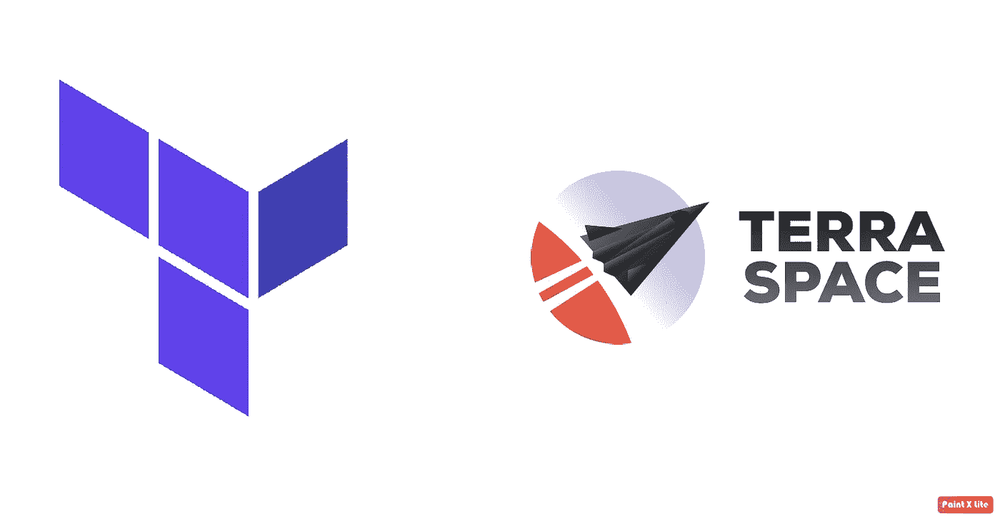

# 地球空间备忘单

> 原文：<https://medium.com/geekculture/terraspace-cheat-sheet-388dae8b0203?source=collection_archive---------5----------------------->

这是关于 Terragrunt 和 Terraspace 的三集系列的最后一篇文章。

为了真正比较这两个框架，在这篇博文中，有多个部分摘自《Terragrunt》第二集。

> *第 1 集:* [*从 Terralith 到 Terraservice with terra form*](/geekculture/from-terralith-to-terraservice-with-terraform-acf990e65578) *第 2 集:* [*Terragrunt 备忘单*](http://bit.ly/2YfWRED) *第 3 集:Terraspace 备忘单(本文)*


今天我将展示一个具有以下特征的 Terraspace 项目:

*   **多环境**:每个单个账户的 QA 和测试
*   **多账户**:不同账户测试开发
*   **多地区**:准备在不同地区之间拆分账户和项目

显然，最后，您应该能够根据您的需要相应地更改需求。

本概述的范围是向您介绍 Terraspace 背后的核心概念和结构。在我的公共存储库中，我已经添加了一些模块间的依赖关系。目标是提供类似于真实用例的东西。

> *资源库链接:* 本文底部。



[1]-[2]

# 什么是 Terraspace？

Terraspace 允许保持您的代码干燥，编写简单的 terraform 文件，但提供了额外的功能来降低管理多个状态文件的复杂性。

# 存储库结构:


Photo by [Joel & Jasmin Førestbird](https://unsplash.com/@theforestbirds?utm_source=medium&utm_medium=referral) on [Unsplash](https://unsplash.com?utm_source=medium&utm_medium=referral)

在这个项目中，我将使用以下代码创建一个 VPC 和一个 EC2 实例:

*   两个具有依赖关系的不同模块`[vpc, ec2]`
*   两个不同的账户`[Test, Dev]`
*   每个账户两种不同的环境`[QA, TEST]`

一个 **makefile** 来统治它们，一个 makefile 来寻找它们，一个 makefile 来带来它们，并在黑暗中绑定它们。

```
terraspace
 ├── Makefile
 └── infrastructure
    ├── Gemfile
    ├── Gemfile.lock
    ├── README.md
    ├── Terrafile
    ├── app
    │   ├── modules
    │   │   ├── ec2
    │   │   │   ├── ec2.tf
    │   │   │   ├── variables.tf
    │   │   │   └── versions.tf
    │   │   └── vpc
    │   │       ├── main.tf
    │   │       ├── output.tf
    │   │       ├── variables.tf
    │   │       └── versions.tf
    │   └── stacks
    │       ├── ec2-service
    │       │   ├── main.tf
    │       │   ├── tfvars
    |       |   |   └── eu-central-1
    │       │   │       ├── base.tfvars
    │       │   │       ├── qa.tfvars
    │       │   │       └── test.tfvars
    │       │   └── variables.tf
    │       └── vpc-service
    │           ├── main.tf
    │           ├── output.tf
    │           ├── tfvars
    |           |   └── eu-central-1
    │           │       ├── qa.tfvars
    │           │       └── test.tfvars
    │           └── variables.tf
    └── config
        ├── app.rb
        ├── args
        │   └── terraform.rb 
        └── terraform
            ├── backend.tf
            ├── provider.tf
            └── tfvars
                └── eu-central-1
                    ├── base.tfvars
                    ├── qa.tfvars
                    └── test.tfvars
```

让我们从 ***app*** 文件夹开始，在这里我们可以识别 ***模块*** 和 ***栈*** 。

在 ***模块*** 中，我们将所有我们想要跨不同服务重用的代码，比如“vpc”和“ec2”。

在 ***栈中*** *相反，*有两个子文件夹:

*   “ *vpc-service* ”:指“vpc”模块。它用于创建网络，我们将在该网络中创建 ec2 实例。
*   " *ec2-service* ":指“ec2”模块，它依赖于" *vpc-service* " *。您需要一个 VPC 来创建实例。*
*   在*“x-service”*中都有一个文件夹`tfvars`。在其中，我们放入变量来配置两个环境之间的差异。

***配置*** 文件夹有点复杂:

```
infrastructure
  └── config
        ├── app.rb
        ├── args
        │   └── terraform.rb 
        └── terraform
            ├── backend.tf
            ├── provider.tf
            └── tfvars
                └── eu-central-1
                    ├── base.tfvars
                    ├── qa.tfvars
                    └── test.tfvars
```

*   *args* :包含了 terraspace 将要通过@ *terraform* 的一些标志，类似于`*-lock-timeout=20m*`*[官方文档此处](https://terraspace.cloud/docs/config/args/terraform/)*
*   **app.rb* :我不使用，但是它允许配置测试和记录器【此处[官方文档](https://terraspace.cloud/docs/config/app/)*
*   **terra form/back end . TF&provider . TF*:我们将存储状态文件的后端配置。一次编写，多次重用是这里的规则。*
*   **terra form/TF vars/eu-central-1*:terra space 考虑的环境变量。在 Makefile 中，我们定义了`TS_ENV`来控制将哪个特定于 env 的 tfvars 文件放在`base.tfvars`之上。*

***Terrafile** 是一个在你的存储库中提供一致性的文件。为了解释它，我们需要一个专门的段落。
正式结构文件，此处参照。*

# *我们如何解决**3“多”模式？***

*   ***多环境**:每个环境都有不同的`env_xx.tfvar`，我们选择正确的文件设置这个由 terraspace 解释的环境变量`TS_ENV=qa`。*
*   ***多账户**:选择修正后的环境变量，到达期望的账户。在“Makefile”中完成。*
*   ***多地区**:准备在不同地区之间拆分账户和项目。你需要复制并重命名所有的文件夹，目前指的是“欧盟-中央-1”*

> *多环境功能是如何工作的？*

> *TS _ ENV = " qa 神奇之处就在这里..*

*使用这种语法，我们将配置`terraspace`来合并文件夹`terraspace/infrastructure/app/stacks/ec2-service/tfvars`中的两个文件。这个特性也称为`terraspace layering:`*

1.  *`base.tfvars`*
2.  *`qa.tfvars`*

*您想以不同的方式配置`test`环境吗？*

*只需导出将合并的`TS_ENV=”test”`:*

1.  *`base.tfvars`*
2.  *`test.tfvar`*

*这种机制适用于任何地方，也适用于所有模块共享的`tfvars`，这里定义了`terraspace/infrastructure/config/terraform/tfvars`*

# *模块…..斯塔克斯呢。*

*区别只是在你的设计上，两者都可能是 terraform 模块！*

*   **模块:*它们更接近 terraform 模块的意思。它们是一组应该生活在一起的资源。注册中心及其生命周期策略就是一个例子。当您需要某些东西时，可以定义一个模块，在 IaC 存储库的不同部分共享。*
*   **栈:*这里有你的业务逻辑。你使用哪种方法？每个云提供商资源一个组？一个例子可能是所有的数据库实例，或者您的观点停留在产品层面？这里您指的是上面的*模块*。*

# *Terrafile*

*`terrafile`是一个简化第二天操作的工具，它提供了一个集中的地方，在这里你可以定义你的所有版本和你的项目中使用的模块的定义。不一定要用，*但是要*！*

*而且，你知道一个`lockfile` 的作用是什么吗？它存在于 python，GoLang，node.js，以及编程语言的主要部分 terraspace 也有！这是一种跨不同角色(如团队和 CI/CD)加强模块内聚性的机制，以避免模块内依赖性的不一致性。*

*为了运行所有命令，GitHub repo 中存在一个 Makefile 来简化管道中的采用。README 中的更多细节
您可以轻松地扩展它，或者创建一个全新的 bash 脚本！*

> *【https://bit.ly/3maXDL0】资源库链接:
> [](https://bit.ly/3maXDL0)*

# **利弊:**

****

****++强项:****

*   **部署一切(但是你应该有足够的技术来管理所有的依赖项，或者部署单个堆栈及其所有的依赖项:[https://terraspace.cloud/docs/intro/deploy-all/](https://terraspace.cloud/docs/intro/deploy-all/)**
*   **您可以使用以下语法在`stacks`之间共享变量:**

```
**<%= output('vpc-service.vpc_service_vpc_public_subnets') %>**
```

*   **语法是标准的 TF，不需要学习新的语言(可能是 Ruby？).但是 terraspace 给出了一些新的命令。**
*   **你是干的，但是有个缺点，见下文！**
*   **自动为每个堆栈生成不同的 TFState。**
*   **您可以随时引用外部模块。**
*   **使用`TF_ENV`和分层管理不同的环境。**

```
**TS_ENV=dev  terraspace up vpc
TS_ENV=prod terraspace up vpc**
```

****— —弱点:****

*   **TFVARS 堆栈中的分层。这是香草地形所缺少的特征。有意识地使用它，它可能会变成一个**套娃**。**
*   **干的后果:如果你在一个栈中对`main.tf`做了一个改变，那么如果你不小心的话，它将被应用到所有的环境中。您使用 tfvars 而不是 tf 文件来管理环境。**
*   **你必须使用 terraspace 语法。无法逃避。*不知道是不是真理的弱点。你选择 terraspace，而不是相反。***
*   **你需要 RubyGems 来使用它。**

> ***资源库链接:* [*https://bit.ly/3maXDL0*](https://bit.ly/3maXDL0)**

********

> **[关注我](https://pie-r.medium.com/)和[订阅](https://pie-r.medium.com/subscribe)获取本系列和下一系列的更新！**

# **参考资料:**

*   **[1]官方 doc 网站:[https://terraspace.cloud/](https://terraspace.cloud/)**
*   **[2]地球空间:[https://github.com/boltops-tools/terraspace](https://github.com/boltops-tools/terraspace)**