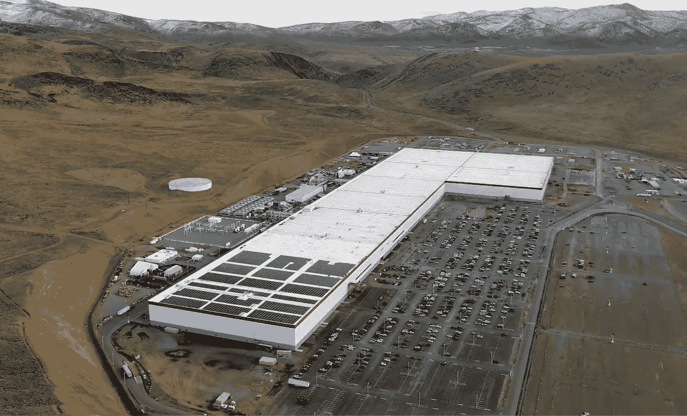

# 特斯拉 Gigafactory 1 是建筑的未来

> 原文：<https://medium.com/geekculture/tesla-gigafactory-1-as-the-future-of-construction-bcca1f0a0062?source=collection_archive---------0----------------------->

## 在埃隆·马斯克和特斯拉看来，建筑业的未来是什么样的？如果你在建筑行业工作，你应该担心吗？是啊！

Photo by [Wikimedia Commons](https://upload.wikimedia.org/wikipedia/commons/8/8d/Tesla_Gigafactory_1_-_December_2019.jpg)

建筑业名声不佳。相对于其他行业，生产率很低，而且还在下降。新技术是慢慢吸收的。成本反而在上升…