# 使用 Graphite Note 通过机器学习预测特斯拉股价

> 原文：<https://medium.com/geekculture/tesla-stock-price-prediction-with-machine-learning-using-graphite-note-5e5522769509?source=collection_archive---------19----------------------->

## 在这个时间点上，我相信这篇文章的所有读者都知道谁是[特斯拉——那个人](https://en.wikipedia.org/wiki/Nikola_Tesla)，发明者——以及谁是[特斯拉——公司](https://www.tesla.com/)。在这里，我们将重点关注公司。更准确地说，在特斯拉股价预测(TSLA)上，通过使用 Graphite Note 及其时间序列无代码机器学习模型。

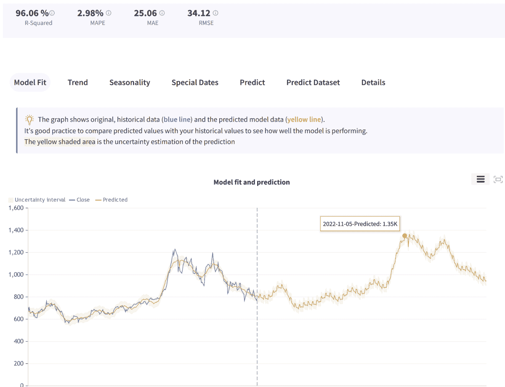

Image by the author: TSLA stock price prediction

特斯拉的使命是加速世界向可持续能源的过渡。它是由一群工程师在 2003 年创建的。他们想证明人们驾驶电动汽车不需要妥协。也就是说，电动汽车比汽油或柴油汽车更好，更快，驾驶起来也更有趣。

# 资料组

我们的目标是根据历史数据预测未来的股票价格。从公开渠道获取历史价格很容易。我们从雅虎获取了过去 365 天的数据。金融。

以下是历史数据:

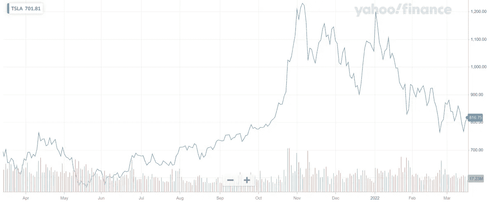

Image source: Yahoo! finance

我们可以清楚地看到，从 2021 年 3 月到 9 月，股票价格在 600-800 之间上下波动，从 2020 年 10 月开始呈急剧上升趋势。

让我们用这个数据集来预测未来 365 天的股价。我们将从上传数据集到 Graphite Note 开始。

只需点击几下鼠标，我们就可以导入并解析之前从 Yahoo！金融。这些是数据集列:

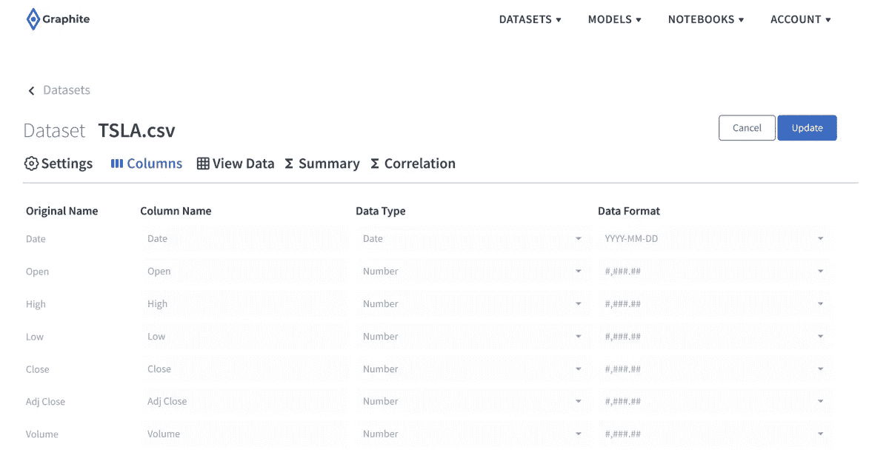

Image by the author: dataset columns

在“查看数据”选项卡上，我们可以浏览数据集行、过滤或搜索。我们有 7 列 254 行。由于我们下载了 365 天，很明显数据集中缺少一些日期。Graphite 的时间序列模型在某种程度上可以很好地处理缺失的日期。

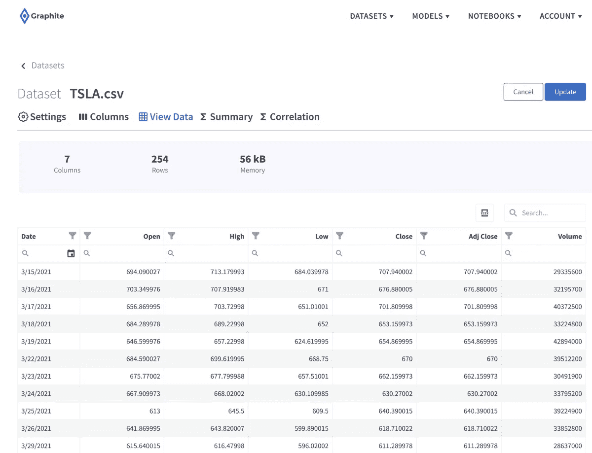

Image by the author: dataset rows

每个上传的数据集都会有一个实用的摘要选项卡。它可以让您一目了然地检查数字列的分布、空值的数量以及不同的统计度量。例如，我们可以发现，对于收盘价(收盘列)，大多数日期(55 个日期)属于值从 630 到 697 的仓位。

我们将使用收盘柱进行预测。这是当天收盘时记录的最后交易价格。

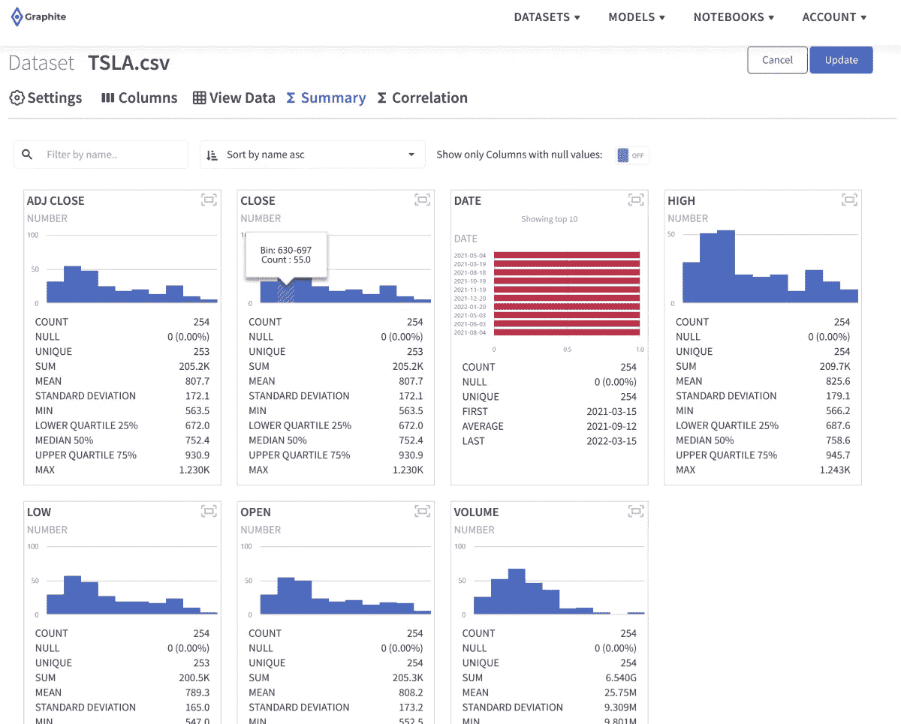

Image by the author: dataset summary

# 时间序列预测

预测股票价格对于金融时间序列分析来说都是机器学习的一个很好的用例。你可以在这里阅读更多关于[时间序列预测](https://graphite-note.com/time-series-forecasting-methods)。简而言之，时间序列预测是在未来趋势与历史趋势相似的假设下，查看一段时间内记录的数据，以预测或预测下一个时间段可能发生的事情。

也就是说，不要把这里的结果作为财务建议。这个练习应该仅用于演示无代码机器学习预测时间序列数据集的能力。机器学习模型只能“学习”我们喂给它们的东西——在这种情况下，这是一种历史模式。

# 石墨的时间序列预测

现在我们已经准备好了数据集，我们准备在 Graphite 中创建一个无代码的机器学习模型。我们选择了时间序列预测模型:

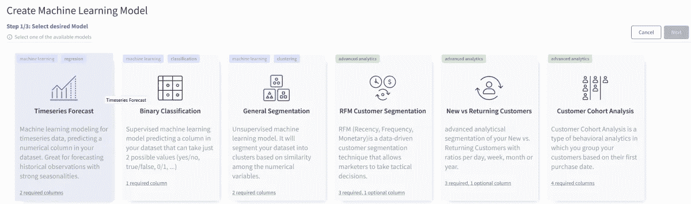

Image by the author: Graphite Note Models

在 Graphite 中，要构建一个时间序列模型，您只需要 2 列

*   目标列(我们预测什么？)
*   日期栏(包含日期、周、月等)

仅此而已。

点击几下鼠标，我们将定义一个模型场景。

我们数据集中的**目标列**和数据集中的**日期列**，期望的预测跨度为 365 天:

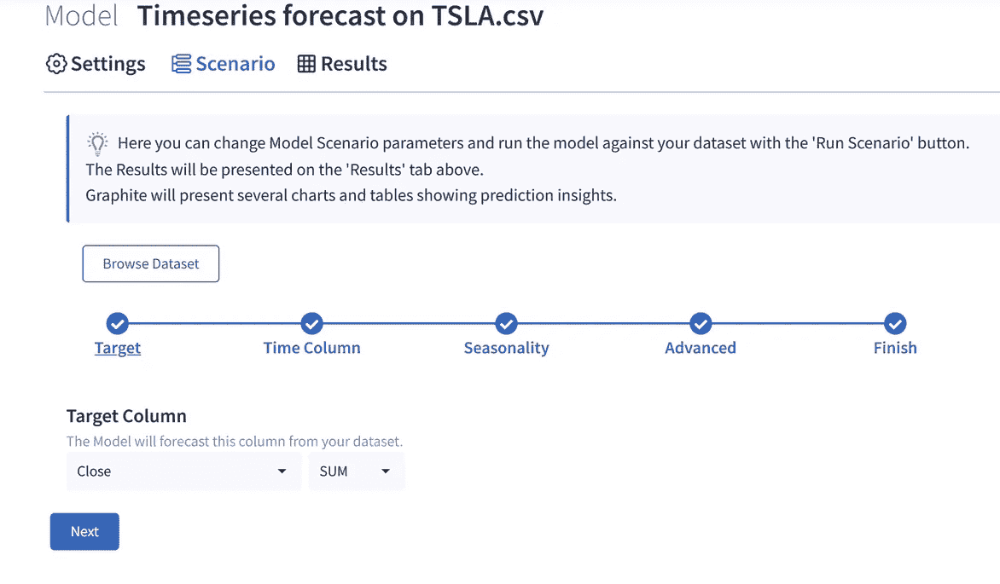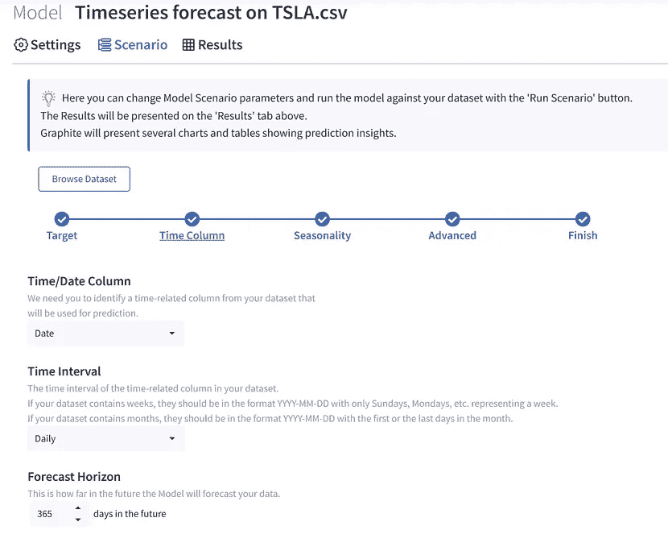

Image by the author: mapping the columns from the dataset

# 运行模型—特斯拉股价预测

我们将默认保留所有其他选项，并运行此场景。Graphite 将抽取我们 80%的数据样本，训练几个机器学习模型。然后，它将在剩余的 20%上测试这些模型，并计算相关的模型分数。关于最终最佳模型拟合、季节性、趋势、结果和预测的详细信息将在结果选项卡上提供。

几秒钟后，我们有了结果。在模型拟合选项卡上，Graphite 将以蓝色显示历史数据，以黄色显示预测数据。我们对未来 365 天的预测已经准备就绪。例如，Graphite 预测 2022–11–05 的价格为 **1.35k。**

Image by the author: Tesla stock price prediction

现在，我们可以检查进一步的分析，以尝试更好地理解模型和模型拟合。在数据中检测到明显的全球上升趋势，关于最小和最大数据点的详细信息如下:

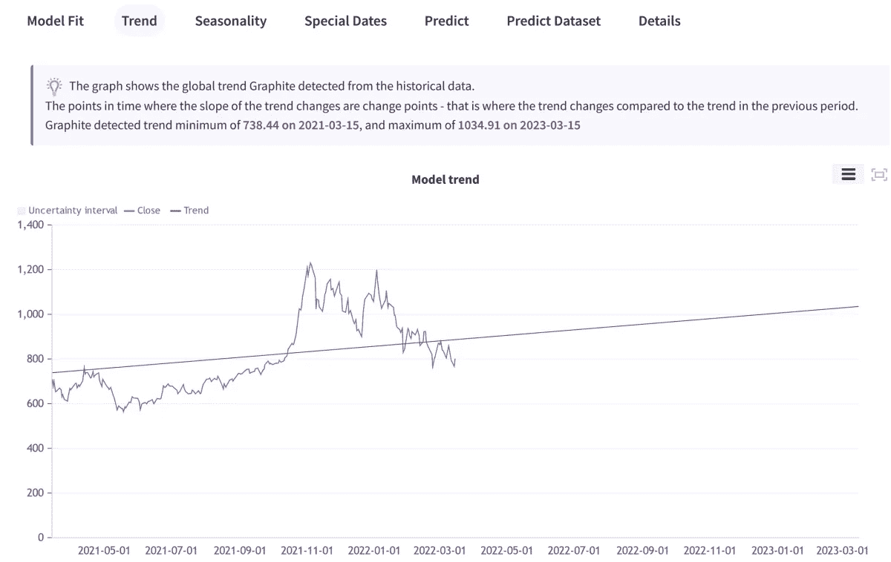

Image by the author: the general trend in data

观察历史数据中发现的季节性总是很有趣的。例如，这种信息在电子商务和零售中非常有价值。

在我们的例子中，检测到 2 种季节性模式——每周和每年的季节性。基于对 TSLA 股票价格的过去 365 天训练模型，最高收盘价出现在周六和周日，最低收盘价出现在周五。

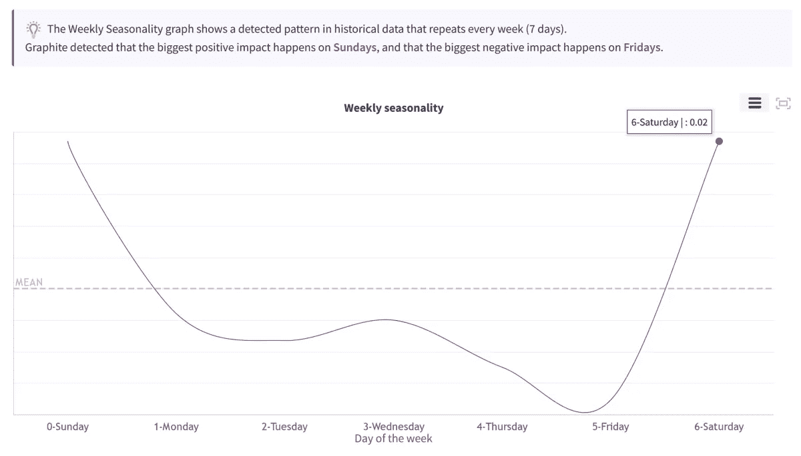

Image by the author: weekly seasonality

此外，就年度季节性而言，11 月份的价格似乎最高。但是请记住，我们只有 1 年的数据，所以这不是一条非常可靠的信息。如果我们根据 5、6 年的数据训练模型，那么每年的季节性会有更大的权重。

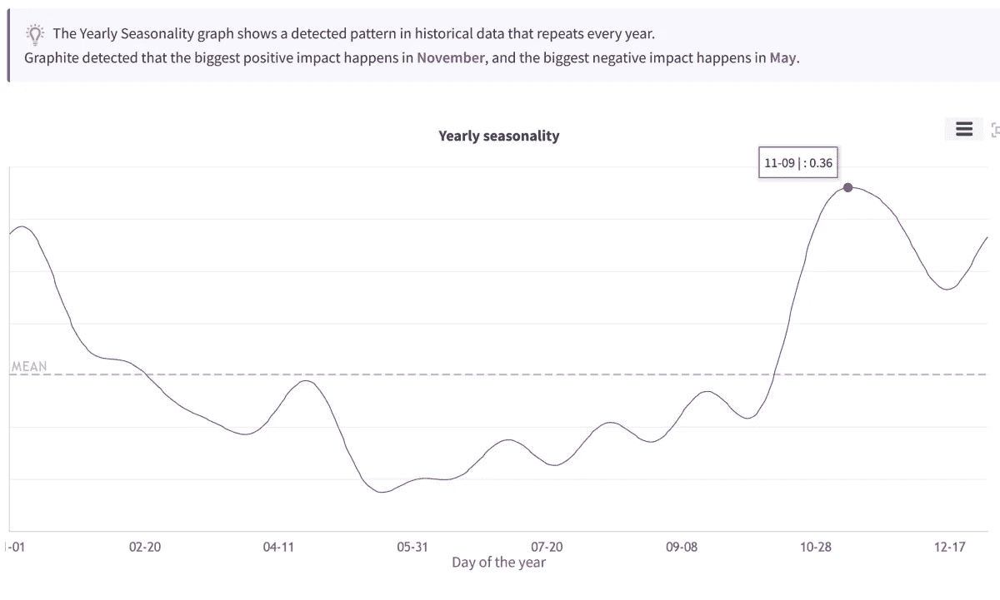

Image by the author: yearly seasonality

石墨公司还试图检测美国假期是否与价格上涨或下跌有任何关联。11 月 11 日(退伍军人节)，它检测到价格受到更大的负面影响，这可能是一个有趣的信息。

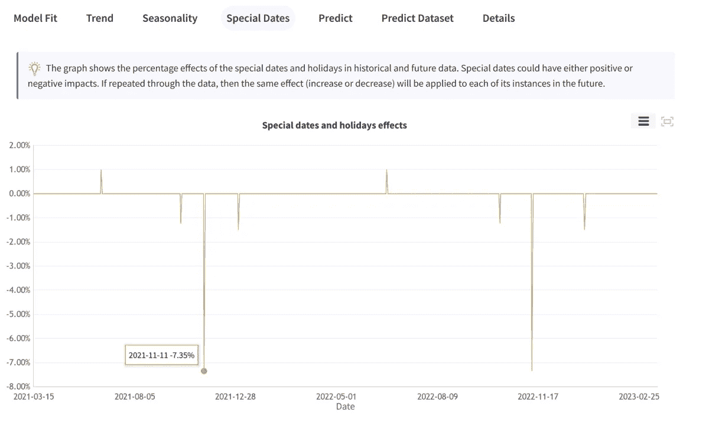

Image by the author: holiday effects

# 结论

我希望这有助于您理解在 Graphite Note 这样的无代码机器学习软件中训练模型是多么容易。只需点击几下鼠标，我们就能预测股票价格，并分析数据中的季节性、趋势和模式。

你可以在这里探索所有其他的[模型。](https://graphite-note.com/machine-learning-automl-models)在任何数据集上随意训练自己的机器学习模型，同样轻松。

希望你们喜欢！

*原载于 2022 年 3 月 16 日*[*【https://graphite-note.com】*](https://graphite-note.com/tesla-stock-price-prediction-using-graphite-note)*。*