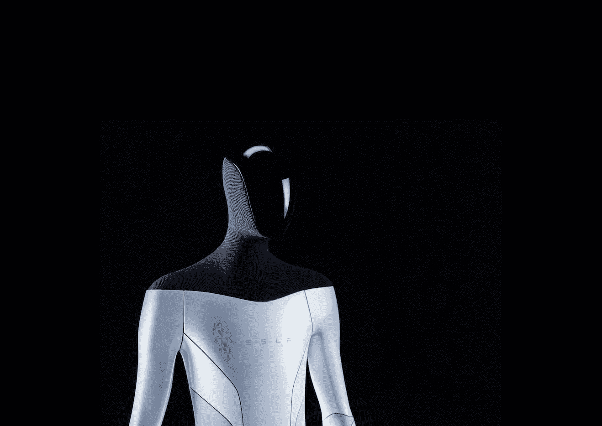
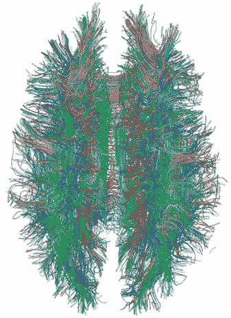
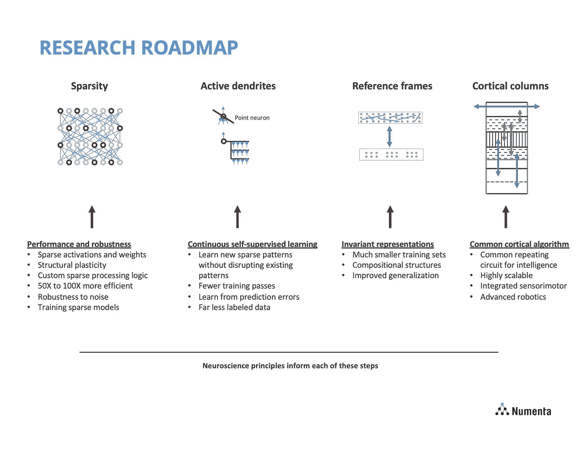
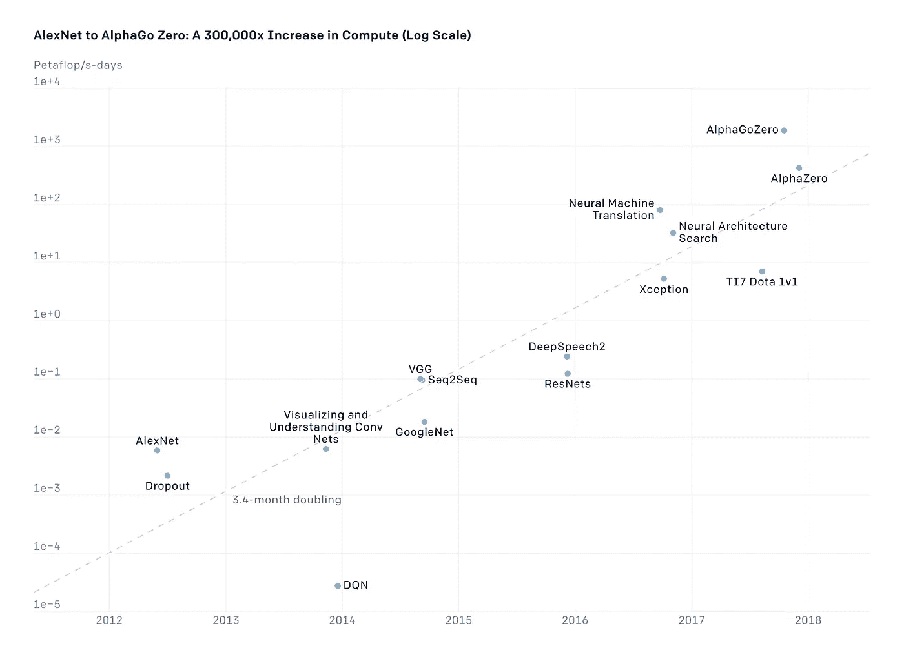

# 特斯拉的王牌:6 万名全自动驾驶测试版测试人员

> 原文：<https://medium.com/geekculture/teslas-ace-in-the-hole-60-000-full-self-driving-beta-testers-b40bf52734be?source=collection_archive---------9----------------------->

## 人工智能机器人时代来临

Courtesy of Tesla

解决了所有关于其数据收集工作质量与 Waymo 和 Cruise 等竞争对手不相上下的质疑，特斯拉在其[季度收益信](https://tesla-cdn.thron.com/delivery/public/document/tesla/99573663-409d-442d-b1f6-50bfc75cb41c/S1dbei4/WEB/tsla-q4-and-fy-2021-update)中宣布，6 万人正在测试其完全自动驾驶(FSD)测试版软件。FSD beta 测试人员的工作与 Waymo 或 Cruise 员工测试自动驾驶汽车软件的工作相同，但特斯拉的客户为这一特权付费。FSD beta 测试包括通过各种复杂的数据管理方法自动收集数据和手动收集数据；测试人员可以按下触摸屏上的按钮，手动标记他们驱动器的一个片段，供特斯拉检查。

将特斯拉的数据收集量与 Waymo 和 Cruise 进行比较的一个公平方法是将其 beta 测试者的数量除以 10。普通美国人每天只开大约一小时的车[,而一辆 Cruise 或 Waymo 汽车每天可能要开 10 个小时左右。因此，特斯拉的 FSD beta 测试人员提供了相当于 6000 辆测试车辆的数量，这恰好是 Waymo 披露的](https://www.volpe.dot.gov/news/how-much-time-do-americans-spend-behind-wheel)[最新数字](https://techcrunch.com/2020/10/08/waymo-starts-to-open-driverless-ride-hailing-service-to-the-public/)的十倍。特斯拉从未透露过它在内部运营了多少辆 FSD 测试车(但它透露过它确实在进行内部测试)。

我[一直认为](https://strangecosmos.substack.com/p/why-im-becoming-more-bullish-on-self)特斯拉的被动和主动数据收集工作，也就是说，当 Autopilot 或 FSD beta 投入使用或脱离使用时，对 FSD 的开发非常有用。这一最新的披露应该会平息这场争论。特斯拉的 FSD beta 计划不仅比其最大的竞争对手 Waymo 的测试计划更大，它在美国土地上进行的测试也比所有其他自动测试车辆更多，截至 2019 年年中[共有 1400 辆。](https://techcrunch.com/2019/06/11/over-1400-self-driving-vehicles-are-now-in-testing-by-80-companies-across-the-u-s/)

这非常接近于直接的比较。特斯拉 FSD beta 测试人员所做的事情与 Waymo 或 Cruise 测试驾驶员所做的事情本质上是一样的。当汽车以自动模式行驶时，他们仔细观察汽车。他们谨慎地进行干预。有时，他们会手动标记驱动器的某个部分，以便进行手动检查。

从商业角度来看，这意味着什么？自动驾驶技术可以通过两种不同的方式为特斯拉的收入、利润和现金流做出贡献:

**1)** 部分自动驾驶。自动驾驶是最著名的例子。这采取软件加载项或软件订阅的形式。

**2)** 完全自主驾驶，即 robotaxis。如果这个技术难题被破解，特斯拉制造的大多数汽车将归特斯拉所有，并作为完全自动驾驶的出租车运营，通常被称为 robotaxis。

我不同意(我所认为的)关于特斯拉部分自主和完全自主的共识。具体来说，我认为部分自动驾驶比大多数人通常想象的更有未来的技术潜力和作为消费品的潜力。(一个例外是派珀·桑德勒的《T4》中的亚历克斯·波特。)关于机器人轴，我认为:

它们在不太遥远的未来比大多数人认为的更有可能实现，

到目前为止，特斯拉是最有优势的公司来开发和商业化它们

有一个显而易见的财务案例，robotaxis 将会非常有利可图。

# 回应对自动驾驶技术的质疑

我已经提到了特斯拉的生产车队通过自动和手动数据收集来发挥优势的方式。我该如何回应对自动驾驶技术的普遍质疑？这要求我钻研技术细节。我希望以一种广为接受的方式这样做。简而言之，深度学习或深度神经网络有四个趋势，我个人认为(并不只是我一个人相信),这对人工智能的发展大有希望:

**1)** 自我监督学习取代监督学习

**2)** 稀疏神经网络取代密集神经网络

**3)** “厚”人工神经元取代“薄”人工神经元(我自己的术语)

**4)** 随着可获得的、可负担的计算资源的增加，神经网络变得更大

我将在下面解释这些:

**1。**监督学习是最常见的深度学习形式。这可能意味着一个专业的贴标签机坐在桌子前，用鼠标在图像中对应不同对象类型的区域涂色:道路、车辆、行人、人行道、树木、天空等等。

An example of semantic segmentation, in which areas of an image are coloured by object category. Source: [Nesti, Rossolini, et al., 2022](https://openaccess.thecvf.com/content/WACV2022/papers/Nesti_Evaluating_the_Robustness_of_Semantic_Segmentation_for_Autonomous_Driving_Against_WACV_2022_paper.pdf).

在自我监督的学习范式中，人工智能研究人员或工程师可能会从神经网络中隐藏一半图像，并要求它从看到的一半图像中生成缺失的一半。这是一种深度学习的形式，其中训练信号来自数据本身，不需要任何人工劳动。没有人类劳动的约束，天空就是极限。(对于那些好奇的人，我推荐听听关于这个话题的 [Yann LeCun](https://www.youtube.com/watch?v=SGzMElJ11Cc) 。)

**2。**在人类大脑中，一个神经元的变化只会影响大脑中其他神经元的极小一部分。这种特性被称为稀疏性。

在广泛使用的人工神经网络中，对单个神经元的改变在整个网络中级联，改变许多其他神经元的权重，即人工神经元乘以其输入并随后传递到网络中的下一个神经元作为其输入的数字。这种特性被称为密度。

越来越多的人工智能研究人员认为，人工神经网络的发展方向是模仿人脑的稀疏性。一些早期的概念证明支持这个观点。

White mater connections in the human brain. Source: [Wikipedia](https://commons.wikimedia.org/wiki/File:White_Matter_Connections_Obtained_with_MRI_Tractography.png).

**3。人工神经网络和人脑之间的另一个主要不同之处是，尽管生物神经元是复杂的微型计算机，但最常见的人工神经元形式，称为点神经元，是非常简单的实体，正如我在上面提到的，本质上只是执行乘法。**

对大脑模拟感兴趣的神经科学研究人员[批评](https://spectrum.ieee.org/blue-brain-project-leader-angry-about-cat-brain)点神经元是一种过于简单的数学抽象，与大脑中的真实神经元几乎没有相似之处。这种神经元我称之为“薄”神经元。

这种事态已经促使一些人工智能研究人员试图开发内部更复杂的(因此计算强度更大)软件。我给这些“厚”神经元起了个绰号。有些，像 Numenta 的[主动树突](https://numenta.com/blog/2021/11/08/can-active-dendrites-mitigate-catastrophic-forgetting)，试图从生物学角度来看是真实的。其他的，像 Geoffrey Hinton 的[胶囊](https://numenta.com/blog/2017/12/18/comparing-capsules-with-htm/)，则没有。

Courtesy of [Numenta](https://numenta.com/)

**4。**推动深度学习的一个可靠的历史弧线是性价比的指数级增长以及 GPU 和神经网络专用处理器的小型化。这种指数趋势将继续下去，以便我们拥有能够运行类似数量的“厚”神经元的自主车辆，比如说，在猫的大脑中发现的神经元。

Courtesy of [OpenAI](https://openai.com/blog/ai-and-compute/)

结合自我监督学习、稀疏网络、“厚”神经元和更大的网络。在那里，你有一个范例性的改变和人工智能能力的彻底提升。

特斯拉处于人工智能硬件和软件的前沿。它继续开发自己的神经网络专用处理器，旨在为自己提供比从 GPU 市场领导者英伟达购买更好的产品。特斯拉越来越多地将自我监督学习集成到其人工智能堆栈中。

稀疏神经网络和“厚”神经元仍处于早期概念验证阶段。他们还没有为黄金时间做好准备。然而，有时深度学习的研究进展惊人地快。我个人对自我监督学习从学术讲座的主题到部分自动驾驶汽车的工程实现的速度感到惊讶。在讨论 robotaxis 的长期可行性时，我们必须记住，人工智能研究人员正在致力于对深度神经网络的原子单位神经元以及神经元连接方式(稀疏与密集)的根本改进。

# 结论

如果你相信 robotaxis 的可行性，或者高度复杂的部分自主软件的最终市场，那么你应该毫不含糊地相信特斯拉在该领域的技术领先地位。

如果你怀疑这项技术还有很大的发展空间，那么我就很难说服你，事实上，关于机器人轴，我对自己是对的没有信心。

然而，当谈到部分自主时，我不禁认为特斯拉在某种程度上的成功几乎是肯定的。我认为这一点目前还没有反映在股价中。

***披露:*** *我是龙斯拉。/* ***免责声明:*** *这不是投资建议。/* ***鸣谢:*** *本文标题是对 Scott Ritcey 的一篇* [*2017 文章*](https://seekingalpha.com/article/4034013-teslas-ace-in-hole-1_3-billion-miles-of-data-and-counting) *。谢谢斯科特。*