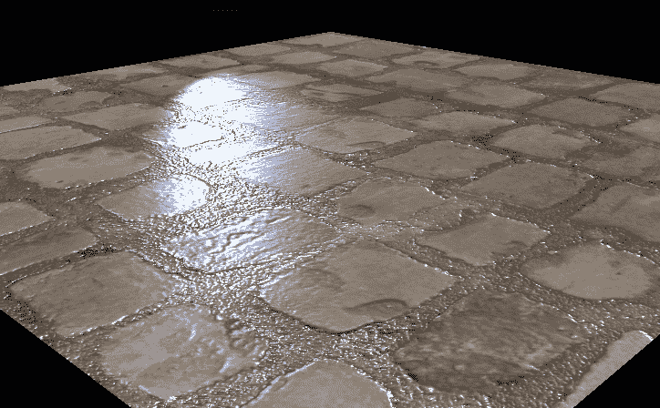
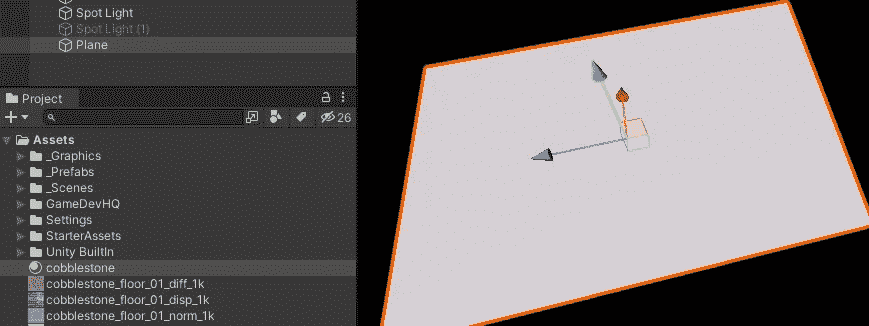
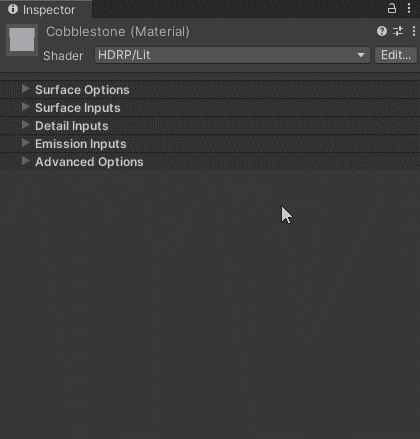
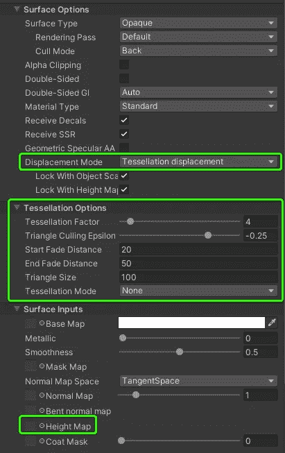
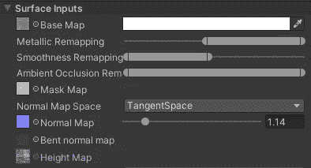
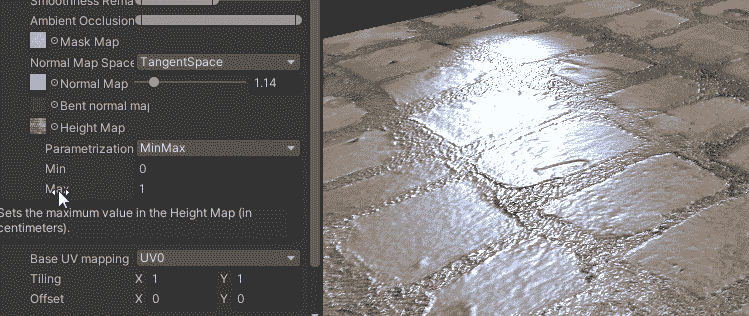
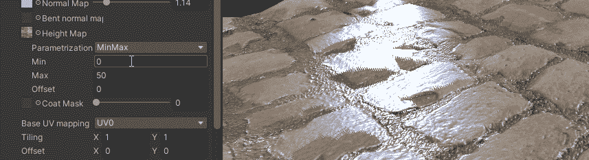
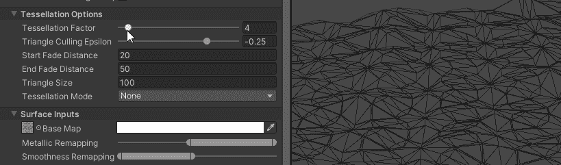
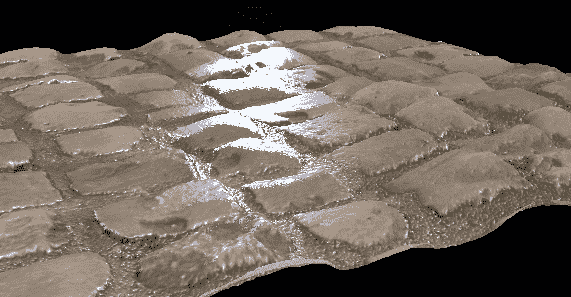

# 统一 HDRP 的镶嵌

> 原文：<https://medium.com/geekculture/tessellation-in-unity-hdrp-e00ecb61644c?source=collection_archive---------12----------------------->

## 镶嵌是 Unity HDRP 的一个重要功能，它允许调整平面的顶点，以适应应用于它们的材质纹理。

**今天的目标:**探索 Unity HDRP 的镶嵌技术，让 2D 的物体和材料看起来像 3D 的。

# Unity 中的镶嵌:

镶嵌是 Unity 中某些材质/着色器上提供的另一个很好的材质选项(使用其中一个镶嵌着色器)。

通过使用*高度贴图*和分配给材质的其他纹理(*反照率*、*法线*、*蒙版*等)，我们可以将一个平面纹理变成一个完整的 3D 物体。

# 创建镶嵌曲面:

首先，我创建了一个新的默认平面游戏对象和一个新的材质资产。

我已经有了一些鹅卵石路径的纹理，包括*反照率*、*法线*和*高度/位移*贴图。

现在，在材质上，我将其设置为镶嵌兼容着色器:

材质现在将显示用于设置镶嵌属性和高度贴图的选项:

在设置了材质纹理，并调整了金属和平滑度之后，我们可以开始镶嵌了。

最小和最大高度贴图值控制网格置换中最低点和最高点之间的距离:

使用振幅也是一种选择:

细分因子值控制网格上使用的细分，这基本上等同于细分中的细节精度级别。

**注意:**更高的值意味着更多的顶点，这导致渲染器的更多工作，可能导致性能问题。在“按需”的基础上使用镶嵌，而不是在任何情况下。

当相机距离对象一定距离时,“镶嵌因子”下的变量控制镶嵌如何逐渐消失。

