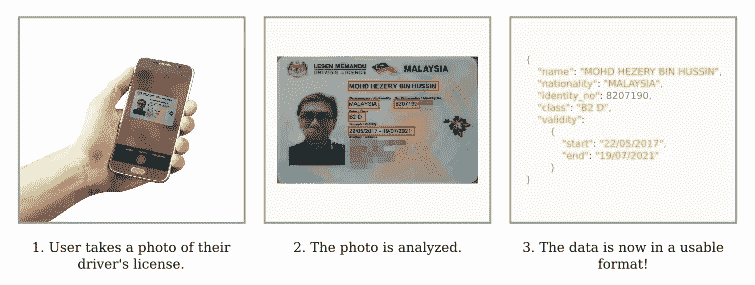
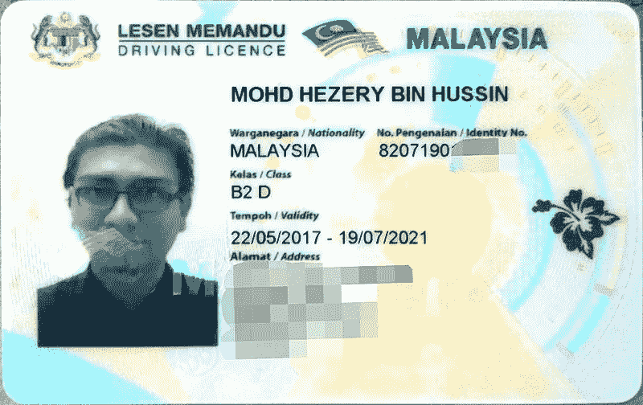
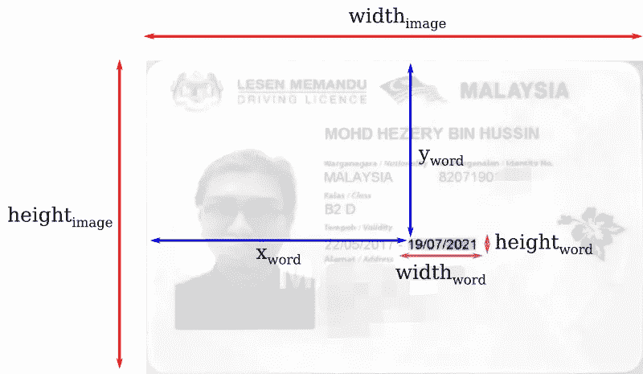
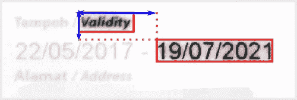

# Tesseract OCR:理解文档的内容，超越文本

> 原文：<https://medium.com/geekculture/tesseract-ocr-understanding-the-contents-of-documents-beyond-their-text-a98704b7c655?source=collection_archive---------1----------------------->

前几天在 Reddit 上偶然发现一个问题。评论者想知道是否有可能从图像的粗略位置提取文本，所以基本上是截图或标准格式文档的图像。他们还想知道这是否可以通过 Tesseract OCR(谷歌赞助的图像到文本工具包)来实现。

这个问题的主题与我目前的两个项目非常接近——也是我硕士论文的主题——以至于我只有*有*来写一个像样的答案。

在这篇文章中，我将介绍一个演示用例，介绍 Tesseract 的用法，介绍一些有用的启发方法，并展示一些代码示例。读完这篇文章后，你应该能够从简单文档(如表格、驾照等)的图像中提取一些基本的文本。).

我已经用 Python 写了代码示例，但是我尽量保持简单。它不应该是漂亮的或“最佳实践”——只是每个人都可以理解，不管他们喜欢什么编程语言。在我们的分析中，我还使用了 Tesseract 的标准输出。对于实际的应用程序，您可能希望使用一个包装器，比如[pytesserac](https://pypi.org/project/pytesseract/)(以及它的 *image_to_boxes()* 方法)。

开始吧！

# 问题:理解驾照的布局

因此，让我们想象一下，我们正在构建一个移动应用程序，它知道用户的驾照何时到期，并在到期时提醒用户更新驾照。我们想象中的应用程序的用户界面很简单:用户拍下他们的驾照照片，应用程序完成剩下的工作！



Image 1: Visualization for our demo use case. (Derivative work from [1] and [2].)

我们应该如何着手构建这种应用程序呢？

嗯，假设文档的布局/截图/等等。我们的照片或多或少是静态的(就像我们的驾照一样；假设他们来自同一个国家/州)，以下三个步骤就足够了:

1.  使用 Tesseract OCR 提取文本以及单词和段落的位置
2.  应用一些启发法来获得您需要的数据
3.  建立应用程序的其余部分(逻辑等。，不在本文讨论范围之内)

现在，让我们更详细地看一下每个步骤。

# 用 Tesseract OCR 提取文本及其位置

> **先决条件:**
> 
> 开始之前，请确保您已经安装了 Tesseract OCR 4。由于网上有数不清的安装指南(例如这份关于 [Windows 10](/quantrium-tech/installing-and-using-tesseract-4-on-windows-10-4f7930313f82) 的指南)，我就不在这里赘述了。
> 
> 我们还假设图像中的文本语言是英语，因为这是默认安装的。

因此，我们想从驾照图像中获取文本。我们将使用这张图片进行演示:



Image 2: Image of a Malaysian driver’s license, by Wikipedia user hezery99\. Increased brightness/contrast from the original. [2]

宇宙魔方对字母和背景有一定的容忍度。因此，您可能想试验一下，为您的输入图像找到正确的预处理步骤。我不得不提高亮度和对比度一点点(导致图像 2)，以获得任何像样的结果。

我们将使用 Tesseract OCR 的命令行界面。打开您的终端(或对于 Windows，您的命令提示符)，并键入以下内容:

```
tesseract -l eng FILENAME_OF_YOUR_IMAGE.jpg out tsv
```

这是什么意思？让我们把它分成几块:

*   **宇宙魔方**:调用宇宙魔方 OCR 应用程序。
*   **-l eng** :这告诉宇宙魔方你正在尝试探测英语。
*   **FILENAME _ OF _ YOUR _ image . jpg**:你要分析的图像的路径。将此替换为图像路径。
*   **out** :输出的文件名。如果您希望只在终端中输出结果，请用破折号(“-”)替换它。
*   **tsv** :输出类型，表示*制表符分隔值。*与默认的纯文本不同，这个选项可以得到一个包含所有单词及其在图像中的像素位置的漂亮文件。

**请注意！**如果你使用的是 Windows，你需要调用*tesseract.exe*可执行文件。您需要将它添加到 PATH 环境变量中，或者直接调用可执行文件，所以:

```
C:\some\path\tesseract.exe -l eng FILENAME_OF_YOUR_IMAGE.jpg out tsv
```

按 Enter 键后，输出应该如下所示:

```
Tesseract Open Source OCR Engine v4.1.1 with Leptonica
Estimating resolution as 231
Detected 24 diacritics
```

如果您打开保存在当前工作目录中的文件 *out.tsv* ,其内容应该类似于此，但不太美观:

Table 1: Tesseract’s output for our example image.

“那看起来阴森森的。这些数字是什么？！搞什么鬼？?"

不要担心。接下来，我会尽可能详尽地解释这些内容。

Tesseract 的 TSV 输出中的每一行都代表我们的输入文档中的一个单词或一个布局结构(比如一个页面或一个段落)。

让我们从最简单也是最重要的部分开始:正文。最右边的一列 ***文本*** 包含一个被宇宙魔方识别的单词。如果该行表示布局结构，则该列的值将为空。

列***conf****包含——以百分比表示——被正确识别的单词的宇宙魔方的置信度。百分比越高，宇宙魔方越有可能是正确的。例如，第 20 行上的值“96 ”(在上面的表 1 中)意味着宇宙魔方 96%确定单词“MALAYSIA”被正确识别。置信度“-1”意味着该行不包含单词，而是前面提到的布局结构表示。*

*列*左*和*上*分别代表图像中单词的 x 和 y 坐标。列宽和列高的意思就是:图像中单词的宽度和高度。所有这些值的单位都是像素。*

*然后，我们跳到第一列，*级*。它的值告诉我们输出中的行是否…*

1.  *一页*
2.  *一个街区*
3.  *一个段落*
4.  *一行*
5.  *一句话。*

*列 *page_num* 、 *block_num* 、 *par_num* 、 *line_num* 和 *word_num* 标识文档层次结构中这些布局结构的各个实例。让我们更详细地看一下这些。*

*   ****page_num*** 是找到单词的页面。**请注意！**在这个演示中，我们不分析多页 PDF 文档，所以我们的 *page_num* 只获取值 *1* 。如果我们的文档中有多个页面(即我们没有分析单一的照片)，我们也会在这里看到更高的索引。*
*   ****block_num*** 告知当前页面内检测到的布局块。*
*   ****par_num*** 告知版面块内的段落号。*
*   ****line_num*** 告诉段落内的行号。*
*   ****word_num*** 告诉行内的字数。*

*在下面的表 2 中，您可以看到输出文件(即表 1)中的不同行根据行的“级别”用不同的颜色突出显示:*

**

*Table 2: Visualizing the logic behind page_num, block_num, par_num, line_num and word_num.*

*在表 2 中，有三个块(1–3)，每个块有一个段落(1.1、2.1 和 3.1)。每个段落只包含一行(1.1.1、2.1.1 和 3.1.1)。前两段包含仅包含空格的单词(1.1.1.1，2.1.1.1)，而最后一段包含单词“LESEN”(3 . 1 . 1 . 1)、“MEMANDU”(3.1.1.2)和“Ee”(3 . 1 . 1 . 3)。*

*在输入图像上，块、段落、行和单词看起来像这样:*

**

*Image 3: Blocks, paragraphs, lines and words in our driver’s license example. Derivative of [2].*

*如你所见，由 Tesseract 确定的布局结构远非完美。但是，这就是 OCR 的本质。*

*回到我们的演示！下面是我们在分析中感兴趣的行。在演示中，我们将集中在最后一行，因为它包含了驾照的到期日期，这也是我们应用程序的重点！*

*Table 3: Output of our Tesseract OCR run, with irrelevant rows excluded.*

*我听到你问:*“那么，我们能不能只取输入图像，运行 Tesseract，选择 page_num=1，block_num=7，par_num=2，line_num=2 的行？会这么简单吗？!"**

****可悲的是，号:(****

*如前所述，由宇宙魔方确定的布局结构并不完美。*

*如果被分析的图像发生非常微小的变化，那么块、段落、行甚至字数可能会发生很大的变化。不同的照明、不同的长宽比，或者对输入图像的许多其他改变中的任何一个都可以改变这些值很多。因此，这里的第 1 页和第 7 块可能是第 1 页和第 3 块，如果图像稍有改变的话。*

*除非你正在分析一个绝对静态布局结构的非常简单的黑白截图，否则你根本不应该相信这些数字*。也许那时还没有。然而，它们多少有些逻辑性，所以在某些情况下会很有用。我们将在下一章讨论这个问题。**

**那么，我们该怎么办？如何从文档的这个一般区域中提取这一段特定的文本呢？有数不清的可能性，但我们现在将讨论其中的几个。**

# **理解图像**

> ****先决条件:****
> 
> **对于这些例子，我将使用 Python。如果您想了解这些示例，请确保您也安装了该软件。**
> 
> **它应该很容易安装，所以只需前往[https://www.python.org/downloads/](https://www.python.org/downloads/)并安装它。**
> 
> **我们将使用 Python 包 re(用于 regex)和 [pandas](https://pypi.org/project/pandas/) 。**

**好了，现在我们已经设法得到了宇宙魔方的输出。接下来，我们需要构建一些东西，让我们可以拍摄任何驾驶执照的图像，并从中提取有效日期。概括地说，有两种可能的方法:使用**试探法**，或者使用**机器学习**。**

**使用**试探法**，也就是基本的经验法则，是你在没有大量训练数据的情况下需要做的事情。如果您的数据(因此，您的模型)足够简单，可以作为规则的基础，那么这也是首选。在没有大型数据集的情况下，简单的经验法则可能比机器学习模型更加稳健。**

**从数据中总结经验法则是一门艺术，而不是科学。你基本上只是从你的数据中做出假设，你需要测试和验证它们的程度取决于你的用例。**

****另一方面，机器学习模型**可以更具体一些。一个适用于马来西亚驾照的模型可能会完全偏离主题，例如分析应用程序的截图，因此对 ML 模型的进一步讨论将是另一篇博客文章的前提。也许到那时我会想出一个比驾照更好的演示用例。**

**关于使用试探法，我们现在将通过以下方法:**

1.  **基于位置的文本识别**
2.  **正则表达式**
3.  **信任宇宙魔方的层次检测**

## **基于位置的识别**

**对于基于位置的文本识别，我的意思是我们根据它们相对于图像的 *x* 和 *y* 坐标来识别文档中的相关单词。**

**如果我们想仅仅根据字符串在文档中的位置来识别字符串，我们需要确保文档的布局不会改变。根据我们建立的规则，我们也许可以改变图像的纵横比或分辨率，但除此之外，我们需要使用更多来自数据的提示。**

**现在，让我们假设驾照照片总是被整齐地裁剪(例如，由应用程序的用户手动裁剪，或使用一些简单的边缘检测算法)。这样，我们就可以浏览宇宙魔方识别的每一个单词**

**下面我们可以看到与这个练习相关的坐标。**

****

**Image 4: Coordinates of the Tesseract-extracted word we’re interested in.**

**基于这些值，我们可以计算出图像中每个单词的相对大小和位置。**

```
**# Relative size of the word within the 
relative_width  = width_word / width_image
relative_height = height_word / height_image# Relative position of the word within the image
relative_x = x_word / width_image
relative_y = y_word / height_image**
```

**以下是 Python 脚本的外观:**

**Script 1: Locating words based on rough location ranges.**

**对于我们的驾照数据，我们得到以下输出:**

```
**19/07/2021**
```

**而这正是我们想要的价值！不错！**

**这种检测方法完全依赖于列表*最小值*和*最大值*。它们的内容定义了我们的图像的 *X* 和 *Y* 坐标的允许范围，宽度和高度。**

**但是这些价值观从何而来呢？**

**在这种情况下，它们被手动调整以覆盖图像中所需文本的粗略区域。所以，如果你的图像布局是超级静态的，并且你知道你要识别的文本在不同的图像之间可以移动多少，那么你就可以猜测这些值。**

## **锚词**

**但是如果我们感兴趣的文本的位置变化很大，但它总是靠近某个已知的关键字，怎么办？就像这种情况，“有效性”？**

****

**Image 5: Distance between our anchor word (“Validity”) and the date. Derivative of [2]**

**让我们稍微修改一下前面提到的代码。假设我们已经遍历了 Tesseract 输出的所有单词，并且找到了锚词“Validity”。因此已知其 *X* 和 *Y* 坐标，并在下面用 *x_anchor* 和 *y_anchor* 表示。**

```
**# Relative size of the word within the 
relative_width  = width_word / width_image
relative_height = height_word / height_image# Relative position of the word to the anchor word, within the image
relative_x_distance = (x_word - x_anchor) / width_image
relative_y_distance = (y_word - y_anchor) / height_image**
```

**经过这些更改后，代码将如下所示:**

**Script 2: Locating the correct word based on an anchor word.**

**运行代码后，我们得到了我们一直在等待的熟悉结果:**

```
**19/07/2021**
```

**这些是基于位置数据可以采取的方法。**

## **信任宇宙魔方的布局层次**

**好吧。还记得我说过宇宙魔方输出的*级*信息不应该被信任吗？是的，我们正在解决。**

**我想介绍的最后一种方法假设 Tesseract 能够将锚词(“有效性”)和感兴趣的词(日期)一致地归类到同一个布局块中。对于某些用例，这种方法可能比前面的方法更好。**

**在表 4 中，我们有以下 pandas 查询的结果:**

```
**df[
    (df["block_num"]==7)
    & (df["par_num"]==2)
    & (
        (df["line_num"]==1)
        | (df["line_num"]==2)
    )
]**
```

**Table 4: Lines 1 and 2 of block_num=7, par_num=2.**

**由于我们不能信任布局结构的确切 id，我们需要再次找到我们的锚词(“Validity”)，并在同一段落中寻找其他词。然后，我们将遍历这些行，寻找看起来像日期的字符串(使用正则表达式)。**

**我们的小脚本应该是这样的:**

**Script 3: Extracting information by trusting the layout logic of Tesseract**

**运行该程序，我们应该得到以下输出:**

```
**22/05/2017
19/07/2021**
```

**但是什么，那是两次约会？！**

**嗯，我们知道驾照的有效期在这两个日期之间，所以我们可以有把握地假设到期日是后者。你知道，因为已经晚了。**

**好了，现在你有了有效期！**

**这就是理解图像布局的全部内容！现在，您应该能够处理带有位置元数据的文本了。**

**接下来，我们将简要讨论在构建生产应用程序之前您可能希望进一步研究的几个主题。**

# **接下来去哪里？**

**这是对布局分析、OCR 和机器学习领域的一个快速概述。演示应用程序本身显然不能用于 99.7%的真实用例，但它是进一步探索的良好起点。**

**根据您的使用情况，这里有一些事情您可能需要做更多的研究。**

## **检测图像操作**

**构建这样的系统需要考虑很多方面。如果我们正在构建我们的演示应用程序，例如用于识别我们的在线客户，并且我们计划只依赖 Tesseract OCR，那么我们的驾照认证步骤可以在三分钟内被绕过，并在 Microsoft Paint 上添加一些艺术和工艺。见鬼，我们的应用程序不会想第二次，如果我们提出它:**

****

**Image 6: My name is Bond. James Bond. Derivative of [2]**

**但是对于一些用例来说，这无关紧要。但是如果*和*有关系，那么你可能需要训练一个更复杂的模型来从图像中识别潜在的操纵假象。**

**如果您可以访问大量有效图像和被操纵图像的示例(即使是手动操纵的)，您可能能够训练一个图像分类器，它将输出图像被操纵的概率。**

## **文档布局分类**

**在驾驶执照的情况下，你将*绝对*比我们的演示有更多不同的布局。世界上每个国家都有自己的驾照，例如在美国，*每个州*都有自己的驾照！我们简单的试探法永远不会明白当你把它们应用到佛罗里达驾照时会发生什么。**

**本质上，为了能够在现实世界中使用我们的启发法，我们必须能够知道图像代表什么样的布局。是佛罗里达*驾照*，马来西亚*莱森·梅曼杜*，瑞典*科尔科特*，还是芬兰*阿约科特蒂*？**

**由于其他原因，该信息也可能极其重要。例如，我们如何解析和理解日期取决于语言环境，而这又取决于驾照的原籍国！因此，对于许多用例来说，这是重要的一步。**

**没有一种正确的方法来识别正确的底层布局。您可以使用用户输入，或者在文档中找到的一些关键字(例如我们演示中的“LESEN MEMANDU”)。或者，再一次，有了足够的数据，你可以训练一个图像分类器来识别正确的布局。**

# **总结**

**如果您已经学了这么多，现在应该知道如何:**

1.  ****使用 Tesseract OCR** 从基于图像的文档中提取文本**
2.  ****解释宇宙魔方的输出**并理解其布局结构背后的逻辑**
3.  ****构建简单的试探法**，允许你进一步分析宇宙魔方的输出。**

**希望你能从中得到一些东西，我希望你能在工作中用到这些。:)我也非常乐意就解决这些问题的一些企业 OCR 应用程序和云服务发表我的看法。**

**正如本文前面提到的，我已经为这个用例开发了几个工具。如果这是一个你觉得自己正在纠结的话题，请在这里关注我或者在推特上给我发消息([https://twitter.com/waltteri_v/](https://twitter.com/waltteri_v/))。任何关于这篇博文的批评都是非常受欢迎的！**

# **来源**

**参考资料、来源等。以完全非科学的形式和顺序:**

**[1] [马来西亚驾照](https://commons.wikimedia.org/wiki/File:Hezery99-Malaysian_driver%27s_license.jpg)，2017 年 5 月 22 日，由维基百科用户 [Hezery99](https://commons.wikimedia.org/w/index.php?title=User:Hezery99&action=edit&redlink=1) ，用作解释性图形的一部分，[知识共享](https://en.wikipedia.org/wiki/en:Creative_Commons)[Attribution-Share like 4.0 International](https://creativecommons.org/licenses/by-sa/4.0/deed.en)**

**[2] [手拿 iPhone 的照片](https://www.publicdomainpictures.net/en/view-image.php?image=228950&picture=cell-phone-in-hand)，由卡伦·阿诺德在[PublicDomainPictures.net](https://www.publicdomainpictures.net/)拍摄**

**(本帖中所有图片均授权为[知识共享](https://en.wikipedia.org/wiki/en:Creative_Commons) [署名-分享 4.0 国际版](https://creativecommons.org/licenses/by-sa/4.0/deed.en)。)**