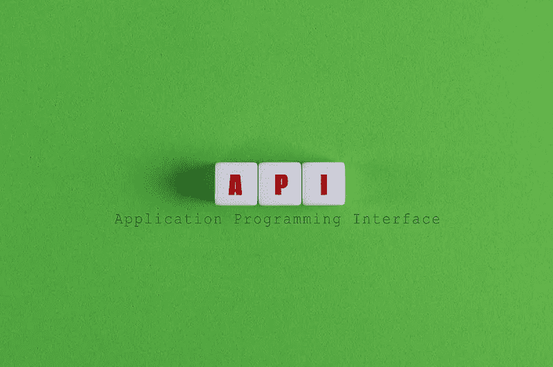

# 4 分钟内测试一个 REST API

> 原文：<https://medium.com/geekculture/test-a-rest-api-in-4-minutes-72d5e06368e2?source=collection_archive---------10----------------------->

有了测试框架

Image by Jernej Furman on [Flickr](https://medium.com/r?url=https%3A%2F%2Fwww.flickr.com%2Fphotos%2F91261194%40N06%2F51081808041), [CC licence](https://creativecommons.org/licenses/by/2.0/)

# 介绍

如今，计算机系统之间有大量的通信。**应用编程接口** (API)就是为此服务的。

**表述性状态转移(REST)** 是分布式系统的一种架构风格，它遵循了我在本文中不会描述的几个原则。您可以找到更多信息…