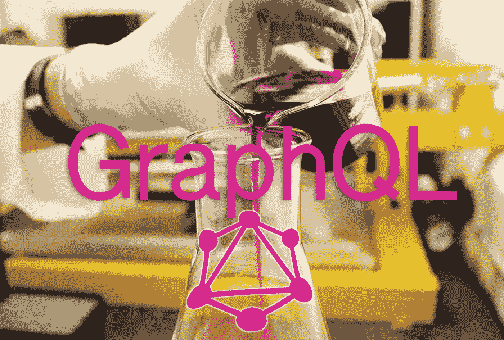
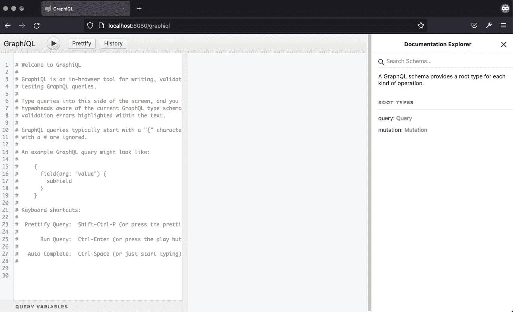
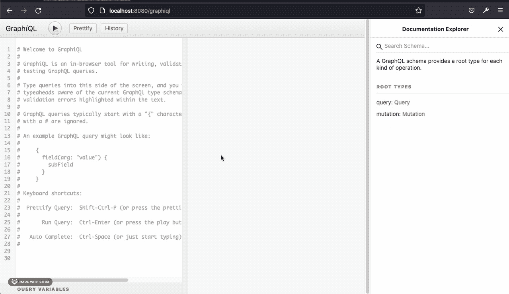
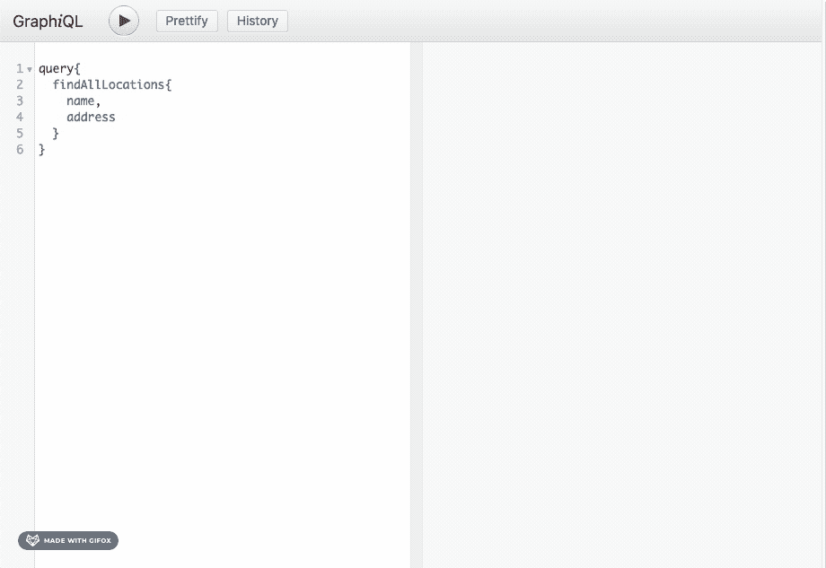
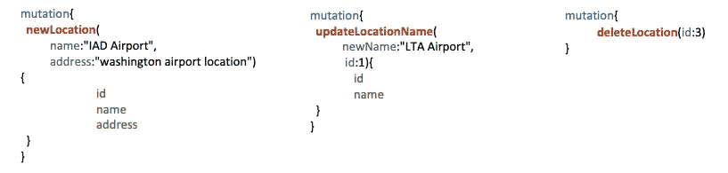
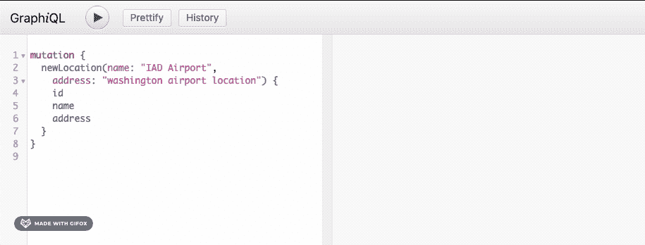

# 测试 Spring Boot GraphQL API

> 原文：<https://medium.com/geekculture/test-a-spring-boot-graphql-api-365ebeb3eb70?source=collection_archive---------24----------------------->

## 使用 GraphQL 工具测试 GraphQL API

Source:[https://unsplash.com/](https://unsplash.com/) and edited by me

[GraphQL](https://graphql.org/) 是一种针对 API 的查询语言，或者是一种描述如何请求数据的语法，通常用于将数据从服务器加载到客户端。GraphQL 提供了最大的效率和灵活性，因为它允许调用客户端精确地指定它需要什么数据。

我们将使用上一篇文章中的同一个例子，如果你没有读过，看看这个链接。

 [## 带 Java 的 GraphQL Spring Boot 入门

### 用 Spring Boot 框架和 JPA 创建一个 GraphQL API

medium.com](/geekculture/graphql-spring-boot-starter-with-java-533fe368264d) 

# **图形语言工具:**

GraphQL 是一个简单的 web 应用程序，能够与任何 graph QL 服务器通信，并对其执行查询和变异。

在 pom.xml 中添加以下依赖项:

Source: [https://mvnrepository.com/artifact/com.graphql-java/graphiql-spring-boot-starter](https://mvnrepository.com/artifact/com.graphql-java/graphiql-spring-boot-starter)

要启用 GraphiQL 工具，请将以下几行添加到 application.properties 文件中:

请注意， **graphql.servlet.mapping** 、**graph QL . endpoint**和**graph QL . mapping**不必与本例中的相同，但它会影响您将来的去向。然而，**graphql . servlet . mapping**和**GraphQL . endpoint**确实需要匹配，因为这是 graph QL 和 graph QL 相互通信的方式。

现在将项目作为一个 spring boot 应用运行，然后进入***localhost:8080/graphiql***，会打开如下界面。

GraphiQL interface

在右边，你会看到项目中***location . graph qls****中定义的模式。*

*The schema in project*

**

***查询请求:***

*在界面的左侧，是我们编写查询的地方。*

**

*您可以自定义查询以获取您需要的数据，例如，如果您只需要姓名。*

***突变请求:***

*对于突变，我们在模式中定义了三种突变，每种都有一个示例:*

****

*您可以用同样的方式尝试其他请求。*

***资源:***

*[https://github.com/graphql/graphiql](https://github.com/graphql/graphiql)*