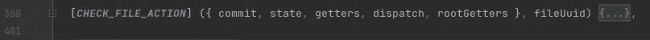
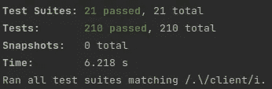

# 测试覆盖率，从零到稳定

> 原文：<https://medium.com/geekculture/test-coverage-from-zero-to-stability-cf552e5bd25c?source=collection_archive---------51----------------------->


# 出发点

项目概述。我们的客户是一个数字化 B2B 市场，为中型工业公司和金属建筑自动采购金属零件。这项业务的主要想法是创建一个在线平台，在这里人们可以比在任何其他地方更快更便宜地订购金属零件。

我们在项目中的职责是改善客户门户网站，增强客户和生产商之间的沟通。业务不断发展，对平台的需求也随之增长。起初，有一个 QA 工程师能够满足项目的所有需求。现在，有三个测试人员，他们经常感到缺少完成任务的时间。因此，我们意识到我们需要尽可能自动化 QA 工程师的工作，用测试覆盖代码。

在这篇文章中，我将描述我们面临的挑战和我们在项目中使用的解决方案，我们还将讨论有趣的案例、错误以及我们如何修复它们。

*文章由瓦西里·塔尔纳波斯基撰写*

# 作为商业逻辑处理的摩卡和柴

开发团队担心服务器端不同情况下的业务逻辑的正常工作。这就是我们从摩卡和柴开始测试的原因。我们还实现了依赖注入，这给了我们轻松替换服务和快速编写测试的可能性。
例如，我们有 *CompanyManagementService* ，它有 *userService* 作为依赖项。那么用 InversifyJS 模拟依赖关系将如下所示:

```
describe(‘Validate CompanyManagementService’, () => {
let userlet companyManagementServicebefore(async () => {user = await setUp()***container***.snapshot()***container***.rebind(types.UserService).toConstantValue(***userServiceMock***)companyManagementService = ***container***.get(types.CompanyManagementService)})
```

# E2E 反对单调的工作

我们完成了业务逻辑覆盖，但是意识到手工测试的问题仍然存在。我们开始用 E2E 测试来解决它，这消除了测试人员工作中单调的部分。经过长时间的讨论，我们同意寻找一个 JavaScript 框架，实际上，团队中的每个开发人员都可以支持它，以防我们需要它。这就是我们决定选择柏树的原因。


[Credits](https://memegenerator.net/instance/68070195/scheming-baby-automated-testing-yes-no-more-manual-testing)

# 柏树的利与弊

该框架的工作始于为期一天的研讨会。每个人都有机会在运行中尝试 Cypress，编写测试。


我们在项目中面临着一个高度优先的问题。这导致了赛普拉斯工作的一点延误。然而，解决方案是显而易见的，一旦我们雇佣了一个新的软件工程师，我们没有让他参与解决业务问题，而是让他与 Cypress integration 一起工作。

通过 E2E 测试，我们完全覆盖了主要流程，这是我们的客户最常用的，并且我们每个月都要测试一千次。实现它们是一个很酷的决定，因为它帮助我们找到并修复未暴露的 bug。说到缺点——像往常一样，没有足够的时间来编写新的测试，并且很难找到具备 JavaScript 和 Cypress 知识的 QA 工程师。我想注意到，这一点非常关键，可能是我们停止使用柏树的主要原因，尽管它有很多优点。

# 令人印象深刻的笑话力量

我们项目中一个更脆弱的部分是——Vuex。

基于我们有超过 100 行的“动作”这一事实，我们不能在那里给出一个意外的结果。



因此，我们决定这将是我们 UI 测试覆盖的完美开端。这个时候，我们选择用 Jest。主要是因为它可以并行运行测试，也因为它拥有开箱即用测试的一切。Jest 真的很快，现在，我们有 200 多个测试，它们运行 6 秒钟，实际上，令人印象深刻:



来说几个有趣的案例吧。当我们在讨论 Vuex 的时候，我们发现代码中的一些地方长时间以错误的方式工作。
例如，我们已经将 State 中的属性名称从' *getMinimumOrderValue'* 更改为*' getminimuordervalues '*，但是在其他地方没有更新。这导致了意想不到的错误，很难被 E2E 测试或手工测试所发现。由于我们在测试过程中发现了类似的问题，所以在测试编写过程中花费的时间完全被覆盖了。

如下，即使我们的业务每天都在快速增长，我们引入新的功能，我们仍然保持我们的系统安全、稳定，并在最终用户可能遇到问题之前解决大部分问题。

感谢阅读。我们希望你喜欢我们的新文章。敬请关注最新消息！