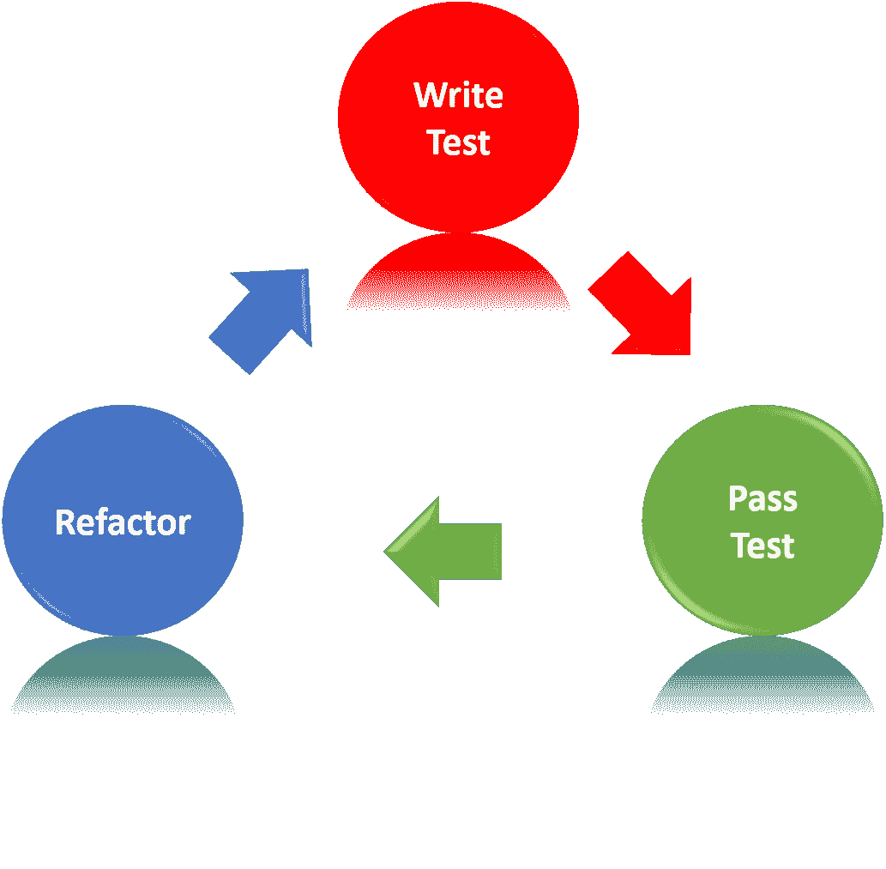
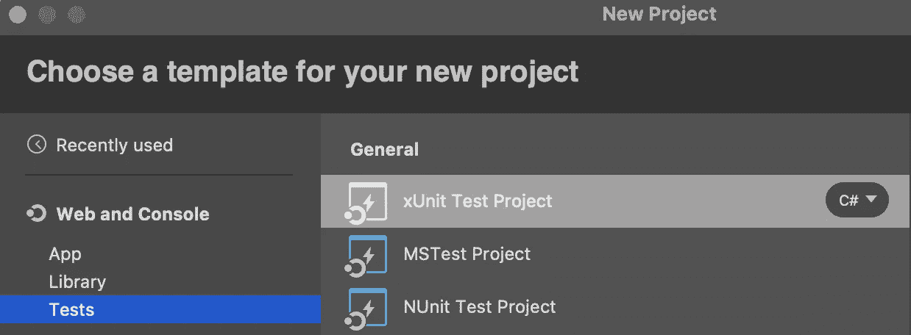
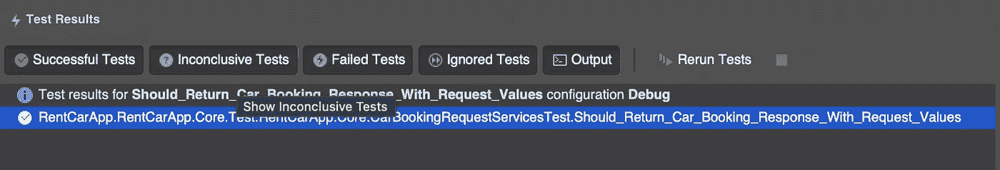
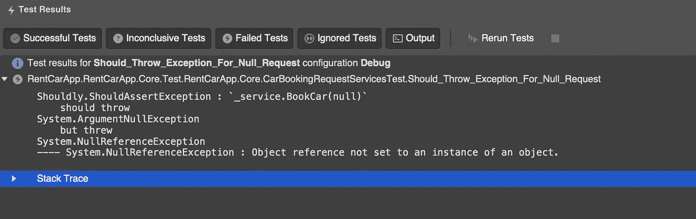
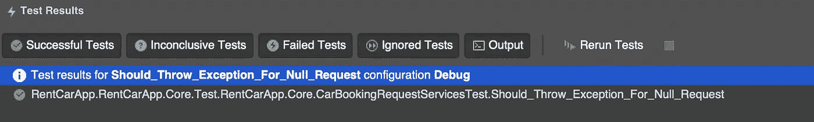

# 测试驱动开发。网络核心

> 原文：<https://medium.com/geekculture/test-driven-development-for-net-core-1630f8707324?source=collection_archive---------3----------------------->

我们可以从一个简单的问题开始测试，为什么我们需要测试？什么是 TDD？

我喜欢下面的定义

“TDD 是一种软件开发过程，它依赖于在编写真正的代码之前作为测试用例编写的软件需求”

但是这个定义可以为你改变。我使用 TDD 来组织我的代码，并使我的代码符合坚实的原则。当然，我们正在与公司的开发团队合作。所以某人的改变会影响我们的代码。为了保护未来开发的代码，我们需要编写一个测试。如果我们看看重构部分。Tdd 帮助我们重构代码。

有什么缺点吗？当然是开发时间！但是对于初始代码。代码编写完成后。那么这些劣势就变成了优势。

这将是一篇长文。但我会试着向你解释我的知识。

我们开始吧，

因为题目。首先，我们应该创建一个测试解决方案。后来它会改变，但现在解决方案将仍然是测试项目。

Xunit Project Selection

好的，项目是什么？

该项目将是一个租车应用程序。将会有一个 web API，用户可以通过它来预订汽车。听起来很棒！

为此，我们应该将同样优秀的 Nuget 包添加到 out 项目中。
第一个是:[宜](https://www.nuget.org/packages/Shouldly/)第二个是:[最小起订量](https://www.nuget.org/packages/Moq/)

这些包很常见。你应该拥有它！

想到的第一个答案。组织良好的代码。适用于实心图案等。对于 TDD，您应该得到 fail(红色)，然后在编写代码并重新运行测试后，它应该会给您带来成功(绿色)。

让我们看一下代码。

当我们看上面的函数时。我们需要一个函数，接受预订请求，并应返回预订响应。也应该有一个具有图书车功能的服务。

我们的需求是什么？

*   预订请求:应该有全名，电子邮件，日期。
*   预订回复:应该有全名，电子邮件，日期。
*   订车服务和功能。

最初，我们没有让我们创造的东西，

我将增加两个项目。核心“该项目将赋予订车功能。它还将包含我们的请求和响应实体。第二个项目“CarBookingApp。领域”用于领域模型。

首先，我想为请求和响应创建一个基本模型。似乎他们有相同的领域。

创建对象类后，我们可以专注于服务。让我们为预订请求创建一个服务。我会补充

创建对象类后，我们可以专注于服务。让我们为预订请求创建一个服务。我将在 CarBookingApp 中添加 CarBookingRequest 处理器。核心项目。目前，我们只是测试方法，它不会预订任何汽车。只是为了输入检查。如果我们请求，它将返回一个带有输入参数的响应。稍后我们将从另一个服务中得到结果。不过目前来看，对于目前的操作来说还是可以的。

现在我们的第一个测试已经准备好了，我们首先编写测试，然后创建类和项目作为测试。

现在我们有绿色测试。让我们编写一个测试来检查输入参数。也许它可以是空的，是吗？

现在我们有了绿色测试。让我们编写一个测试来检查输入参数。也许它可以是空的，是吗？在这种情况下，我们应该抛出一个异常。但是我们为它写了一个测试。这将是红色测试。

为什么？因为我们需要检查输入，但目前我们没有。问题的解决方案是我们需要在 BookCar 函数中添加一个输入检查。

现在我们正在检查请求！让我们再做一次测试，

解决方案中有更多的代码，我将分享这些代码。但是我想说一些关于模拟的事情。在解决方案中，一些接口已经模拟了为什么我们需要模拟一些东西？因为我们想检查功能而不是整个系统。在测试结束时，我们将单独检查所有功能。但是我们可以实现所有的接口。对我们的模拟帮助。当你从我的 [GitHub](https://github.com/barkinkizilkaya/RentCarApp) 账户中获得所有解决方案时。您将看到有一个与数据库连接的服务。我们需要嘲笑这一点，因为我们没有使用真实的数据。我们需要一份汽车清单，但我们还没有数据库。所以我们需要嘲笑。

这是关于 TDD 的非常简短的信息。但这可以是一个起点。请随意提问。

你们自己保重。