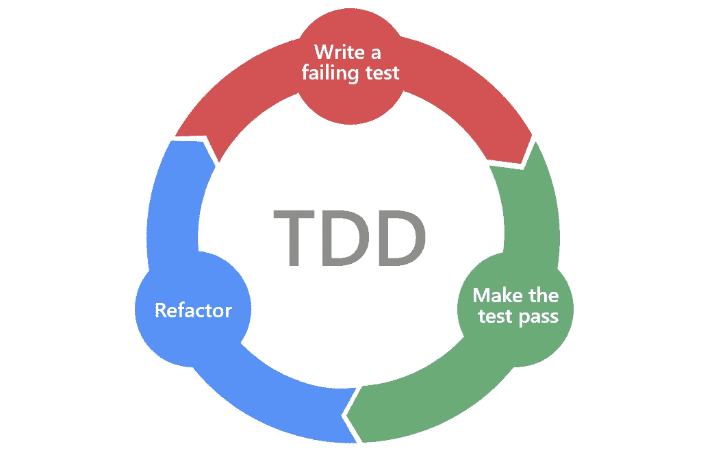

# 每个开发人员都应该知道的测试驱动开发(有例子)

> 原文：<https://medium.com/geekculture/test-driven-development-that-every-developer-should-know-about-with-example-c5f68af547a6?source=collection_archive---------10----------------------->



感谢[蔡](https://medium.com/u/28170ef65a60?source=post_page-----c5f68af547a6--------------------------------)关于 [TDD 过程](/@heaton.cai/tdd-process-1637cd4434fe)的文章，我们能够看到一个 TDD 框架的高级开发。但是，以我个人的经验来看，大部分的开发人员(包括我)，尤其是非软件公司或者传统行业的开发人员，仍然在使用代码驱动的框架。

代码驱动框架的一个主要缺点是，代码驱动方法是前瞻性的，这导致开发人员过于关注应用程序的业务逻辑，而忽略了可扩展性和边缘情况。相反，测试驱动的方法是逆向思维的。它允许你积极地思考可能的测试用例，制定类和方法，更优雅地设计代码结构。

在本文中，我将参考蔡的框架，用我在工作中遇到的一个例子来演示一个 TDD 过程。

# 准备

## **1)定义场景**

在我的新项目中，我将为我的前端应用程序设计一个缓存服务的应用程序。缓存服务主要做两件事:从前端应用程序存储数据和从后端数据库检索数据。

人们可以使用不同的 Java 缓存库来查询、存储和查找数据。在我的例子中，我将从 Jedis 库开始，它是 Redis 缓存的 Java 客户端。将来，可能会添加其他缓存服务，比如 GemFire。然而，无论使用哪种缓存库，功能几乎是相同的——数据存储、搜索、查询、保存和删除。

## 2)设计界面

接口应该关注高层次的问题，而不是具体的实现。因此，以下功能是我们应该拥有的基本方法。当我们考虑接口方法时，我们应该考虑函数的最佳输入和输出:

1.  String getData(字符串键，字符串字段)；
2.  boolean ifDataExists(字符串键，字符串字段)；
3.  void deleteData(字符串键，字符串字段)；
4.  void saveData(字符串键，字符串字段)；

## 3)设计测试用例

在我的例子中，我以检索后端数据的场景为例。然后我有几个案例:

1.  该数据可以是空值
2.  数据可以是有效的字符串
3.  数据可能不存在

正如希顿的文章中提到的，我们不需要对测试用例如此具体和全面，因为如果我们以后想要驱动代码或重构代码，测试用例可能会改变。

# 编码

## 1.编写第一个测试

首先，我们编写一个测试，从缓存中获取正确的结果。目前我的项目是用 Java 编写的，我使用 JUnit5 作为我的测试框架。在下面的代码中，我有一个我应该创建的类的粗略设计。

```
@Test
public void testGetOrderDetailsWithExistingValue(){
    CacheOrderService cacheOrderService = new CacheOrderServiceImpl();
    Optional<OrderDTO> result = cacheOrderService.getOrderDetails("1");
    assertEquals(result.value, "MyOrderDetails")
}
```

首先我们有一个类 *cacheOrderServiceImpl* ，它是一个服务接口 *cacheOrderService* 的实现类。它实现了一个名为 *getOrderDetails* 的方法，参数是一个名为 *orderId* 的字符串。接下来我们有一个*order to*类，它是一个存储我的必填字段的定制数据传输对象。出于测试目的，我传入了一个*orderId*“1”。因为我们得到的结果可能不存在，所以使用了一个可选的*类。因为我正在测试一个现有的值，所以结果应该包含一些东西，并且使用了 *result.value* 。再次为了测试，我让它断言到*“MyOrderDetails”*字符串。*

## 2.编写功能

为了完成测试用例，我在 *CacheOrderServiceImpl* 类中编写了如下方法。

```
private String myOrderTable = "MyOrderTable";public Optional<OrderDTO> getOrderDetails(String orderId) {
    CacheManager cacheManager = new cacheManager("myHost", "myPort");
    final String result = cacheManager.getCache(myOrderTable, orderId);
    final OrderDTO orderDTO = convertStringToOrder(result);
    return Optional.ofNullable(orderDTO);
}
```

我们首先有一个字符串*“my order table”*的模拟订单表。该方法接受一个名为 *orderId* 的参数。在方法内部，我们实例化了一个类 *CacheManager* 。*缓存管理器*关注与缓存数据库相关的操作(使用 Jedis 库)。在与缓存服务器建立连接之后，我们可以使用来自 *CacheManager* 的 *getCache* 方法首先返回一个字符串结果，因为 Redis 会将对象数据存储为字符串。然后，我们需要一个 helper 方法将字符串转换成我们想要的对象，*orded to*。最后，我们返回一个带有*order to*值的*可选*对象。

## 3.重构和缩放

最后，我们需要重构代码，使其清晰和可伸缩。注意到 *getOrderDetails* 方法驻留在 *CacheOrderServiceImpl* 类中。我们需要一个接口类 *CacheOrderService* ，由 *CacheOrderServiceImpl* 类实现。在接口类中，我们可以指定我们想要处理订单的一般方法，例如 *ifOrderExists* 、 *deleteOrder* 和 *saveOrder* 。

此外，在上面的步骤 2 中提到，我们有一个 *CacheManager* 类。 *CacheManager* 和 *CacheOrderService* 的区别在于 *CacheManager* 处理缓存操作，而 *CacheOrderService* 处理订单特定的操作。每当我们需要处理订单时，我们必须实例化一个 *CacheManager* 实例来操作缓存中的数据。如果我们遵循上面的代码，对于我们创建的每个 order 方法，我们都在实例化一个新的 *CacheManager* 类，这是多余的，并且占用 JVM 中的堆空间。因此，我们需要确保在整个订单处理过程中只使用一个实例。

```
private final CacheManager cacheManager;
private String myOrderTable = "MyOrderTable";

public CacheOrderServiceImpl(CacheManager cacheManager){
    this.cacheManager = cacheManager;
}

public Optional<OrderDTO> getOrderDetails(String orderId) {
    final String result = cacheManager.getCache(myOrderTable, orderId);
    final OrderDTO orderDTO = convertStringToOrder(result);
    return Optional.ofNullable(orderDTO);
}
```

为了避免 *CacheOrderService* 的多个实例，我们也可以应用**工厂**和**单例**设计模式。更多细节，请查看我以前的文章。

[](/geekculture/3-design-patterns-i-applied-in-my-java-code-in-one-hour-59bf6fe46673) [## 我在一个小时内在 Java 代码中应用了 3 种设计模式

### 设计模式对于编写高质量的代码至关重要。尤其是在 Java、Python 等面向对象的语言中…

medium.com](/geekculture/3-design-patterns-i-applied-in-my-java-code-in-one-hour-59bf6fe46673) 

## 重复

正如希顿提到的，我们一个接一个地写测试用例——完成一个直到代码重构，然后再从下一个开始。我们刚刚在本文中列出了准备阶段的一个测试用例，我们需要构建更多的测试用例和功能，它们都应该遵循类似的模式。

如果您还不熟悉 TDD 过程，我希望您能从这篇文章中得到一些启示。这已经是行业中的一种技术趋势，我确信这对您自己的项目是一种有益的实践。

我希望这篇文章对你有所帮助。如果你像我一样渴望学习一些与技术相关的东西或定期反思工作和生活，请关注我的频道，了解我日常工作和生活中的最新灵感。

演职员表:
https://medium.com/@heaton.cai/tdd-process-1637cd4434feT21