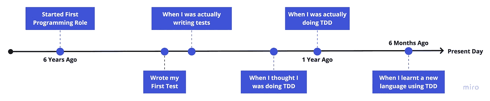
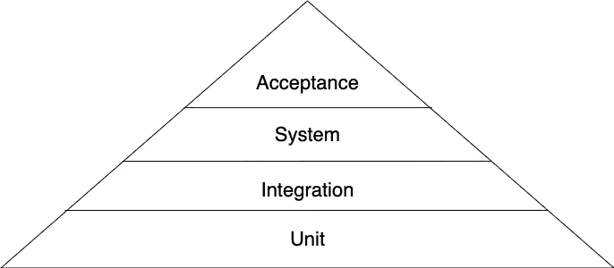

# 测试驱动开发:工程师不太完美的旅程

> 原文：<https://medium.com/geekculture/test-driven-development-the-not-so-perfect-journey-of-an-engineer-8dedb121bcbc?source=collection_archive---------50----------------------->

所有的编程教科书、课程和学习一门新语言的一般方法都不会从测试开始，更不用说测试驱动的开发了。

偶尔你可能会找到一本书，其中有一章是关于用特定语言创建单元测试的，甚至可能是对特定测试技术或库的介绍。

> 在我的第一个编程角色中，我删除测试，因为它们失败了，我不知道如何修复它们。我仍然在拼凑代码，而不是编程。我一无所知。

这篇文章描述了我从第一次测试到能够自信地利用 TDD 学习一门新语言的旅程。

正如你从上面的图表中所看到的，我花了大约 5 年的时间去理解、欣赏、学习和实际执行 TDD。

> 我认为考试是浪费时间，并没有努力学习如何考试。

# **我的第一次测试**

我的职业生涯已经过去了 6 个月，但我仍然没有写一个测试。

有一天，我被明确要求为我一起黑出来的一件作品写一个测试；因为这是一项需要测试的重要功能。

我不情愿地写了我的第一个测试——花了几天时间，在堆栈溢出的情况下，让测试看起来正常:我的第一个测试……嗯……通过了。

经过审查，测试完全没有抓住功能的要点，当时的高级工程师花时间和我一起修复了它。

> 了解质量意味着什么，以及质量对于软件产品寿命的重要性，促使我投入时间学习如何测试。
> 
> 参加“ISTQB-BCS 软件测试基础证书”课程确实有助于巩固满足这一需求所需的核心概念、工具和词汇。

# 当我实际编写测试时

直到我软件开发生涯的第三年，当我被允许领导一个新项目时，我才真正开始认真对待测试。

我们雇佣了一个有着丰富开发经验的开发人员来帮助完成这个项目。这种经历是非常宝贵的，我们都学到了很多关于开发哲学、测试、设计模式的知识。

对我来说，新的是嘲笑。我们用 Java 构建项目，就像当时大多数企业应用程序一样。

我已经理解了不同级别测试的需求(即单元/集成级别测试)，但是没有嘲笑，编写单元级别测试被证明是困难的。

这个项目，有一段时间，集成测试很重，对于那些熟悉下面的测试金字塔的人来说，不应该是这样的。嘲笑是答案，但我完全不知道如何做到这一点。

An interpretation of the test pyramid, there are other variations and terminology (i.e. Component/Component-Integration), and other 5-level versions of this diagram also.

所以，实际上，我正在编写有目的的测试，但是效率不高。我需要弥补知识上的巨大空白。这个项目给了我学习和弥补这些差距的机会。

> 学习如何有效地模拟和编写单元测试和集成测试具有变革性。

# 当我以为我在做 TDD 的时候

我们已经为最后一个项目交付了最小可行的产品，是我继续前进的时候了。我已经学会了如何正确地模拟和测试，这个项目的测试比以前更像金字塔。

我以顾问的身份加入了一家新公司，作为一个项目中最资深的开发人员，我陷入了困境——同时也有责任指导更多的初级开发人员。

一路上，我学会了 TDD 至少我是这样认为的。

我所学到的是首先编写测试，这与 TDD 有细微差别。然而，这是一个重要的细微差别。

我被扔进了深水区，知道的足够让我通过，但是我从另一个和我一起合作的开发人员那里得到了一些惊人的反馈:我的 TDD 方法与其他人不同。所以，我决定学习更多。

我读着，看着:

*   [鲍勃大叔在 TDD 上，R. C .马丁](https://www.youtube.com/watch?v=GvAzrC6-spQ)
*   [重构，马丁·福勒](https://www.amazon.com/gp/product/0134757599/ref=as_li_tl?ie=UTF8&camp=1789&creative=9325&creativeASIN=0134757599&linkCode=as2&tag=martinfowlerc-20)
*   [TDD 三定律，R. C .马丁](https://www.youtube.com/watch?v=qkblc5WRn-U&t=1135s)
*   [测试驱动开发，Kent Bech](https://www.amazon.co.uk/Test-Driven-Development-Addison-Wesley-Signature/dp/0321146530/ref=asc_df_0321146530/?tag=googshopuk-21&linkCode=df0&hvadid=310819191513&hvpos=&hvnetw=g&hvrand=5247139507673105939&hvpone=&hvptwo=&hvqmt=&hvdev=c&hvdvcmdl=&hvlocint=&hvlocphy=9044966&hvtargid=pla-448095042394&psc=1&th=1&psc=1)

> TDD 最难的部分是找到开始的耐心和纪律。

# 当我真的在做 TDD 的时候

在下一个任务中，我回到了我的元素——Java 技术栈，并且我已经掌握了 TDD 的诀窍，这次是以正确的方式。

我更有效地编写代码，测试指导解决方案。利用红-绿-蓝重构产生了更干净、可读和更简洁的代码…感觉很好。

仍然没有什么比按照规范构建更令人满意的了，它就像预期的那样工作，没有任何意外。

值得注意的是，实际上，从头开始编写每个测试并不是最有效的，所以最好的方法是利用您以前做过的事情并适应特定的情况——同时仍然遵守核心原则，即我至少可以做些什么来使测试有意义地失败，以及至少可以让它再次通过。

> 正确地学习 TDD 使我能够更高效地产生更清晰、可读、更简洁的代码。

# 当我去学习一门新语言的时候

在过去的 6 个月里，我一直在使用一种新的语言和框架。走出我在 Java 技术堆栈中的舒适区，进入使用 Typescript 和 React Native 的移动领域。

这次的方法有所不同，相反，我选择先学习如何编写有意义的测试。这意味着我可以使用 TDD 作为学习新语言和框架的工具。

这并非没有困难，尤其是不同的编程范例和语法规则。然而，这是一种更有效的学习方式，而且不影响解决方案。

> TDD 可以用来更有效地学习新语言，TDD 原则可以继续，语法不行。

# 摘要

我花了将近 6 年的时间去理解，但这段旅程和经历是无价的:

*   编写我的第一个测试
*   理解质量的重要性
*   领导我的第一个绿地项目
*   接受有价值的反馈
*   研究和学习哲学
*   用 TDD 学习一门新语言

我现在努力证明不使用 TDD 方法来编写代码是正确的，对我来说，这已经成为开发过程中很自然的一部分。