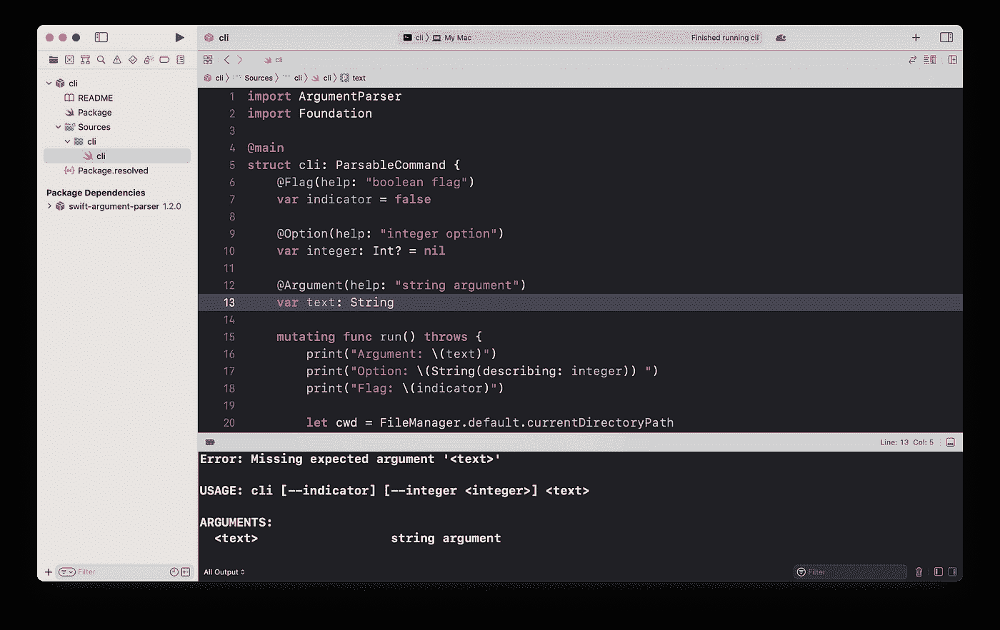
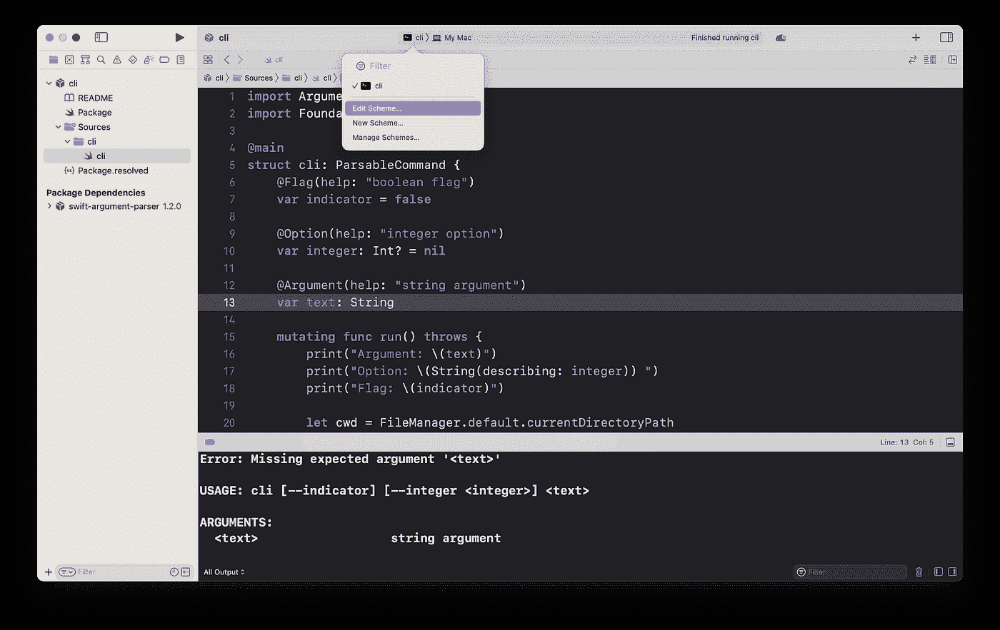
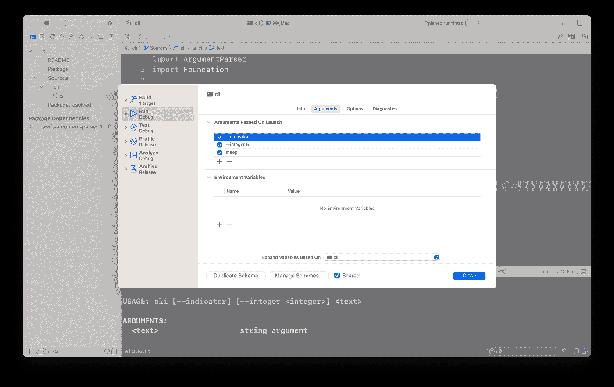
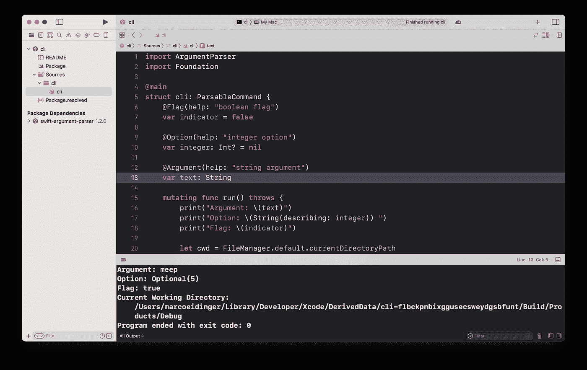
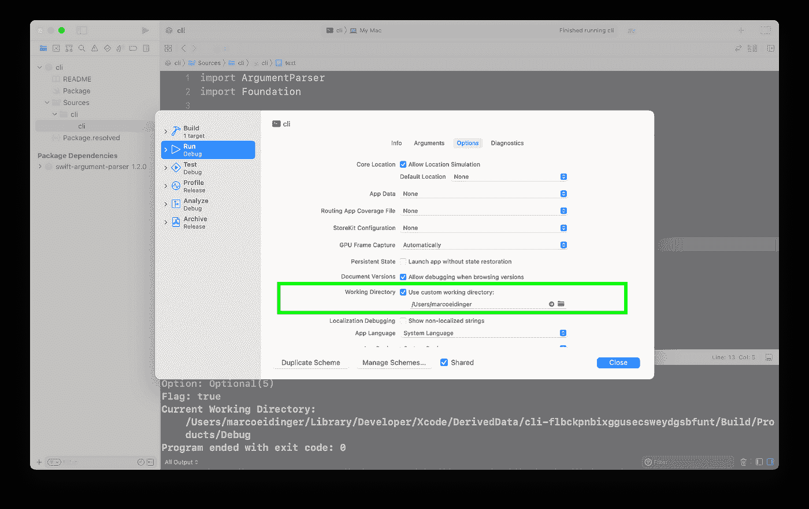
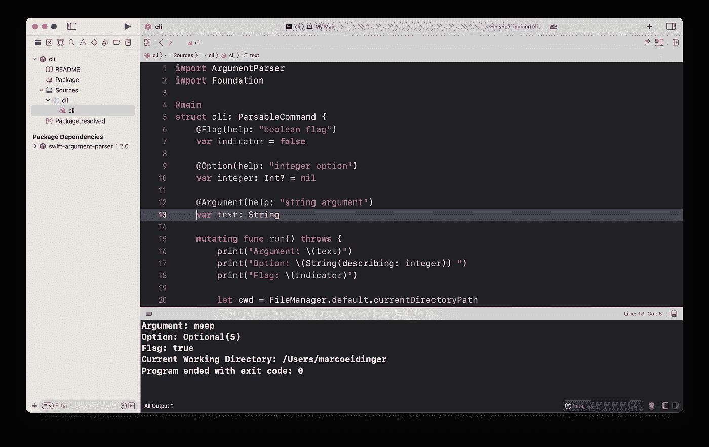

# 在 Xcode 中测试您的命令行工具

> 原文：<https://medium.com/geekculture/test-your-command-line-tool-in-xcode-7800a42eead6?source=collection_archive---------18----------------------->

终端中的手动测试很简单，但是当从 Xcode 运行程序时，您可能会遇到以下挑战之一。

# 挑战

如果您的命令行工具定义了强制参数，那么您可能会感到困惑，因为默认情况下没有传递任何参数。您可能面临的另一个挑战是，您希望模拟程序是从特定目录启动的。

别担心。在这篇博文中，我将向你展示如何

1.  启动时传递参数
2.  设置自定义工作目录

# 启动时传递参数

打开“编辑方案”。

您可以在运行阶段的“arguments”选项卡中指定启动时传递的参数。

# 设置自定义工作目录

默认情况下，`$(BUILD_PRODUCTS_DIR)`被用作工作目录。要改变这一点，请打开“编辑方案”。您可以在运行阶段的“选项”选项卡中指定一个自定义工作目录。

# 演示

*原载于*[*https://blog . eidinger . info*](https://blog.eidinger.info/test-your-command-line-tool-in-xcode)*。*