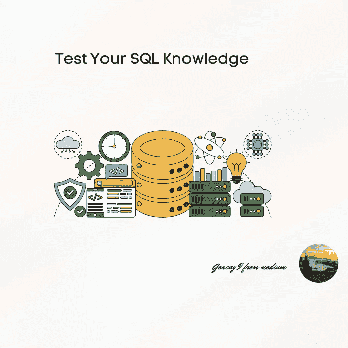

# 考考你的 SQL 知识，怎么考？回答这些问题。

> 原文：<https://medium.com/geekculture/test-your-sql-knowledge-how-answer-those-questions-4d43b5fac3da?source=collection_archive---------3----------------------->

## 这里有 17 个 SQL 问题和答案，包括 SQL 操作符、子句、聚合函数等等，让你成为更好的数据科学家。

Image by Author

# 介绍

SQL 是一种编程语言，用于与数据库通信。