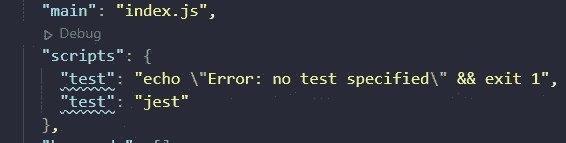
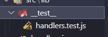
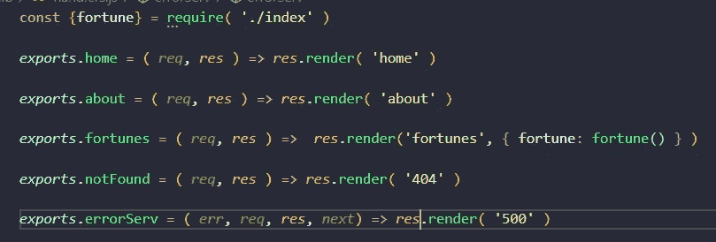
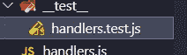
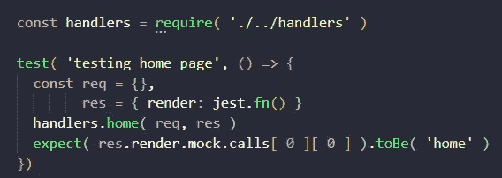
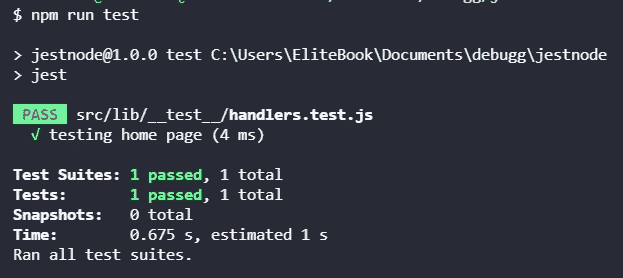
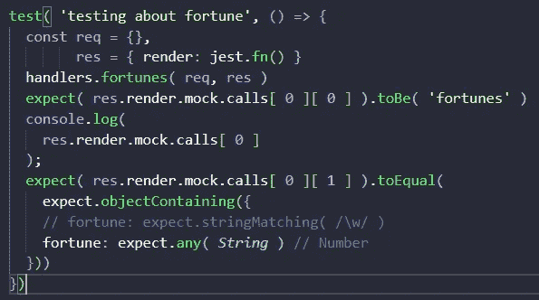
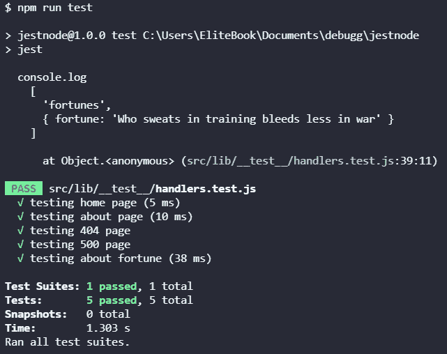

# 用 Jest 测试 Express.js

> 原文：<https://medium.com/geekculture/testing-express-js-with-jest-8c6855945f03?source=collection_archive---------1----------------------->


你好，我正在阅读关于 Node.js 的 QA，他们谈到 Jest 是 Node.js 和 React.js 等其他库的一个非常好的选择，实际上我正在做一个小的 Node.js 项目，我们将用 Jest 测试他！

如果你还没有从 [Node.js](/geekculture/how-to-create-a-small-server-with-express-js-using-handlebars-aab529be375a) 开始查看我最近的帖子

或者这边动态数据用 [Node.js](/geekculture/how-to-insert-dynamic-data-using-express-js-and-handlebars-8b82461d0c7)

重要！因为 Express-handlebar 更新了它的库，所以您需要更改导入

```
import { engine } from 'express-handlebars';
```

并为此更改 handleExp

```
app.engine( 'handlebars', engine({
defaultLayout: 'main'
}))
```

你也可以看视频

Complete post

# 安装 Jest

要安装 Jest，您只需添加以下命令

```
npm i --save-dev jest
```

# 将命令添加到包 JSON 中

要运行 Jest 测试，请将这个脚本添加到您的 JSON 包中

```
"test": "jest"
```



Example script to the package JSON

# 结构

我们强烈建议创建一个名为 __test__ 的目录，并在其中为您想要测试的每个部分添加您的测试文件，文件名为 nameyouwant.test.js 在这种情况下，您可以节省搜索测试文件的时间。



Example test directory and test file

# 独立功能

我们需要分离我们用来呈现页面的每个函数，首先我们需要创建一个文件来封装这些函数，并且我们需要导出



Example encapsulate function and using exports

```
const {fortune} = require( './index' )
*exports*.home = ( *req*, *res* ) => *res*.render( 'home' )
*exports*.about = ( *req*, *res* ) => *res*.render( 'about' )
*exports*.fortunes = ( *req*, *res* ) =>  *res*.render('fortunes', { fortune: fortune() } )*exports*.notFound = ( *req*, *res* ) => *res*.render( '404' )
*exports*.errorServ = ( *err*, *req*, *res*, *next*) => *res*.render( '500' )
```

# 创建我们的测试文件并开始测试

其次，我们需要创建 handlers.test.js 文件



handlers test file

第三，我们需要将所有函数导入到一个名为 handlers 的变量中，然后我们需要开始测试

为了测试我们的函数，我们需要从需要两个参数的测试函数开始，第一个参数是测试的名称，第二个参数是一个函数，在这个函数中你可以预期你需要什么，例如我们需要测试 render，它必须是 home。



Example testing home page

```
const handlers = require( './../handlers' )
test( 'testing home page', () => {
const req = {},
res = { render: jest.fn() }
handlers.home( req, res )
expect( res.render.mock.calls[ 0 ][ 0 ] ).toBe( 'home' )
})
```

如果你看到我们有 req 和 res 变量，但是 res 变量有 render 和一个 jest 函数 fn 来模拟，然后我们期望 render 是 home。

# 开玩笑

要运行命令，请使用以下命令

```
npm run jest
```

这将运行测试，我们将在控制台输出中看到它们



Example run test complete

如果一切正常，我们可以看到“测试主页”通过了

我们可以用其他的来做，因为它们是一样的，我们可以用上面的例子，但是如果我们需要测试其他的东西，我们可以在需要测试对象的时候使用财富页面



Example testing fortune page and object

这几乎是一样的，除非我们需要检查动态变量的对象，在这种情况下，我们使用 Jest 文档中的调用[ 0 ][ 1 ]和 expect.objectContaining()来检查对象和检查字符串，我们可以使用 expect.any( String)或 expect.stringMatching( /\w/)，它们可以接受正则表达式或字符串

# 结束

再次运行命令，我们可以看到一切都是正确的！



Example all test in Jest

# 结论

总之，Jest 是测试我们的项目(如 Express.js)的极好工具，文档非常棒，我真的找到了我需要的对象字符串、数字等。为了让你的项目保持高标准，你可以使用 Jest。

# 来源

[](https://jestjs.io/) [## 玩笑

### Jest 是一个 JavaScript 测试框架，旨在确保任何 JavaScript 代码库的正确性。它允许您…

jet js . io](https://jestjs.io/) [](https://jestjs.io/docs/expect) [## 期待笑话

### 当您编写测试时，您经常需要检查值是否满足某些条件。expect 让您可以访问…

jet js . io](https://jestjs.io/docs/expect) [](https://www.amazon.com/Web-Development-Node-Express-Leveraging/dp/1492053511) [## 使用 Node 和 Express 进行 Web 开发:利用 JavaScript 堆栈

### 使用 Node 和 Express 进行 Web 开发:利用 Amazon.com 的 JavaScript 堆栈。*免费*送货到…

www.amazon.com](https://www.amazon.com/Web-Development-Node-Express-Leveraging/dp/1492053511)