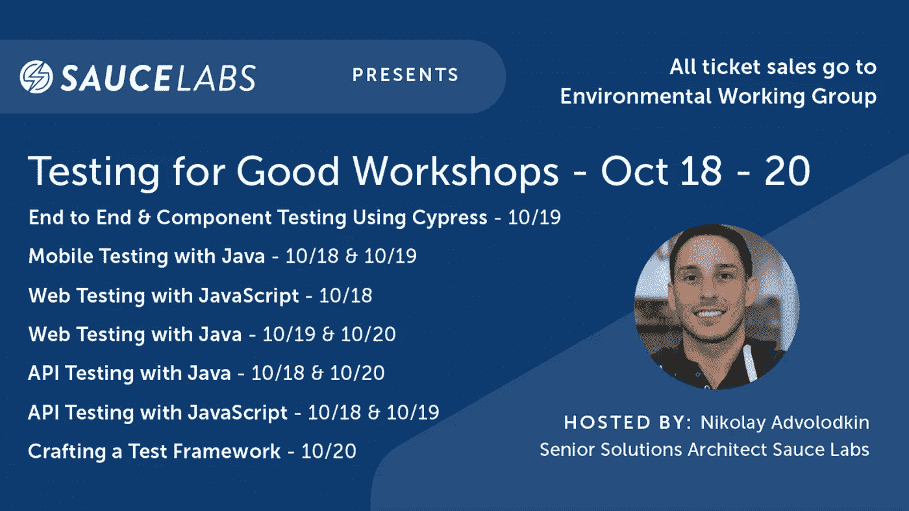

# 优秀研讨会测试—10 月 18 日至 20 日

> 原文：<https://medium.com/geekculture/testing-for-goods-workshop-october-18th-to-20th-ec1bcd3cd526?source=collection_archive---------21----------------------->

## 💻永远的测试带着它有史以来最大的事件回来了！

商品测试工作坊是一个虚拟的活动，致力于在测试自动化技能方面培训世界。在行业专家的指导下，您将能够在这些动手操作的键盘技术研讨会中练习和提高您的技能。带着工作代码和知识离开车间，你可以立即在你的工作场所应用。

除了提高你们的技能，我们还将通过为环境工作组增加捐款来帮助弥合社会鸿沟。我们在提高技能的同时，也让世界变得更美好。

一张票可以让你去任意多的工作室。100%的门票收入流向 EWG。

为了适应多个时区，我们将在多个不同的时间举办一些研讨会。请查看时间表，并将最适合您的研讨会时间添加到您的日历中。这将包括加入会话的直接链接。

## 🧠你会学到:

*   使用 Cypress 进行端到端组件测试
*   Bas Dijkstra 用 Java 测试 API
*   Titus Fortner 的《精心制作测试框架》
*   用 Java 进行移动测试
*   用 Java 进行 Web 测试
*   我用 JavaScript 进行 API 测试

# ***在这里注册*** *👉*[*https://snip.ly/p64hq5*](https://snip.ly/p64hq5)

🌎商品测试工作室的存在是为了实现惊人的测试自动化，同时塑造一个更加公平的社会。迄今为止，商品测试已经为不同的非政府组织筹集了超过 20，000 美元。

🆘由于全球变暖，我们的世界变暖，每个人都感受到了席卷全球的热浪。是时候采取行动来帮助我们唯一的星球了。此次活动的全部收益将捐给环境工作组。

加入一些最伟大的自动化头脑，他们围绕#java 和#javascript 教授许多不同的研讨会！