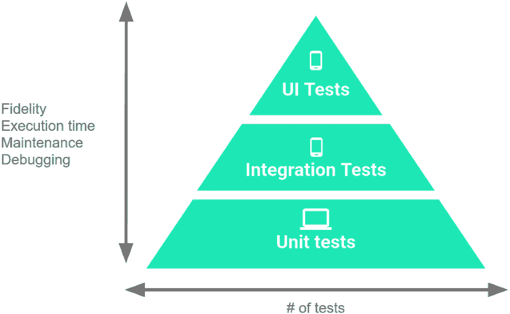
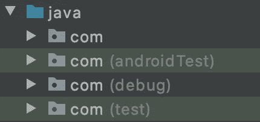
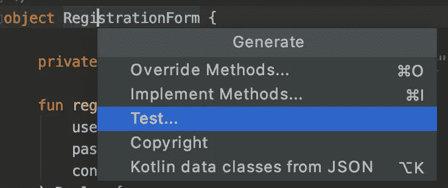
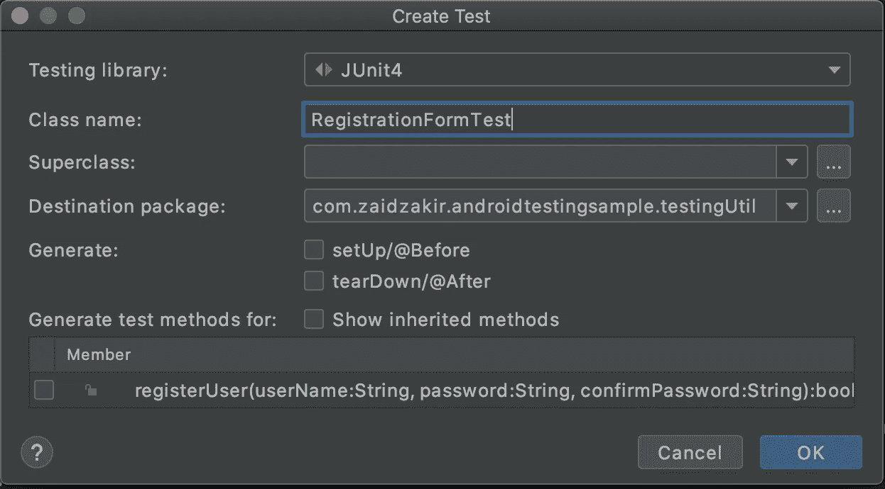
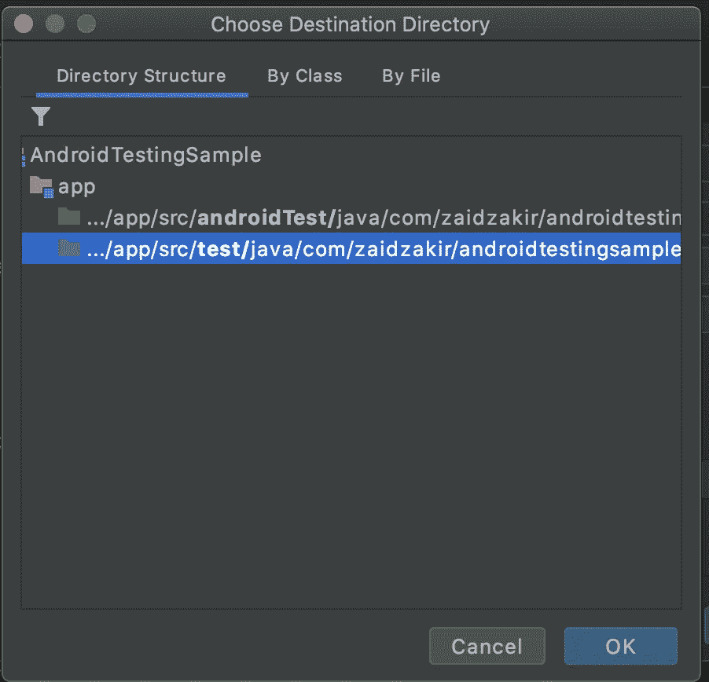
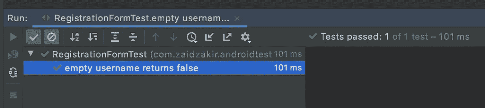
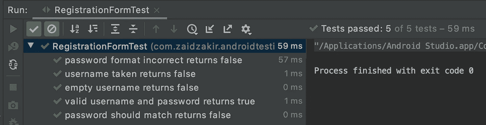

# Android 测试从零到英雄教程-第 1 部分

> 原文：<https://medium.com/geekculture/testing-in-android-a-zero-to-hero-tutorial-part-1-b2f3a7a2b6b2?source=collection_archive---------24----------------------->

什么是 Android 测试，举个简单的例子


本系列教程将使用我的 [github](https://github.com/zaidzak9/AndroidTestingSample) 中的一个工作示例，涵盖所有你需要了解的关于 android 测试的必要知识。

*   **JUnit / Mockito / Espresso /谷歌真相库**
*   **带简单例子的 TDD**
*   **使用 Pixabay Api 的房间 DB/改造网络**
*   **匕首柄**
*   **MVVM**
*   **片段&导航**

[](https://github.com/zaidzak9/AndroidTestingSample) [## zaidzak 9/Android 测试示例

### 用于学习和编写测试用例的购物清单应用程序，也在 medium 文章中用作解释测试的示例…

github.com](https://github.com/zaidzak9/AndroidTestingSample) 

我们需要在我们的 android 应用程序中编写测试用例，以便我们能够定期单击一个按钮，从零开始立即测试代码。这有助于我们在大多数时候避免代码错误。

**开始吧**

下面是测试金字塔



image from [https://developer.android.com/training/testing/fundamentals](https://developer.android.com/training/testing/fundamentals)

你的测试用例将需要或者[**JVM**](https://developer.android.com/studio/intro/studio-config)， [**Android 模拟器**](https://developer.android.com/studio/run/emulator) 或者两者的帮助。需要模拟器的测试用例通常很慢，因为它们需要 android 组件的帮助才能运行，这就是为什么它占据了三角形中较小的部分，最大的部分被主要使用 JVM 的测试用例占据，这些测试用例是单元测试。

**单元测试** **-** 是我们程序中最快的测试，它们通常在几毫秒内运行，它用于测试功能，如检查用户名是否与功能验证或计算一些整数之和的功能匹配，它工作迅速的原因是因为它不依赖于任何组件，如 UI 或网络模拟，只测试逻辑。

**集成测试-** 在模拟器的帮助下运行，这使得它比单元测试慢，这种测试的一个例子可以是测试片段和 viewmodel 之间的通信或者复制网络调用。

**UI 测试**——测试一轮完整的用户交互，包括我的 github 项目中的例子，即添加一个购物项目并检查它是否输入到数据库中，这种类型的测试应该占用最小的部分，因为模拟器需要通过 UI 创建和运行。UI 测试不一定要在我们金字塔的顶端，因为它们是另外两个的助手。

# **测试驱动开发**

**TDD 最佳实践的第一理论是**

> ***【在功能实现前编写测试用例】***

这些是应该遵循的步骤

*   编写您的函数签名
*   为该功能将要做什么以及您对它的期望编写测试用例。
*   编写函数逻辑，以便测试用例通过。

> *在编写* ***单元测试*** *时，要仔细遵循这个过程，推荐用于* ***集成和 UI 测试*** *。*

你的每个测试用例应该尽量只包含一个断言充其量，断言是决定一个特定测试用例结果的东西，这可能是真的也可能是假的，但是在极少数情况下，你可能需要检查对象是否为空。

但是拥有多个断言的问题是它使我们的测试用例依赖于其他测试用例或结果，而目标是使测试用例尽可能的独立，为什么你问？因此，如果出现问题，我们需要能够尽快确定原因，避免检查测试用例，除非我们真的需要。

## 什么是好的测试用例？

范围——你的测试用例覆盖了多少代码

速度——你的测试用例运行得有多快，运行得越快，你就越频繁地运行它，找到错误并修复它们

确保你的测试用例在真实场景中尽可能准确。

**避免不可靠的测试**——不可靠的测试是在不同时刻产生不同结果的测试，例如:想象一个函数产生 1 到 10 之间的随机数，如果你的测试成功取决于你得到 5，6，7，那么它将在其余时间失败。不可靠的测试也可能依赖于其他因素，而不仅仅是这个例子。稍后我们将深入探讨这些主题。

这就是为什么让测试用例独立，而不是编写依赖于其他测试用例结果的测试用例是很重要的。

## **等价类理论**

> 重要的是编写测试用例，并且尽可能少地编写测试用例。

等价类理论是指某个特性的单一结果，举个例子，比如带有用户名、密码和确认密码的注册表单。这个页面的等价类是一个成功的注册，所以为了模拟一个成功的注册，我们需要检查用户名和密码的有效性，检查密码是否与确认密码匹配，还需要检查用户名是否已经存在，为了完成所有这些，我们需要编写尽可能少的测试用例。 如果测试用例使用两个有效的用户名(如“用户名 1”或“用户名 2 ”)并不重要，因为它会产生相同的结果，没有必要单独测试两个输入，因为两个都会产生相同的结果。

我们看了测试的理论和原则，现在让我们进入一些基本的编码例子和解释。

## **编写我们的第一个单元测试**

默认情况下，当我们创建一个 android 项目时，我们有 3 个与测试相关的依赖项。

```
**testImplementation** **"junit:junit:4.13.2"**
**androidTestImplementation** **'androidx.test.ext:junit:1.1.2'**
**androidTestImplementation** **'androidx.test.espresso:espresso-core:3.3.0'**
```

*   JUnit 是一个 android 测试框架
*   Espresso 是 UI 和集成测试所需的依赖项。

我们将需要一些额外的依赖项。

```
***androidTestImplementation*** **"com.google.truth:truth:1.1.2"**
***testImplementation*** **"com.google.truth:truth:1.1.2"**
```

这是谷歌制作的一个库，让我们的[断言](https://en.wikipedia.org/wiki/Test_assertion)更具可读性。

**那么 testImplementation 和 androidTestImplementation 的区别是什么？为什么我们要插入两次？**

如果你是一个测试新手，那么当你创建一个新项目的时候，你有没有问过自己突出显示的这两个额外的文件夹(androidTest & test)意味着什么？



在第 1 部分中，我们讨论了什么是单元测试、集成测试和 UI 测试，它们在什么时候以及为什么需要时的优缺点。

需要您的**仿真器**和 **android 组件**帮助的 I **集成和 UI** 测试用例将进入 **androidTest** **文件夹**并且**单元测试**将进入**测试，这些单元测试在 J.V.M 上运行并且不需要您的**仿真器**或任何 [**上下文**](https://developer.android.com/reference/android/content/Context) 的帮助**

我们输入同一个依赖项两次的原因是为了让它可以被 **androidTest** 和 **test** 文件夹中的测试用例访问。

下面我在我们的 android kotlin 项目中创建了一个对象类，这个类和它的 registerUser 函数的目的是验证用户在注册表单中的输入。

因为我们在这个单元测试中遵循 TDD，所以我们需要做的第一件事是创建函数签名，并编写允许它通过的规则集。

**现在让我们继续创建单元测试用例**👌

右键单击您的注册表单类名，并选择**测试…**



现在按下测试库下拉菜单并选择 **JUnit 4**



一旦我们按下 ok，系统会提示我们选择需要保存该文件的文件夹，因为这是一个单元测试，我们不需要仿真器的帮助，只需要 JVM，我们将选择**测试文件夹。**



Android 现在将在测试包中创建一个测试类，我们将在其中编写我们的第一个测试用例，这个测试用例只是检查用户名是否为空。

**第 5 行-注释，**在编写测试用例时，使用 **@Test** 对其进行注释以告诉 android 这是一个测试函数，这一点很重要。

**第 6 行——命名约定**如果你注意到了命名约定，我们使用了 back 标记(‘测试用例允许我们这样命名我们的函数’),这不是在我们的常规类中正常函数声明的方式，但是我们被允许在测试类中这样做，因为这是由 JVM 使用的，而不是由我们引用的。

**第 7 行-registration form . registerUser()**在这里，我已经访问了注册类方法 register user，并给了它一个空用户名和有效密码，该密码也与确认密码匹配。

**断言(结果)。isFalse()** -最后，我告诉 android，如果用户在真实的应用程序场景中进行了类似的输入，那么将其标记为 False。

> *另一个需要注意的重要事情是，当你使用****asset that，*** *时，它默认访问 JUnit import 提供的 asset，我们需要的是来自* ***google 库中的 asset，所以删除 JUnit import，并确保使用如下所示的 Google asset。***
> 
> 导入 com . Google . common . truth . truth . assert that

## 现在我们已经编写了检查空用户名的测试用例，我们转到注册类并为它创建验证

如果用户名为空，我们返回 false，否则我们返回 true。

既然我们已经编写了我们的第一个测试用例以及我们的函数验证，我们通过在测试类中按绿色的 play 按钮来运行我们的测试用例。


press the green button on the left



运行测试用例后，我们看到的结果是通过。这意味着检查用户名是否为空的验证有效。

现在我们可以继续并完成剩余的测试用例来满足我们的规则并完成我们的验证。

注册 Util 类，所有验证都满足测试用例

这是我们测试案例的结果



所有的测试用例都已经通过，这意味着考虑到规则，我们的注册验证功能非常完美。

想象一下这个场景，现在您可以在不到 10 秒的时间内通过一次单击来测试所有内容，而不是手动测试您的注册活动和花费时间。

现在你可能会争辩说，我本可以在测试用例之前编写函数，因为我已经知道需要做什么，这是真的，但是 TDD 的要点是确保在开始函数实现之前首先消除边缘用例

[**安卓测试一零到英雄教程——第二部**](https://zaidzakir.medium.com/testing-in-android-a-zero-to-hero-tutorial-part-2-577aeb79ae14)