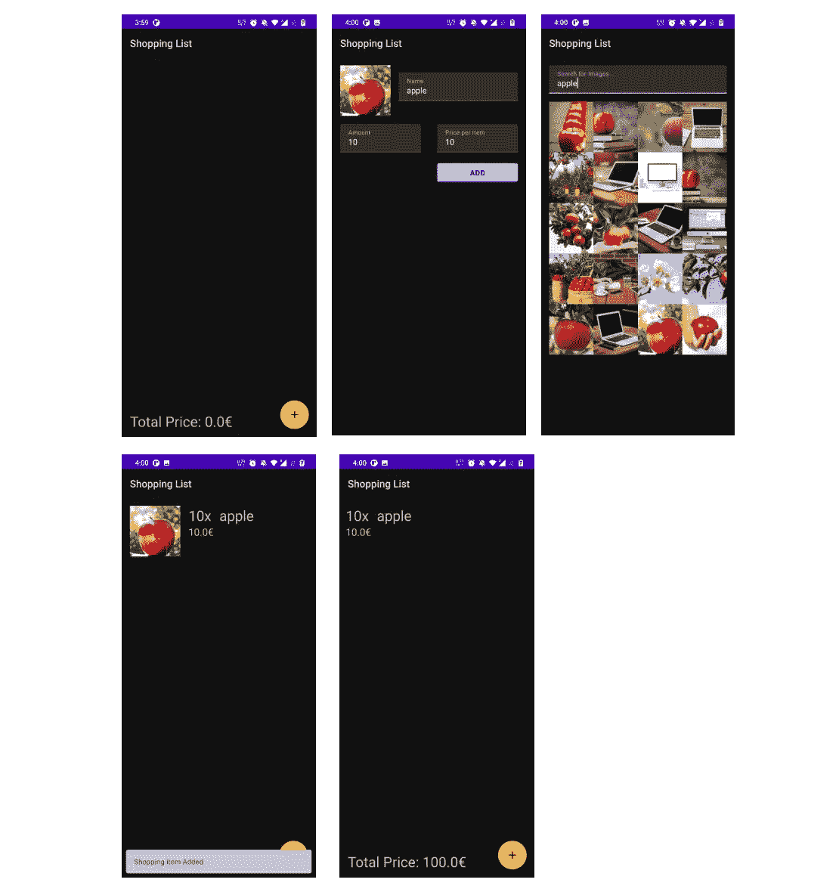

# Android 测试从零到英雄教程-第 2 部分

> 原文：<https://medium.com/geekculture/testing-in-android-a-zero-to-hero-tutorial-part-2-577aeb79ae14?source=collection_archive---------31----------------------->


在这一部分，我们来看看测试 android 组件、@Before 和@After 的概念，以及我们如何**测试 Room DB** 。

在上一个教程中，我们创建了一个函数和测试用例，它可以在 test 文件夹中使用 JVM 运行，现在让我们来看另一个例子，它需要一个上下文并检查来自资源文件的字符串是否与来自用户输入的字符串相匹配。

**让我们开始吧**

这一次我们将创建一个 kotlin 类，在这种情况下，我们将在测试用例中需要这个类的一个实例。所以继续创建 **CompareStrings.kt** 类，它接受上下文、资源字符串 id 和用户输入字符串。

就像在上一个教程中一样，我们通过

*   右键单击名称
*   选择 junit 4 和一个合适的名称
*   这次我们选择 androidTest 文件夹而不是 Test 文件夹

我们选择 **androidTest** 文件夹，因为我们需要获得上下文对象的引用，与上次不同，我们还需要我们的类 CompareStrings.kt 的实例

让我们首先使用不良实践来做这个测试用例，我将解释为什么这是不良实践👎

不幸的是，我们在 test 目录中使用的命名约定不适用于 androidTest 目录，许多关于为什么的答案可以在这个 [stackoverflow 问题](https://stackoverflow.com/questions/46295418/cannot-use-kotlin-backticked-method-names-in-androidtest-bad-descriptor-except)中找到，希望当你阅读这篇文章时有一个解决方案，你可以选择在两个文件夹中使用相同的命名约定或不同的命名约定，这取决于你。然而，以下是一些不好的做法。

上面的测试类，我们创建测试用例来检查两个字符串是否匹配，是否返回真，如果不匹配，则返回假，工作正常，但是为什么这是一个不好的做法呢？😕

我们所有的测试用例应该独立运行，但是在上面的例子中，它们依赖于类 compare string 的共享实例，这是不好的，因为让我们想象一下，如果我们有一个函数有一个 counter 成员变量。

如果我们有 2 个测试用例，在这种情况下，A 将计数器加 1，B 从 1 开始，因为我们没有测试用例首先运行的顺序，这可能会产生[不稳定的测试](https://engineering.atspotify.com/2019/11/18/test-flakiness-methods-for-identifying-and-dealing-with-flaky-tests/#:~:text=A%20flaky%20test%20is%20a,new%20builds%20to%20complete%20successfully.)(有时失败，有时成功)。

**最佳实践答案现在**

对象引用问题可以通过在前使用注释**@和在**@后使用注释来解决。****

**@Before** -使用它的函数将在任何测试用例运行之前运行，因此每次都会创建新的实例，并允许测试用例从头开始运行，因为您不希望在每个测试用例中为比较字符串类和上下文创建新的实例，这将创建大量冗余代码。

**@After** -用于在所有测试用例运行完毕后进行清理，在这个例子中我们不需要它，因为我们不需要它，因为垃圾收集处理上下文。但这在我们接下来要讨论的测试室 DB 中非常常用。

## **使用真实应用进行测试**

在开始之前，我假设你已经知道 MVVM，LiveData，匕首柄，翻新，房间数据库和协同程序是如何工作的，因为本教程只集中在测试上。

[> > >点击这里查看我的文章< < <](https://zaidzakir.medium.com/coroutines-in-android-explained-8f00a37c8528)

这个关于测试的系列教程是基于我创建的一个简单的应用程序，用来管理购物清单项目，上传到我的 github 上，我们将使用它作为我们的例子，所有的实现都已经完成，我们将只看测试是否完成。

功能包括:

*   MVVM，实时数据，协同程序，匕首柄
*   将项目插入房间数据库
*   使用翻新和 Pixabay API 进行网络调用
*   回收器视图，滑动以删除

[](https://github.com/zaidzak9/AndroidTestingSample) [## zaidzak 9/Android 测试示例

### 用于学习和编写测试用例的购物清单应用程序，也在 medium 文章中用作解释测试的示例…

github.com](https://github.com/zaidzak9/AndroidTestingSample) 

**测试时关闭动画**

[这是谷歌推荐的最佳实践](https://developer.android.com/training/testing/espresso/setup#set-up-environment)

> 为了避免剥落，我们强烈建议您关闭用于测试的虚拟或物理设备上的系统动画。在您的设备上，在**设置>开发者选项**下，禁用以下 3 项设置:

*   窗口动画比例
*   过渡动画比例
*   动画师持续时间量表

现在让我们来看看如何测试我们的房间数据库，测试房间数据库需要 **Android 组件的帮助，如上下文和内存**，所以我们必须在 androidTest 文件夹中创建一个测试类。

永远记住，我们在 test 或 androidTest 中的文件夹结构应该遵循与包含 android 代码的主结构相同的结构。

因为我们最初的 shoppingDao 是一个接口，所以我们不能像前面的例子那样通过右键单击来为接口创建测试类。

我们必须在 androidTest 文件夹中手动创建一个测试类，**右键- > kotlin 文件/类- >创建类**

```
@RunWith(AndroidJUnit4::class)
class ShoppingDaoTest {

}
```

因此，一旦我们像上面那样创建了类，我们就添加注释**@ run with(android JUnit 4::class)**，一般来说，任何 java 或 kotlin 代码都需要 JVM 来运行，因为这默认包含在我们的测试文件夹中，这不包含在 androidTest 文件夹中，因为我们在 Android 环境中，所以要启用它，我们必须包含上面所示的注释。

## 测试注释的类型

> 测试大小限定符是构建测试代码的一种很好的方式，用于将一个测试分配给一个运行时间相似的测试套件。

**@ Small test**-小型测试应该非常频繁地运行。关注代码单元以验证特定的逻辑条件。这些测试应该在隔离的环境中运行，并使用模拟对象作为外部依赖。不允许资源访问(如文件系统、网络或数据库)。与硬件交互、进行绑定调用或者促进 android 工具的测试不应该使用这个注释。

**@ Medium test**——中型测试应该集中在非常有限的组件子集或者单个组件上。允许通过定义良好的接口(如数据库、内容提供者或上下文)对文件系统进行资源访问。应该限制网络访问，应该避免(长时间运行的)阻塞操作，而应该使用模拟对象。

大型测试应该专注于测试所有应用程序组件的集成。这些测试完全参与到系统中，并且可以利用所有资源，例如数据库、文件系统和网络。根据经验，大多数功能性 UI 测试都是大型测试。

对于这个类，我们使用@ MediumTest

*   **第 5 行& 6-** 我们已经创建了对 **ShoppingItemDatabase** 和 **ShoppingDao** 类的引用。
*   **第 8 行到第 16 行-** 现在，我们使用在注释前带有 **@的函数设置来确保每个测试用例都需要 RoomDB 和 ShoppingDao 的新实例，因此测试用例之间是完全独立的，不需要任何类型的数据操作来产生不稳定的测试。**
*   **第 10 行——room . inmemorydatabasebuilder**用于指示系统使用 ram 中的内存而不是持久内存来存储数据，这样我们就可以为每个测试用例创建一个新的数据库
*   在正常情况下，我们允许网络调用和数据库调用等功能在后台线程中运行，这样用户界面就不会被中断，也不会导致 ANR 崩溃，但是在编写测试用例时，我们特别指示测试用例在主线程中运行，以禁止任何类型的操纵，您不希望测试 A 和测试 B 同时运行，并以不同的方式操纵数据库，这将导致不可靠的测试。
*   **第 18 行到第 21 行-** 在前面的例子中，我们不能使用 **@ After** 注释，因为不需要，但是在数据库的情况下，这是非常必要的，因为我们需要在每次测试完成后关闭数据库。

## 所以现在我们可以开始编写测试用例来测试购物项目是否被正确地插入到房间 DB 中。

由于我们接口中的 insert 函数是一个 **suspend 函数**，我们需要**协程**来运行它，但是回到我之前的观点，当涉及到测试用例时，我们不能使用任何形式的并发，所以为了满足这两个需求，我们可以使用一个协程 lambda 函数，叫做`runBlockingTest { }` **，**你可能听说过`runBlocking { }`，它的目的是运行它的线程(主线程)得到*阻塞*runBlockingTest 做了类似的事情，但被修改以适应测试用例，它将立即通过延迟，进入启动和异步块。您可以使用它来编写在存在延迟调用的情况下执行的测试，而不会导致您的测试花费额外的时间。

**第 3 行**——我们使用我们的数据类创建一个购物项目。

**第 4 行**——我们使用 dao 引用并在我们的接口中访问插入挂起功能。

**第 6 行**-插入后，我们需要确认我们插入的数据是否真的成功，为此我们使用 observeAllShoppingItems()方法，但这会返回一个 liveData，这将我们带回到并发问题/参数，我们的测试用例中不能有这个，所以我们可以使用 google 预先构建的名为[**LiveDataUtilAndroidTest**](https://developer.android.com/codelabs/advanced-android-kotlin-training-testing-basics#8)的类来解决这个问题

> 你可以将这个类复制粘贴到你的项目 androidTest 根文件夹中，这个类所做的是观察一个 LiveData，直到它接收到一个新值(通过`onChanged`)，然后它移除观察者。如果 LiveData 已经有一个值，它会立即返回。此外，如果从未设置该值，它将在 2 秒钟后(或您设置的任何时间)抛出异常。这可以防止出现问题时测试无法完成。

以上解释摘自下面链接的文章，阅读更多详细解释。

[](/androiddevelopers/unit-testing-livedata-and-other-common-observability-problems-bb477262eb04) [## 单元测试 LiveData 和其他常见的可观察性问题

### 下一次，当你抓耳挠腮地看着一个应该通过的带有 LiveDatas 的完美单元测试时，或者…

medium.com](/androiddevelopers/unit-testing-livedata-and-other-common-observability-problems-bb477262eb04) 

**第 8 行** -现在我们使用来自 google 真理库的 assertThat 并检查数据库中是否存在插入的条目

现在，当你按下播放并运行这个程序时，你可能会得到一个错误提示

> **Java . lang . illegalstateexception:该作业尚未完成**

**这表示的是**

这个异常是由我们的实时数据引起的，因为它在默认情况下是异步的，即使我们使用 runBlockTest{} JUnit 也不允许这样做，为了解决这个问题，我们需要声明一个规则，明确地告诉 JUnit 在同一个线程上一个接一个地执行测试类中的所有代码

```
**@get:Rule
var instantTaskExecutorRule = InstantTaskExecutorRule()**
```

现在，当您重新运行它时，它会成功。

现在让我们继续完成剩下的测试用例，非常类似于上面的一个，不言自明。

我们不必担心数据不匹配，因为每次测试用例运行时，都会创建一个新的数据库实例

上述测试案例中唯一的区别是我们如何使用 assertThat()来获得我们需要的结果。

> deleteShoppingItem():首先我们插入一个项目，这样我们就有一些东西要删除，插入后我们继续删除那个项目，然后检查数据库是否为空，以确认它已被删除。
> 
> **observeAllShoppingItem():我们插入一个条目，检查数据库的大小是否为 1。**
> 
> **observeTotalPrice():我们输入 3 个商品，并在 assert 中计算我们的总数是否与我们输入的价格相匹配。**

这是对房间数据库测试的基本概述，在下一个教程中，让我们看看如何测试**带匕首刺**的改型

[**点击此处测试安卓一个零到英雄教程——第三部**](https://zaidzakir.medium.com/testing-in-android-a-zero-to-hero-tutorial-part-3-b1a3b5504965)