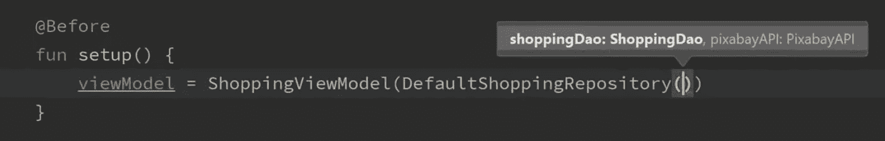
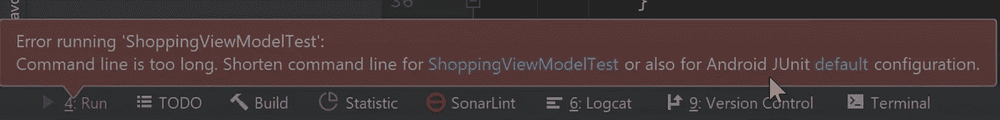
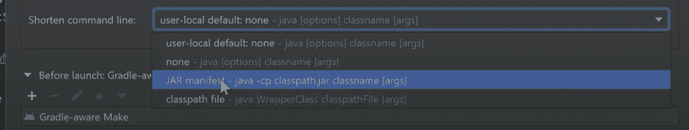
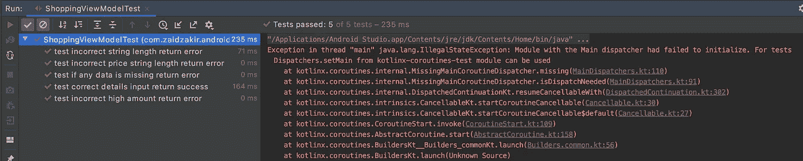
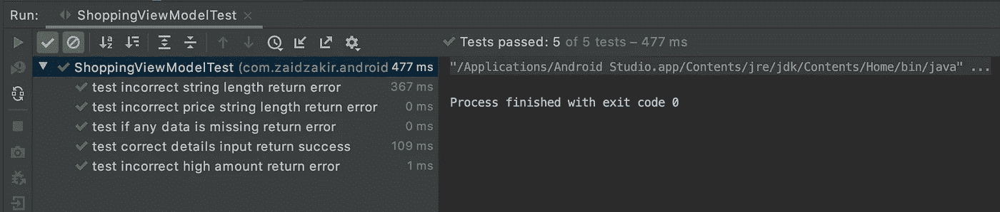

# Android 测试从零到英雄教程-第 3 部分

> 原文：<https://medium.com/geekculture/testing-in-android-a-zero-to-hero-tutorial-part-3-b1a3b5504965?source=collection_archive---------21----------------------->

测试视图模型和存储库


> 在本教程中，我使用了来自 https://pixabay.com/api/docs/的 api 来演示改进 API 调用的网络。

我将不会通过设置改造和匕首柄，下面我已经链接到所有的设置文件。

[](https://github.com/zaidzak9/AndroidTestingSample) [## zaidzak 9/Android 测试示例

### 用于学习和编写测试用例的购物清单应用程序，也在 medium 文章中用作解释测试的示例…

github.com](https://github.com/zaidzak9/AndroidTestingSample) 

您现在已经知道测试用例必须很快，但是网络调用绝不是这样。因此，为了编写网络调用的测试用例，我们需要测试替身的帮助，这意味着，我们将创建一个真正的存储库，我们的应用程序在其中访问 API，并创建一个假的/模拟的存储库，用于我们的测试用例。

## 让我们从实现购物存储库开始

为了创建一个 test double，我们需要首先实现一个 repository 接口，其中声明了我们所有的 suspend 函数，简而言之就是我们的 Room DB 和 Room 调用所需的必要函数，以操纵/访问数据，然后这个接口将被我们的**测试存储库**和**真实存储库(也称为默认存储库)继承。**

由于我们在本教程中使用 [**匕首柄进行依赖注入**](https://zaidzakir.medium.com/a-simple-android-app-using-mvvm-dagger-hilt-e9f45381f1bc) ，我将对我们之前实现的 Room DB 进行修改，并使用匕首柄更新它。购物存储库接口现在拥有应用程序访问数据所需的所有功能。

**下面是默认存储库，实际应用程序将使用它来进行 api 调用和访问数据库。**

**现在我们将在测试文件夹中创建模拟存储库，我们必须始终确保我们在 androidTest 文件夹和 Test 文件夹中的文件夹结构与我们的主文件夹结构相匹配。**

**mockshopping repository 的分解**

**MockShoppingRepository** 的主要目的是稍后测试 view model，我们只创建这个存储库来传递给我们的 viewmodel 以模拟我们的测试用例，因为我们不能使用**默认存储库**，我们将在视图模型的构造函数中传递购物存储库，允许我们的 viewmodel 在需要时继承真实和模拟存储库

```
private val shoppingItems = *mutableListOf*<ShoppingItem>()
```

下面我们创建一个购物项目列表，我们将使用它来填充数据，这样我们就可以模拟我们的数据库购物项目的行为。

```
private val observableShoppingItems = MutableLiveData<List<ShoppingItem>>(shoppingItems)private val observableTotalPrice = MutableLiveData<Float>()
```

下面，我们为 observableShoppingItems 和 observableTotalPrice 创建了可变数据，以便从我们的视图模型中观察，就像我们的真实回购一样。

```
private var shouldReturnNetworkError = false

fun setShouldReturnNetworkError(value: Boolean) {
    shouldReturnNetworkError = value
}
```

由于我们不使用网络调用，我们需要一个值来模拟我们的视图模型在网络可用和不可用时的工作方式，这允许我们检查我们的应用程序在两种环境下的工作方式。

正如在我们的默认存储库中一样，我们将继续从购物存储库接口继承，并获取所有方法来完成我们的类。

```
private fun refreshLiveData() {
    observableShoppingItems.postValue(shoppingItems)
    observableTotalPrice.postValue(getTotalPrice())
}
```

为了正确地模拟动态数据对象的行为，我们需要在向列表中添加项目后提交新的值，这就是为什么我们需要如上所示的 **refreshLiveData()** 函数。

## 准备用于测试的视图模型

```
@HiltViewModel
class ShoppingViewModel @Inject constructor(
    private val repository: ShoppingRepository
): ViewModel(){}
```

当准备用于测试的 ShoppingViewModel 时，我们必须确保在构造函数中传递接口 ShoppingRepository，以便使它兼容我们的默认存储库和模拟存储库来访问它，在这种情况下，它将很容易为两者互换，因为这两个类都继承自 shopping repository。

**通用事件类**

现在，我们需要一个类的帮助来确保我们的 livedata 发出一次性事件，因为当我们向我们的服务器发出网络请求时，我们经常会遇到问题，使用资源类，我们会在 live data 对象中发出**成功**或**错误**。

由此可能产生的问题是，如果在纵向模式下发生错误，用户旋转设备，实时数据将再次发出相同的数据，导致相同的消息显示两次。

**getContentIfNotHandled()** 该函数仅在第一次被调用时发出数据，第二次以后将返回 null。

由于测试视图模型是单元测试的一部分，我们将只创建函数签名，并首先为它们编写关于 TDD 的测试用例。

在我们的常量类中定义两个常量，用于检查**ITEM _ NAME**&**ITEM _ PRICE**的长度

```
const val MAX_ITEM_NAME_LENGTH = 20
const val MAX_ITEM_PRICE_LENGTH = 10
```

因为我们没有为我们的视图模型提供默认的购物存储库注入，所以我们必须创建一个默认的购物存储库并将其转换为购物存储库

```
@Singleton
@Provides
fun provideDefaultShoppingRepository(
    dao: ShoppingDao,
    api: PixabayAPI
) = DefaultShoppingRepository(dao, api) as ShoppingRepository
```

现在匕首柄将知道我们的视图模型需要的注入。

最后，我们在所有片段中实例化我们的视图模型。

示例:

```
lateinit var shoppingViewModel: ShoppingViewModelonViewcreated(){
shoppingViewModel = ViewModelProvided(requireActivity()).
get(ShoppingViewModel::class.*java*)
}
```

**requireActivity()** 将我们的视图模型绑定到我们的活动。

# 测试我们的视图模型

> **ShoppingViewModel - >右键点击- >生成测试用例- > Junit 4 - >测试文件夹- >创建名为 ShoppingViewModelTest 的文件**

测试视图模型不需要任何 android 组件，所以我们使用测试文件夹。

```
lateinit var viewModel: ShoppingViewModel
```

我们初始化我们的 **ShoppingViewModel** 以便在整个测试视图模型类中使用

```
@Before
fun setup(){
    viewModel = ShoppingViewModel(MockShoppingRepository())
}
```

现在我们将它初始化为 **ShoppingViewModel** 并传递 **MockShoppingRepository()** ，现在我们只需要一个数据列表，而不是默认的存储库，在默认的存储库中我们必须传递 api 和 dao 类，如下图所示。



why we should not use the default repository for testing

## 让我们编写一些 ViewModel 测试用例

1.  测试在数据库中插入一个条目的数据是否有任何缺失的字段，如果有，我们预期的响应应该是一个错误，如果一切按计划进行，我们的测试将通过

**。getOrAwaitValueTest()** 来自类 **LiveDataUtil** ，我们不能使用之前为 androidTest 创建的类，因此我们必须将它复制粘贴到我们的测试文件夹中，以使其可访问。

assertThat() 将从我们的事件类中检索状态，并检查状态是否等于**状态。错误**

2.一个函数来测试输入的名称长度是否超过我们在常量文件中的值，如果是，返回错误，测试用例应该通过，否则失败，为了实现这一点，我们使用 kotlin lambda 函数 buildString 的帮助，它将为我们动态构建一个长度为常量大小的字符串。MAX_LENGTH +1，而不是我们必须静态地键入它。在这种情况下，我们不需要在每次做改变的时候更新我们的测试函数和类。

3.同样在下面，我们将写一个完全相同的函数，但这次是为了测试我们的价格长度有多长。

3.最后，我们通过编写最后两个 casess 来总结它，这两个 case 将检查输入的金额是否是无效的 int，我们必须确保输入的数字不超过 int 值可以容纳的数字，并且我们编写一个测试来检查如果我们输入正确的项目细节，插入到 db 中是否成功。

现在当我们运行这个程序时，你会发现一些错误，在解决之前需要一些解释

**错误 1**



如果您遇到这种情况，那么单击 default 并选择 JAR manifest，然后按 ok。

**错误 2**

现在，当你再次运行时，我们会得到另一个错误，但这一次是因为我们没有使用**InstantTaskExecutorRule**，就像在 androidTest 中一样，这将允许所有测试用例在同一线程中一个接一个地运行。

> **@ get:Rule
> var instantTaskExecutorRule = instantTaskExecutorRule()**

**错误 3**

此外，由于我们的 liveData 没有发出测试用例所期望的值，因为我们还没有发布任何东西，因为我们的视图模型中的函数实现在我们遵循 TDD 之后从未完成，所以为了解决这个问题，我们必须在我们的真实视图模型类中完成我们的函数实现。

> **Java . util . concurrent . time out 异常:从未设置 LiveData**

**完成视图模型类的实现**



**错误 4**

现在，当我们运行我们的测试类时，我们的测试用例运行并成功通过，但是我们以一个不寻常的错误结束

> **线程“Main”Java . lang . illegalstateexception 中出现异常:具有主调度程序的模块无法初始化。对于测试，可以使用来自 kotlinx-coroutines-test 模块的 Dispatchers.setMain】**

*这是什么？*

失败的原因是，如果你看看我们的 **ShoppingViewModel** 类，我们在我们的**fun validateShoppingItem(name:String，amount: String，price: String){}** 函数中使用了一个协程，这个协程调用了我们的 **insertItemsIntoDb()** 函数，这个函数使用了一个 suspend 函数，这个函数使用了依赖于主循环的主调度程序，这个主循环程序只在真实的应用程序场景中可用

因为我们在我们的 JVM 中运行这个测试，所以我们不能像在 androidTest 文件夹中那样访问真正的应用程序环境，Android test 文件夹可以访问主 Dispatcher。

因此，要解决这个问题，我们需要创建自己的 JUnit 规则。

在你的测试文件夹的根目录下创建一个名为 **MainCoroutineRule** 的类

在构造函数中，我们传递 Dispatcher 并默认将其设置为**TestCoroutineDispatcher**，这是测试用例的推荐 dispatcher，它将从**测试观察器**继承，这将使这个类能够被 **JUnit test** 识别为一个规则。

**超驰乐趣启动**将允许我们的测试调度员在需要时替换主调度员，然后**超驰乐趣完成**将在工作完成后重置一切。

现在，在我们的 **ShoppingViewModelTest** 中，我们应用我们的新规则并重新运行我们的测试

```
@get:Rule
var mainCoroutineRule = MainCoroutineRule()
```

一旦我们重新运行，我们所有的测试都将通过，并且不会显示任何错误，因为我们的视图模型测试类现在已经完成。



[**安卓测试一零到英雄教程——第四部**](https://zaidzakir.medium.com/testing-in-android-a-zero-to-hero-tutorial-part-4-307417ea9abb)