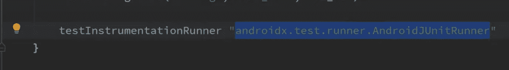
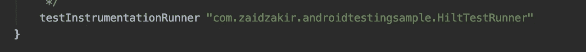
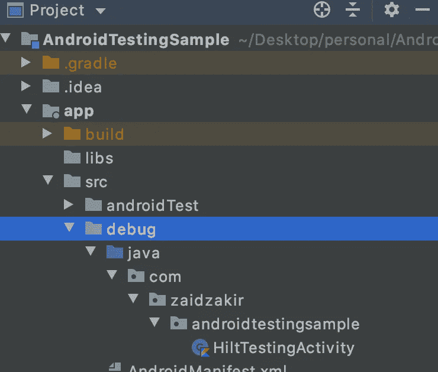
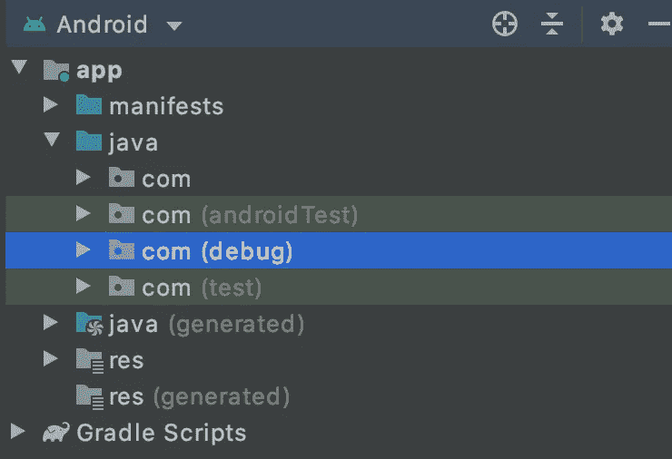
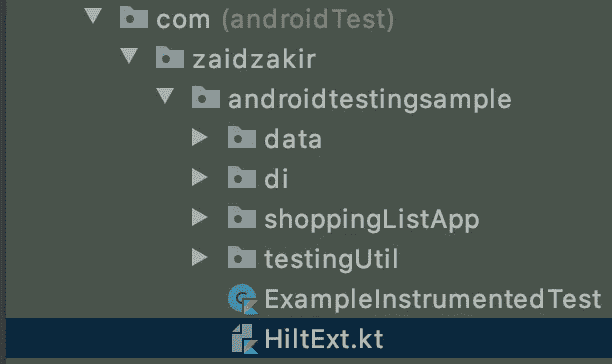
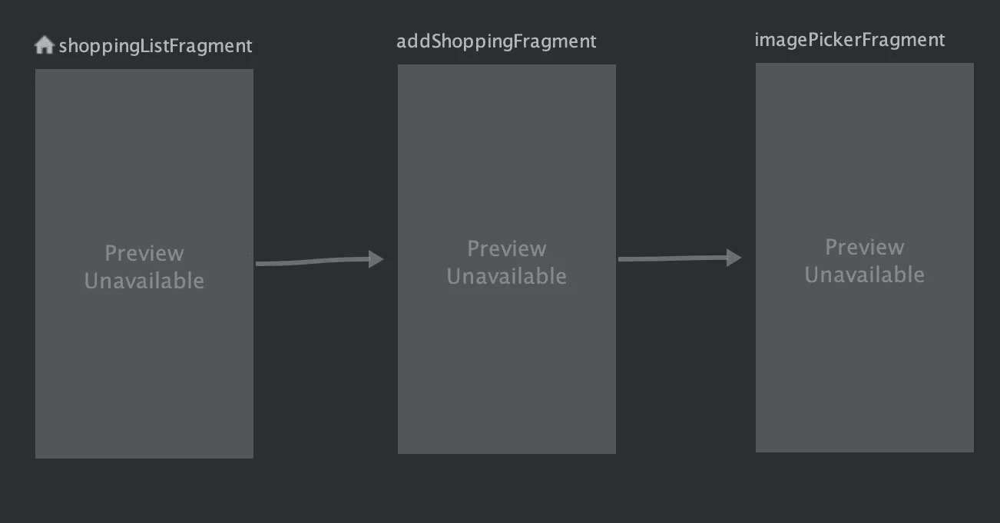

# Android 测试从零到英雄教程-第 4 部分

> 原文：<https://medium.com/geekculture/testing-in-android-a-zero-to-hero-tutorial-part-4-307417ea9abb?source=collection_archive---------32----------------------->

用匕首柄测试碎片和导航


当您的测试用例快速增长时，对象初始化将在您的测试类中的 **@ Before setup(){}** 函数中重复，例如:房间数据库。

> @Before fun setup(){
> 
> database = room . inmemorydatabasebuilder(application provider . getapplicationcontext()、ShoppingItemDatabase::class . Java)。allowMainThreadQueries()。构建()
> 
> dao = database.shoppingDao()
> 
> }

数据库实例是几个测试类经常需要的东西。如果您像上面显示的那样对所有的测试类进行初始化，将会产生大量的样板/重复代码。

这就是我们对 Dagger-HILT 使用依赖注入的原因，所以需要的每个对象都在 App 模块类中定义。

为了实现 HILT，我们在应用程序类中注释了@ HiltAndroidApp。

```
@HiltAndroidApp
class ShoppingApplication: Application()
```

但是对于测试来说，这本身是不够的，我们必须创建另一个定制的应用程序类。并告诉 JUnit 使用它作为测试的默认类

在 androidTest 文件夹的根目录下，我们将创建一个名为 **HiltTestRunner** 的类

我们覆盖新的应用程序，它返回我们在清单中声明的原始应用程序类，我们用我们的自定义应用程序类**hilttestatapplication::class . Java . name**替换它

现在我们必须通过移除我们的@ Runwith(AndroidJunit4::class)在测试类中声明这一点，因为我们不再需要它了。

因为我们的 HiltTestRunner 已经继承了 AndroidJunitRunner，所以我们不需要**androidx . test . runner . AndroidJunitRunner，我们可以使用我们的 HiltTestRunner。**



在默认配置中，将 testInstrumentationRunner 替换为:



use our new class for testInstrumentationRunner

**(你的包名+剑柄测试者等级)——>现在按同步**

## 现在我们创建依赖注入所需的 TestAppModule 类

与我们的应用模块的 4 个主要区别

1.  没有@ Singleton 注释，因此每次需要测试时都会创建对象
2.  用内存数据库代替数据库，这样速度更快
3.  在主线程中运行以避免并发
4.  要声明@ Named annotation，并通知测试类从 **TestAppModule** 和**而不是**real app module 中获取依赖关系。

**现在我们相应地更新我们的 ShoppingDaoTest 类:**

**第 3 行- @ HiltandroidTest 注释**让 Android 知道使用了 hilt injection 并利用测试 AppModule。

**第 16 行-** 数据库对象引用被注入来自**测试应用模块**的数据库。这就是为什么命名注释被用于，它不再是私有的，所以允许注入。

在 setup 函数中，我们允许在每次运行测试用例时进行注入。

## 用匕首柄测试碎片

当测试片段时，我们使用称为**片段场景**的东西，这些片段在一个空活动中启动，这不是问题。

但是因为我们使用 dagger hilt，所以这并不简单，因为我们的片段需要依赖注入，我们需要用 AndroidEntryPoint 注释这些片段。我们还需要用 AndroidEntryPoint 注释空活动

由于片段场景在库中带有一个空的活动，这个注释在那个库中丢失了，所以我们将创建一个定制的活动来满足 Dagger HILT 的需求，并将片段附加到它上面。

**首先我们需要为片段测试添加一个新的依赖项**

```
debugImplementation "androidx.fragment:fragment-testing:1.4.0-alpha01"
```

这个依赖称为 debugImplementation，这意味着它要求我们创建一个调试文件夹源集，我们将在其中创建我们的定制测试活动

在 src 文件夹中，按照默认的项目层次结构创建一个类，如下所示。



我们的新活动将只包含 2 行代码。

```
@AndroidEntryPoint
class HiltTestingActivity: AppCompatActivity()
```

就像任何活动一样，我们必须在清单中声明它，但是我们不能使用我们的默认清单。因此，我们必须创建一个自定义清单文件来声明我们的自定义活动。

你可以将默认的清单文件复制粘贴到新的调试文件夹的根目录下，你可以删除大部分我们不需要的代码，如上所示，我们只提到 android:export="false ",这样就可以只在调试文件夹中访问它。

现在你的 Android 文件夹结构应该看起来像这样，里面有我们新的调试文件夹。



现在，在你的 AndroidTest 项目根目录下，我们需要创建一个名为 **HiltExt.kt，**的 kotlin 文件，作为 dagger hilt 的实用函数



由于这是一个复杂的函数，我将逐行解释这个函数中发生的一切。

**第 7 行**——我们使用内联函数，这样可以增强高阶函数(一个将其他函数作为参数的函数)的性能。内联函数告诉编译器将参数和函数复制到调用站点/必需的类。因此，编译器不会在后台创建任何对象，这将有助于提高代码的内存效率。

**第 7 行-** 这将是一个通用函数< T >，它将在具体化的帮助下从片段继承，这意味着只有在编译时才知道值。

**第 8-12 行** -声明参数

**第 10 行**——允许我们稍后在构造函数中传递数据，这对视图模型很有用。

**第 11 行-** 用作启动包含当前正在测试的片段信息的刀柄容器的参考。

**第 13–20 行** -我们创建一个意图来开始我们的活动，其中我们想要附加我们的片段。既然这个活动作为主要活动，我们需要制定一个特殊的意图。这需要我们活动的上下文和类名，因为我们在 androidTest 文件夹中，我们可以使用 application provider . getapplicationcontext()，对于类，我们提到了我们专门为测试创建的活动，我们还添加了一个额外的，允许定义主题。

**第 22 行**——现在我们创建我们的自定义场景，启动我们的 HiltTestActivity 并传递我们的意图。

**第 23–25 行**——我们将片段工厂附加到这个场景，我们首先确保它不为空。

**第 26–29 行**——现在我们可以使用片段管理器实例化我们的片段，使用我们传递给类的 androidx . core . util . prerequisitions。

**第 30 行** -使用之前的引用，并为其设置参数。

**第 32–36 行**——创建片段事务以在活动中启动我们的片段。

现在我们可以编写一个简单的测试，在 ShoppingDaoTest.class 中使用这个类从您的选择中提取一个片段，看看这是否可行。

```
**@Test
fun testLaunchFragmentInHiltContainer(){
    *launchFragmentInHiltContainer*<ShoppingListFragment>{}
}**
```

## 测试从 ShoppingListFragment 到 AddShoppingFragment 的导航

我们首先创建一个导航图，并启用这些片段之间的导航。



让我们从创建测试类的相同过程开始

> 右击 ShoppingListFragment-> generate-> test case->选择 androidTest 文件夹，因为我们将需要 android 组件的帮助

我们从声明注释开始， **MediumTest** 因为它是集成测试，然后我们指定 **HiltAndroidTest** 因为我们的测试类测试前面提到的使用 hilt 的片段。

那么我们需要做哪些测试用例呢？

断言我们是否在点击浮动按钮时正确导航到 **AddShoppingFragment** 。我们通过创建模拟对象来做到这一点，模拟对象基本上是一个不做任何事情的类的版本。

它是一个只有函数签名的类，但是它会记录我们调用它的函数的频率，以及哪些参数。我们还定义了在每种情况下它应该返回哪些值。为此，我们将使用 **Mockito 库**。对于点击浮动按钮动作，我们将使用 **Espresso 库。**

**第 16 行-** 我们创建一个变量，并使用 mockito 库函数 **mock()** 来传递我们真正的 NavController，并要求它创建一个模拟变量。

**第 18–20 行-** 使用我们的自定义类，在 activity 中启动片段，并通过导航传递参数。

**line 22- onView()** 是 espresso 库提供的一个函数，用于将按钮单击附加到我们的测试用例中，以便我们可以模拟单击的动作，这是作为 perform 方法中的参数传递的。

**第 24–26 行- verify()** 是来自 **mockito 库**的函数，它将从我们的导航图中获取**动作 id** ，导航图负责识别将从 **ShoppingListFragment 导航到 AddShoppingFragment** 的动作

## 测试从 AddShoppingFragment 到 BackPressed()上的 ShoppingListFragment 的导航

现在让我们编写测试用例来检查我们是否真的回到了购物片段。

> 右键点击 AddShoppingFragment ->生成->测试用例->选择 androidTest 文件夹

这里唯一的区别是

**第 20 行-**espresso 库中的一个函数在测试类中复制 onBackPress()按钮单击。

**第 21 行-** 验证 popBackStack 是否成功的函数

[**安卓测试一零到英雄教程-第五部分**](https://zaidzakir.medium.com/testing-in-android-a-zero-to-hero-tutorial-part-5-a4d3bffe9114)