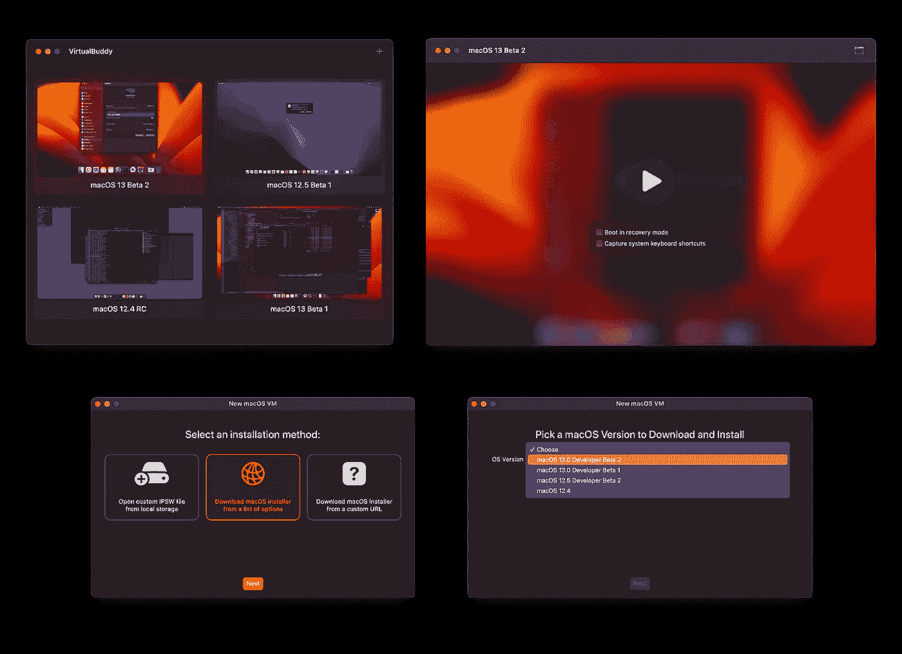

# 使用 VirtualBuddy 测试 macOS betas

> 原文：<https://medium.com/geekculture/testing-macos-betas-with-virtualbuddy-c4f38d680d99?source=collection_archive---------8----------------------->

VirtualBuddy screenshots

每次苹果宣布新的 macOS 测试版，我都想知道如何把它和我的日常操作系统一起安装。然后我意识到这比我希望的要难，或者我没有足够大的外部驱动器可用，然后放弃这个想法。

但是 Ventura 中的几个功能让我非常兴奋，以至于我想在发布前尝试一下。所以，我决定投资一个…