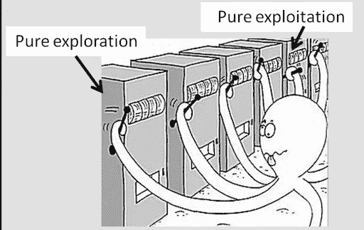

# 在不进行传统“测试”的情况下测试新产品和新功能

> 原文：<https://medium.com/geekculture/testing-new-products-and-features-without-running-a-traditional-test-5957747a12f6?source=collection_archive---------23----------------------->

Bandits is a heuristic for things that steal money, like a row of slot machines. And you have to be an octopus to pull all of the bandit’s arms simultaneously. Hence Multi-armed bandit. And the octopus. Source: Microsoft Research

多臂强盗(MAB)是一个关键的和讨论不足的产品测试/实验问题的方法，从推荐引擎到广告投放到标题使用。在高层次上，MAB 帮助您确定最佳的产品功能/标题/广告/推荐策略，而无需运行昂贵且耗时的 A/B 测试。