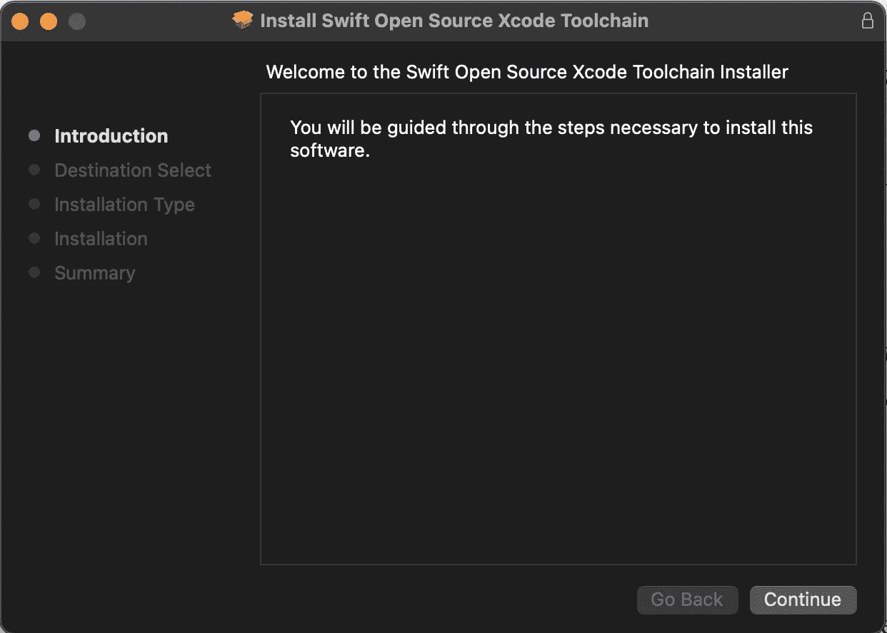
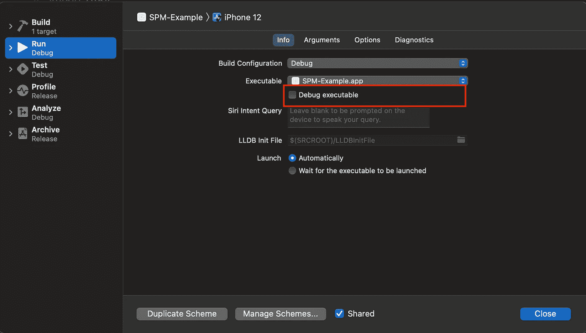

# 测试 Swift 新功能

> 原文：<https://medium.com/geekculture/testing-the-swift-new-features-8b7c73dbb5f?source=collection_archive---------51----------------------->

Image source: [undraw.co](https://undraw.co/)

随着 Swift 越来越受开源贡献/演进的欢迎，您将会看到许多提议和新功能被添加到 [Swift 库](https://github.com/apple/swift-evolution)中。

作为一名开发人员，我们对新功能很感兴趣，同时也想通过一些例子来尝试这些功能，以获得对这些提议/功能的更多理解。

尝试 Swift 的新功能并不困难，只需要遵循几个步骤，这里我试着把它写在一篇文章里。这将有助于开发人员专注于新功能，而不是试图建立环境。

在我们开始这些步骤之前，让我们先了解一下工具链。在软件中，工具链指的是

> 一个**工具链**是一组编程工具，用于执行一个复杂的**软件**开发任务或者创建一个**软件**产品，它通常是另一个计算机程序或者一组相关程序。参考[此处](https://en.wikipedia.org/wiki/Toolchain)更多详情

在我们快速发展的环境中，

> 工具链是编译器(swiftc)、lldb、llvm 和其他相关工具(swift-demangle、swift-driver、swift-build-tool 等)的集合，这些工具为使用特定版本的 swift 提供了开发体验。

让我们进入设置 swift 开发环境的步骤。请遵循以下步骤

1.  点击从[下载最新的 swift 工具链。选择平台并下载软件包。](https://swift.org/download/#snapshots)
2.  对于 Mac OS，在平台上安装软件包。对于其他平台，请在这里阅读更详细的指南[。](https://swift.org/download/#using-downloads)

3.一旦安装了这个包，你将会有一个新的工具链添加到 Xcode 组件中。

或者，您也可以从 Xcode-> Preferences-> Components-> Select tool chain 选项卡访问相同的内容

4.请从方案→运行部分取消选中调试可执行文件

根据文档，

> “调试可执行文件”复选框指定是否要在启用调试器的情况下运行。运行后，如果需要，您可以对已在禁用调试的情况下启动的进程使用 Debug > Attach to Process。

在我们的例子中，我假设实验工具链没有必要的 Xcode 工具来支持调试体验。

一旦您遵循上述步骤，现在您就能够测试最新的 Swift 功能。

感谢您阅读文章。请提供您宝贵的反馈/意见，以改进文章。