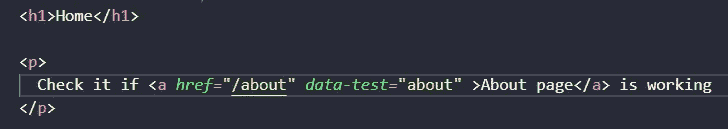
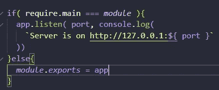
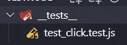
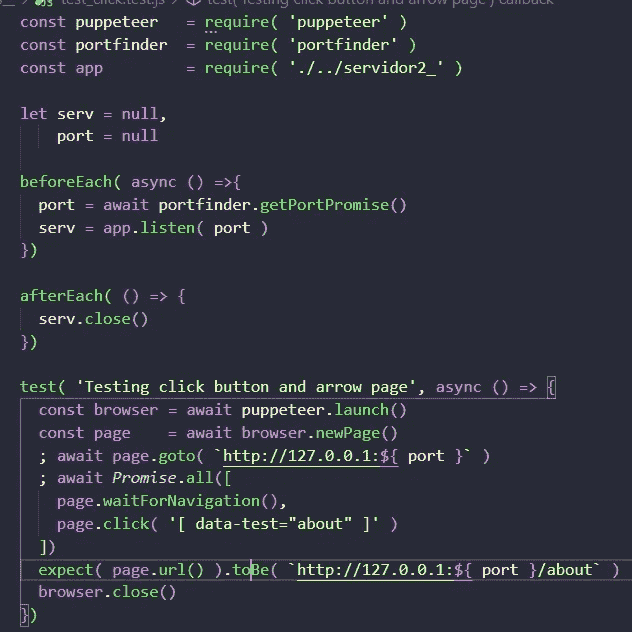
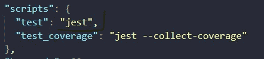
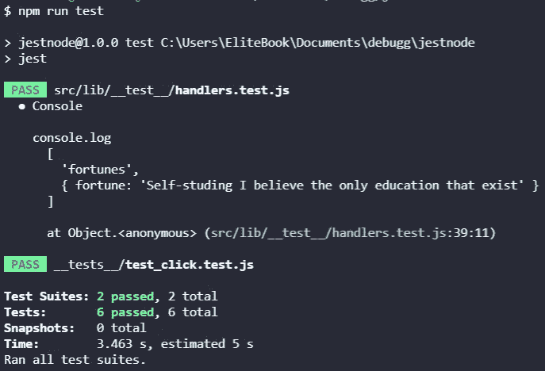

# 使用 Puppeteer 和带有 Jest 的 Portfinder 测试 URLs Express.js

> 原文：<https://medium.com/geekculture/testing-urls-express-js-using-puppeteer-and-portfinder-with-jest-9ab6ad20292f?source=collection_archive---------6----------------------->


我正在学习如何使用 Jest 测试 URL 并模拟用户的按钮点击，我们可以使用 Pupperteer 启动一个浏览器进行测试，还可以使用 Portfinder 找到一个空闲端口，让我们从我的最后一篇文章和他的代码开始，立即开始测试！

如果你与我的旧项目，这将有助于你，如果没有检查出来

[Express.js 基础服务器](/geekculture/create-a-basic-server-with-express-js-really-basic-but-delicious-c5cceaca1c60)

[Express.js 和车把](/geekculture/how-to-create-a-small-server-with-express-js-using-handlebars-aab529be375a)

[动态数据用 Express.js](/geekculture/how-to-insert-dynamic-data-using-express-js-and-handlebars-8b82461d0c7) 这才是重要的

用 Jest 小项目测试 Express.js】这是我的最后一篇文章

# 操纵木偶的人

就像他的[官方网页上说的](https://developers.google.com/web/tools/puppeteer/):

> Puppeteer 是一个节点库，它提供了一个高级 API 来控制 [headless](https://developers.google.com/web/updates/2017/04/headless-chrome) Chrome 或通过 [DevTools 协议](https://chromedevtools.github.io/devtools-protocol/)的 Chrome

换句话说，我们可以把 Chrome 和 Node.js 一起用，耶！当我们能开玩笑地使用它时，它是令人敬畏的。

记得也安装 Jest[如果没有，检查这个帖子](/geekculture/testing-express-js-with-jest-8c6855945f03)

# 端口查找器

端口查找器是一个库，它搜索端口以找到一个空闲端口

# 让我们从视频开始

如果你想看所有这些，这里有视频

# 让我们从代码开始

安装木偶师和端口查找器

```
npm i --save-dev puppeteer portfinder
```


Example installing puppeteer and portfinder

将 a 的标签添加到我们的项目或主页，并重定向到 about，有趣的是，我们需要添加一些东西来链接 a 的标签，这就是为什么我添加了 data-test="about "以方便搜索。



Example adding a’s tag to our project with redirect to about

更改我们的服务器文件，添加一个条件，这是因为如果我们想用命令节点启动我们的服务器，它将启动服务器，如果不是，我们将导出并在测试等其他事情中使用它。

```
if( require.main === *module* ){
app.listen( port, console.log(`Server is on http://127.0.0.1:${ port}` ))}else{
*module*.*exports* = app
}
```



Example adding conditional

创建我们的测试目录和测试文件，我们将在其中进行测试



Example test directory and test file

重要！因为 Express-handlebar 更新了它的库，所以您需要更改导入

```
import { engine } from 'express-handlebars';
```

并为此更改 handleExp

```
app.engine( 'handlebars', engine({
defaultLayout: 'main'
}))
```

向文件 xD 添加代码

```
const puppeteer   = require( 'puppeteer' )
const portfinder  = require( 'portfinder' )
const app         = require( './../servidor2_' )
let serv = null,
port = null
beforeEach( async () =>{
port = await portfinder.getPortPromise()
serv = app.listen( port )
})
afterEach( () => {
serv.close()
})
test( 'Testing click button and arrow page', async () => {
const browser = await puppeteer.launch()const page    = await browser.newPage(); await page.goto( `http://127.0.0.1:${ port }` ); await *Promise*.all([page.waitForNavigation(),page.click( '[ data-test="about" ]' )])expect( page.url() ).toBe( `http://127.0.0.1:${ port }/about` )browser.close()
})
```

首先，我们需要 puppeteer 端口查找器和应用程序，这就是为什么我们需要每个部分的要求，然后服务器和端口，我们保存服务器和端口从端口查找器和应用程序启动。

第二，我们从 beforeEach async await 开始，因为 portfinder 与 promises 一起工作，我们用我们将拥有的空闲端口在服务器中保存我们的应用程序，我们用 afterEach 关闭服务器。

第三，我们打开了测试函数，并在里面添加了测试段落和异步等待函数，因为木偶师也与承诺一起工作，我们需要浏览器(木偶师)和一个新页面，就像我们已经做的那样，每次在我们的 Chrome UI 应用程序中，然后我们等待所有的承诺完成，一个是导航，另一个是单击我们 a 的标签以重定向到我们的关于页面。

最后，我们使用页面 URL 方法编写 expect，准确地说，如果页面是我们需要的页面，我们就关闭浏览器。



Example complete code for test our click and URL server

# 运行测试

您需要在 JSON 包中包含这个脚本



Example script package JSON

然后运行这个命令

```
npm run test
```

我们可以看到测试进展顺利，这是检查所有测试:D



Example testing our about URL with Jest, output from the console

# 结论

总之，使用 Node.js，Puppeteer 是测试和检查其他东西的一个很好的工具，它与 promises 一起工作，如果我们在我们的服务器上使用一个特定的端口，portfinder 是为我们的测试找到一个空闲端口的最简单的方法，Jest 是保持项目高质量的最后一步，这是一个使用 Express.js 的小项目，这是保持良好测试的第一步！

# 来源

[](https://developers.google.com/web/tools/puppeteer/) [## 木偶师|网络开发者工具|谷歌开发者

### Puppeteer 是一个节点库，它提供了一个高级 API 来控制无头 Chrome 或 DevTools 上的 Chrome

developers.google.com](https://developers.google.com/web/tools/puppeteer/) [](https://www.npmjs.com/package/portfinder) [## 端口查找器

### portfinder 模块有一个简单的接口:或者带有 promise(如果 Promise 被支持的话) :如果…

www.npmjs.com](https://www.npmjs.com/package/portfinder) [](https://www.amazon.com/Web-Development-Node-Express-Leveraging/dp/1492053511) [## 使用 Node 和 Express 进行 Web 开发:利用 JavaScript 堆栈

### 使用 Node 和 Express 进行 Web 开发:利用 Amazon.com 的 JavaScript 堆栈。*免费*送货到…

www.amazon.com](https://www.amazon.com/Web-Development-Node-Express-Leveraging/dp/1492053511) [](https://jestjs.io/) [## 玩笑

### Jest 是一个 JavaScript 测试框架，旨在确保任何 JavaScript 代码库的正确性。它允许您…

jet js . io](https://jestjs.io/)