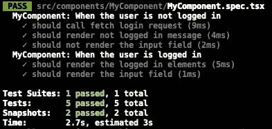

# 使用酶测试使用效果并减少挂钩

> 原文：<https://medium.com/geekculture/testing-useeffect-and-redux-hooks-using-enzyme-4539ae3cb545?source=collection_archive---------2----------------------->


你好。大约两年前，我写了一篇关于用钩子测试 React 函数组件的博客，现在我从一个新的角度写同样的内容。
**TLDR；**在这里，我将告诉你一个我学会的测试生命周期挂钩的方法，例如`useEffect`和 redux 挂钩，即`useSelector`和`useDispatch`，同时使用`enzyme`浅安装组件。
如果你没有读过我的上一篇文章，我建议你读一读，因为它涵盖了诸如如何测试诸如 useState 之类的钩子以及如何处理受控和不受控组件之类的主题，我不会在这里讨论这些主题。

[](https://acesmndr.medium.com/testing-react-functional-components-with-hooks-using-enzyme-f732124d320a) [## 用酶测试反应功能成分与钩子

### 使用 Jest 测试库和…通过浅层渲染测试具有状态和生命周期挂钩的功能组件

acesmndr.medium.com](https://acesmndr.medium.com/testing-react-functional-components-with-hooks-using-enzyme-f732124d320a) 

## 前言🌃

当时，当我写上一篇文章时，没有办法测试浅层安装的 react 函数组件的生命周期方法，因为当我们使用 enzyme 的`shallow`来测试生命周期方法时，诸如 **useEffect** 和 **useLayoutEffect** 之类的生命周期方法不会被执行。因此，我推荐使用`mount`来测试生命周期方法。我对此并不满意，因为我所有的测试文件都是`shallow`和`mount`方法的混合，而且从本质上来说感觉是多余的。

一年后，我收到了迈克的评论，如果我想测试效果挂钩，可以尝试使用`jest-react-hooks-shallow`包。当时我试着用它，但我记得它不工作。最近我想再试一次，这次成功了。所以我在这里也写了一些关于它的内容，以及如何将它嵌入到你的酶测试中。

# 玩笑-反应-钩子-浅薄

*(如果您不想了解实施细节，请跳过此部分)*

这个包所做的就是神奇地让肤浅的渲染器运行效果生命周期方法`useEffect`和`useLayoutEffect`，让我们的编码生命周期更容易。

[](https://www.npmjs.com/package/jest-react-hooks-shallow) [## 玩笑-反应-钩子-浅薄

### 这个包使 React 挂钩(即 useEffect()和 useLayoutEffect())能够处理浅层渲染。换句话说…

www.npmjs.com](https://www.npmjs.com/package/jest-react-hooks-shallow) 

使用 npm 或 yarn 设置它相当容易。您必须采取的一个额外步骤是在 jest 设置文件中初始化它，您已经在该文件中设置了酶适配器。

```
import enableHooks from 'jest-react-hooks-shallow';

// pass an instance of jest to `enableHooks()`
enableHooks(jest);
```

一旦安装完毕，测试文件中所有浅安装的组件将会按照软件包文档中的说明运行它的效果钩子。这就是我遇到问题的地方。我的组件没有运行效果挂钩。经过几次尝试，我意识到效果挂钩只有在我用 HTML 标签包装它们的时候才有效。所以我的意思是如果

```
const wrapper = shallow(<Login/>);
```

不工作，那么尝试使用 shallow，将它包装在一个 div 中，然后使用`dive()`获取它。

```
const wrapper = shallow(<div><Login/></div>);
const container = wrapper.find('Login').dive();
```

然后你可以测试功能组件的生命周期。

您也可以在所需的规格文件中手动启用效果挂钩，而不是在设置`jest-react-hooks-shallow`库时通过传递附加参数来全局启用。

```
enableHooks(jest, { dontMockByDefault: true });
```

然后你需要在测试文件中启用效果挂钩，方法是用`withHooks()`把它们包装起来。

# 写作测试

让我们以这个小组件为例，它在 mount 上发出一个 AJAX 请求，检查用户是否登录，有条件地呈现一个输入字段(如果他们登录了)，并在输入字段值改变时验证文本字段。

## 测试组件安装效果挂钩

尽管 useEffect 钩子现在与`jest-react-hooks-shallow`一起运行，但我立即遇到了 Effect 钩子中异步函数的问题。我试图用 jest `jest.mock('axios')`模仿 axios，甚至试图集成`[msw](https://github.com/mswjs/msw)`包来创建一个模拟服务器。但是这两个实现中的问题是，当模拟服务器返回一个值时，测试已经退出了。我尝试添加`setTimeout`并使用`done()`函数来确保它会等待更改触发，但无论我做什么都失败了。它总是渲染`<>User is not logged in.</>`组件。

我犯的错误是，我试图模仿服务器，而不是模仿抽象出查询服务器值的逻辑的函数。所以解决这个问题的方法很简单。我所做的是将发出异步请求的函数移动到另一个文件中，并模拟该函数。

既然异步请求被分离到一个不同的文件中，您可以模仿 axios 或者使用`msw`为`requests.js`添加测试规范。现在为`MyComponent.jsx`编写测试规范，你可以模仿`requests.js`来确保快速响应，从而解决问题。

然后，测试按预期运行，在用户登录时呈现输入字段，确保我们已经测试了组件挂载效果挂钩。

```
// Jest Snapshot v1, https://goo.gl/fbAQLPexports[`MyComponent: When the user is logged in should render the logged in elements 1`] = `"<input type=\\"text\\" value=\\"\\"/><div></div>"`;exports[`MyComponent: When the user is not logged in should render not logged in message 1`] = `"User is not logged in."`;
```



Passing tests ✅

## 测试组件更新效果挂钩

测试组件更新效果挂钩也相当简单。我们可以模拟事件并检查变化。

在这里，我们确保了当`text`状态更新时`validateText()`和`doSomething()`属性得到执行。

# 测试 Redux 挂钩

如果你使用`react-redux`而不使用`useSelector`和`useDispatch`挂钩，你就错过了。我推荐阅读我写的这篇关于如何从使用 connect 迁移到使用 redux 挂钩的文章。🏴‍☠️

[](https://acesmndr.medium.com/connect-to-usedispatch-and-useselector-in-redux-46aa5021ab55) [## 连接到 useDispatch 并在 Redux 中使用 Selector

### 为什么应该从 mapDispatchToProps 和 mapStateToProps 迁移到 useDispatch 和 useSelector，以及如何做到这一点…

acesmndr.medium.com](https://acesmndr.medium.com/connect-to-usedispatch-and-useselector-in-redux-46aa5021ab55) 

让我们考虑这个简单的组件，其中从存储中获取登录状态，并在挂载时分派一个操作。

为了使用这些钩子测试组件，您需要模拟它们，最好的方法是在设置酶适配器的测试设置文件中这样做。嘲笑完`react-redux`之后会是这个样子。

## 测试使用选择器挂钩

现在测试 useSelector 挂钩非常简单，因为我们已经模拟了它。所以我们只需添加一个模拟实现来返回所需的值。

## 测试使用的 Dispatch 挂钩

它类似于测试 useSelector 挂钩，但唯一的关键区别是，由于 useDispatch 是一个调度我们传递的函数的函数，因此我们需要一个模拟实现，以便它返回一个模拟函数，我们测试模拟函数以测试操作是否已被调度。

# 结论

因此，通过这种方式，我设法为 effect 和 redux 挂钩编写了测试规范。总结一下:

*   当浅安装组件时，默认情况下 Enzyme 不支持效果挂钩。你需要添加`jest-react-hooks-shallow`来确保钩子运行。
*   异步请求应该从组件中抽象到一个单独的文件中，这样在测试组件而不是模拟服务器时，可以删除或模拟产生异步请求的方法。
*   要测试组件更新 useEffect 挂钩，只需触发状态更新并检查渲染元素中的效果。
*   Redux 挂钩可以通过模仿它们和它们的实现来测试。

希望这将有助于那些一直使用酶编写测试的人。😇如果您知道任何更简单或更好的编写浅层测试的方法，请告诉我。