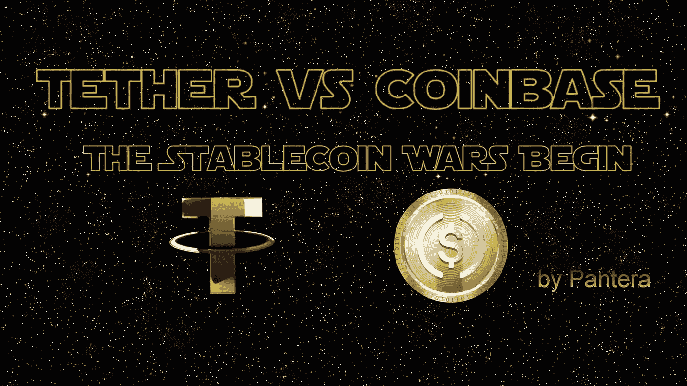

# 系绳-$USDT vs 比特币基地-$USDC:稳定币战争开始了！

> 原文：<https://medium.com/geekculture/tether-vs-coinbase-the-stablecoin-wars-begin-b64bdf3a1484?source=collection_archive---------3----------------------->

## 在一个毁灭性的隐秘的冬天中等待辐射

Cover Picture (background) on [Pixabay](https://pixabay.com/illustrations/space-stars-star-wars-darck-black-1164579/)

Crypto 在 2022 年受到了几次猛烈的打击。

前所未见的令人震惊的事件。回到 2013 年，还只是 MtGox。2017 年，加密货币领域见证了 Bitconnect 庞氏骗局、交易所黑客和 ICO 骗局，但…