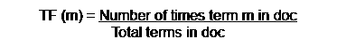
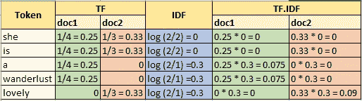

# 文本特征提取(2/3): TF-IDF 模型

> 原文：<https://medium.com/geekculture/text-feature-extraction-2-3-tf-idf-model-c3a8f7a92bc9?source=collection_archive---------5----------------------->


[Source](https://unsplash.com/s/photos/books-and-laptop)

在自然语言处理中，任何基于文本的问题都需要转换成可以建模的形式。一个简单的文本可以用各种技术转换成特征，比如单词包(BOW)、TF-IDF 或单词嵌入。在文本特征提取系列的[最后一篇博客](/geekculture/text-feature-extraction-1-3-bag-of-words-model-649dbeeade79)中，我们从零开始研究了计数向量器及其在文本分类中的用例。我们在那里破译了它有一个缺乏语义的主要缺点。**计数矢量器**考虑字数来创建特征，因此**不考虑句子结构和顺序**。此外，它还会产生一个很大的稀疏矩阵。这样，TF-IDF 就出现了。

这个博客系列展示了详细的 TF-IDF 技术。那么，我们开始吧。

## **瞄准**

TF-IDF 技术给出了相关的术语。这个相关术语是一个可以理解整个上下文而不是阅读整个文本的术语。

## 直觉

*   这个词出现多次意味着它的重要性(TF)。
*   但同时，如果它频繁出现在多个文档中，则可能不相关(IDF)。我们可以称这些词为停用词，如 the、this 等。

## 理论与概念

*   TF-IDF(词频-逆文档频率)刻画了一个词的重要性。它是 TF 和 IDF 的点积的计算。在此之前，我们先单独了解一下术语。
*   词频(TF):
    -它演示了单词对文档的重要性，直觉上文档中的词越多意味着重要性越高。



equation-1

*   反向文档频率(IDF):
    -显示一个术语实际上是如何相关的。在某些文档中，频繁出现的术语不一定是相关的，例如停用词(the，of 等)。停用词不能揭示上下文，因此应该避免使用。以色列国防军的工作方式忽略了他们。
    -它惩罚在文档中频繁出现的单词
    -IDF 分数对相关术语较高，而对停用词的权重较低
    -它考虑自然对数函数，也称为 log e


equation-2

*   简而言之，TFIDF 值与 doc 相关，而 IDF 取决于语料库
*   手动计算 TF-IDF 和 Sklearn 的 TF-IDF 不一样。
    **区别:** TF 术语保持不变，IDF 术语不同。让我们开始吧！
    ***标准 TF-IDF*** 标准符号如下所示，其中 N 是跨语料库的文档，N 是具有术语 m 的文档


equation-3

***Sklearn TF-IDF*** 根据定义，Tfidf 应该按照上面的公式工作但是 sk learn 提供了一些更高级的计算。TfidfVectorizer 和 TfidfTransformer 的计算与标准的不同之处如下:
-给分子加 1
-给分母加 1 以防止零除法
-给整个对数项加 1 作为平滑常数
-得到的 TF * IDF 向量然后用 L2(欧几里德)归一化


equation-4

想了解更多信息，请访问这个 [StackOverflow 链接](https://stackoverflow.com/questions/24032485/difference-in-values-of-tf-idf-matrix-using-scikit-learn-and-hand-calculation)和一个有深入细节的[博客](https://towardsdatascience.com/how-sklearns-tf-idf-is-different-from-the-standard-tf-idf-275fa582e73d)。

## 过程

让我们切入正题，研究构建 TF-IDF 模型的步骤。我们将遵循标准符号*等式-3* 。

科珀斯= "她是一个旅游癖"，"她很可爱"

1.  **计算 TF** :参考等式 1。

TF_doc2("是")= 1/3
TF_doc2("可爱")= 1/3

**2。计算 IDF** :参考等式-3。

IDF(" is ")= log(2/2)= 0
IDF(" lovely ")= log(2/1)= 0.30
可以清楚地看到，“is”的权重小于“lovely”。因此可爱似乎更贴切。

*   **TF 和 IDF 字的点积:**

TF-IDF ("is") = TF。IDF = (1/3) * 0 = 0
TF-IDF("可爱")= (1/3) * 0.3 = 0.09

结果显示，单词“是”是不相关的，而“可爱”具有一定的重要性。仅仅读“可爱”这个词就能使句子与众不同。

结果总结如下:



table-1

## 履行

为了理解 TF-IDF 模型，让我们先来看看如何手动实现，然后再为 Sklearn 实现 will。

1.  **手动**

*   让我们创建我们的句子语料库，并将它们转换成小写，以便不区分“this”和“This”。

```
doc = "She is a wanderlust”, “She is lovely”
#Convert into lowercase
doc = list(map(str.lower, doc))
```

*   为语料库中的每个文档创建一个单词包

```
cv = CountVectorizer()
count_occurrences = cv.fit_transform(corpus)#For doc1
bagOfWords_1 = dict.fromkeys(cv.get_feature_names())
for ind,key in enumerate(bagOfWords_1):
    bagOfWords_1[key] = count_occurrences.toarray()[0][ind]
bagOfWords_1
Out[2]:
{'is': 1, 'lovely': 0, 'she': 1, 'wanderlust': 1}#For doc2
bagOfWords_2 = dict.fromkeys(cv.get_feature_names())
for ind,key in enumerate(bagOfWords_2):
    bagOfWords_2[key] = count_occurrences.toarray()[1][ind]
bagOfWords_2
Out[3]:
{'is': 1, 'lovely': 1, 'she': 1, 'wanderlust': 0}
```

*   计算 TF

```
def compute_tf(bow, doc):
    tf_dict ={}
    doc_count = len(doc)
    for word, count in bow.items():
        tf_dict[word] = count/doc_count
    return tf_dict
tf_doc1 = compute_tf(bagOfWords_1, corpus[0].split(' '))
tf_doc2 = compute_tf(bagOfWords_2, corpus[1].split(' '))
tf_doc1Out[4]:
{'is': 0.25, 'lovely': 0.0, 'she': 0.25, 'wanderlust': 0.25}
```

*   计算 IDF

```
def compute_idf(docs):    
    N = len(docs)
    idfDict = dict.fromkeys(docs[0].keys(),0)
    for doc in docs:
        for word, val in doc.items():
            if val > 0:
                idfDict[word] +=1 

    for word, val in idfDict.items():
        # standard notation
        idfDict[word] = math.log(N / float(val))
        #sklearn notation
        #idfDict[word] = (math.log((N+1) / (val+1))) + 1
    return idfDict
idfs = compute_idf([bagOfWords_1,bagOfWords_2])
idfsOut[5]:
{'is': 0.0,
 'lovely': 0.6931471805599453,
 'she': 0.0,
 'wanderlust': 0.6931471805599453}
```

*   计算 TF * IDF

```
def compute_tfidf(tf,idf):
    tfidf = {}
    for word, tfVal in tf.items():
        tfidf[word] = tfVal * idf[word]
    return tfidf
tfidf_doc1 = compute_tfidf(tf_doc1, idfs)
tfidf_doc2 = compute_tfidf(tf_doc2, idfs)
tfidf_doc1Out[6]:
{'is': 0.0, 'lovely': 0.0, 'she': 0.0, 'wanderlust': 0.17328679513998632}
```

**2。上面的步骤只需要几行代码就可以完成。Scikit-learn 提供了一个名为 TfidfVectorizer 的库，用于计算 Tfidf 权重。**

```
vectorizer = TfidfVectorizer()
vectors = vectorizer.fit_transform(corpus).todense()
vectors
"""
matrix([[0.50154891, 0\.        , 0.50154891, 0.70490949],
        [0.50154891, 0.70490949, 0.50154891, 0\.        ]])
"""
```

## 缺点

*   **上下文理解**
    bagowords 和 TFIDF 技术缺乏对上下文的理解。TFIDF 可以破译句子结构，但不能破译上下文。
*   **大词汇量**
    在词汇量很大的情况下，特征变得浩如烟海，对内存和时间提出了挑战。

为了克服上述缺点，出现了一种新的特征提取方法，称为单词嵌入。让我们在文本特征提取(3/3):单词嵌入模型中了解一下这个。

**查看我的**[**GitHub repo**](https://github.com/shachi01/NLP/blob/main/TFIDF_Sklearn_Scratch.ipynb)**总结了这里演示的所有代码。**

**此外，您还可以通过本** [**GitHub 知识库**](https://github.com/shachi01/NLP/blob/main/TFIDF_MovieReviews.ipynb) **了解更多关于如何开发 TF-IDF 模型来预测电影评论情绪的信息。**

# 参考

[](https://www.freecodecamp.org/news/how-to-process-textual-data-using-tf-idf-in-python-cd2bbc0a94a3/) [## 如何在 Python 中使用 TF-IDF 处理文本数据

### 我的计算机擅长处理数字，但不擅长处理文本数据。最广泛使用的一种…

www.freecodecamp.org](https://www.freecodecamp.org/news/how-to-process-textual-data-using-tf-idf-in-python-cd2bbc0a94a3/) [](https://towardsdatascience.com/how-sklearns-tf-idf-is-different-from-the-standard-tf-idf-275fa582e73d) [## Sklearn 的「TF-IDF」与标准的「TF-IDF」有何不同？

### 让我们来看看不同之处，并逐步分析计算 Sklearn 的 TF-IDF 所采用的方法

towardsdatascience.com](https://towardsdatascience.com/how-sklearns-tf-idf-is-different-from-the-standard-tf-idf-275fa582e73d) 

如果你喜欢这位作者的博客，请随意关注，因为这位作者向你保证会带来更多有趣的与人工智能相关的东西。
谢谢，
学习愉快！😄

***可以通过***[***LinkedIn***](https://www.linkedin.com/in/kaul-shachi)***取得联系。***