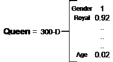
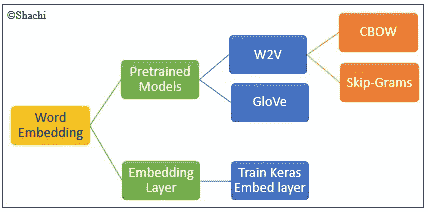
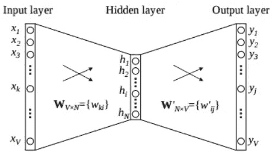
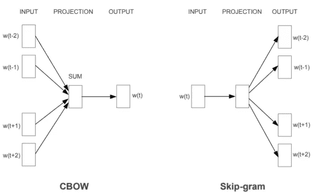
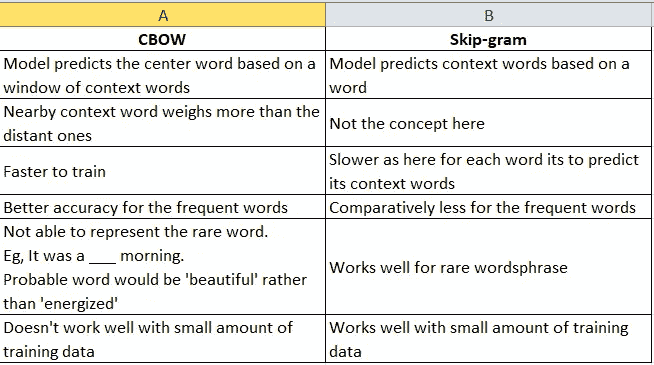
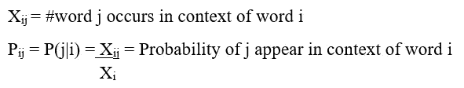
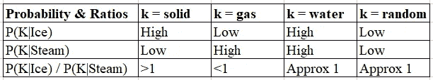

# 文本特征提取(3/3):单词嵌入模型

> 原文：<https://medium.com/geekculture/text-feature-extraction-3-3-word-embeddings-model-e98f3d270dce?source=collection_archive---------14----------------------->

[Source](https://www.namesnack.com/guides/nature-photography-business-names)

在文本特征提取系列的前几部分中，我们已经看到在 NLP 中可以对基于文本的数据进行建模。已经讨论了特征提取技术，例如 [BagOfWords](https://shachikaul35.medium.com/text-feature-extraction-1-3-bag-of-words-model-649dbeeade79) 和 TF-IDF。所以，在这里我们将学习另一种叫做单词嵌入的技术。单词嵌入已经成为一种非常重要和有趣的方法，在构建文本模型中有多种用途。让我们了解更多！

# 单词嵌入

## 目标

它旨在识别文本的语义和上下文信息，这在 BOW 和 TFIDF 中是不可能的。

## 详细研究

*   **直觉:**相似的语境(词)往往具有相似的向量空间或嵌入，并且彼此位置更近。
*   **什么？**
    -将**文本转换成低维空间的实数向量**的技术。这些低维的向量叫做**嵌入**。
    -单词嵌入，又名单词向量，用于表示单词
    -它将每个单词表示为具有特定维度的数字向量。这些数字维持了间接存储语义信息的各种其他词向量之间的相似性。女孩= [..,..,..]而女人= [..,..,..]密切相关。
*   **将单词的**映射到向量空间
*   由于矢量，算术运算现在在文本中是可能的。
    例如，国王-男孩+女孩=王后
    国王向量(皇室+男性)减去男孩(正常+男性)再加上女孩(正常+女性)结果变成王后(皇室+女性)
*   让我们看看**这个矢量看起来**怎么样。
    具有特定维度的向量如果使用英语语料库(en_core_web_lg)，假设有 300 个维度。这 300 个是英语单词的各种可能的特征。每一个特征都是人类无法解释但由 ML 模型获得单词的某一特性。因此，无法准确描述。
    例如，对于 Queen，300-D 向量，其中数字表示特征的大小，如图 1 所示

Fig-1

*   **单词嵌入为什么会出现？**
    我们来调出一个场景
    Vocab words = 5000
    一个矢量皇后投射在 Vocab 中的第 5 个索引上。通常，BOW 和 TFIDF 中文本到文本的转换使用字数。
    皇后= [0，0，0，0，1，0..00..00..0]与 5000-D
    这导致整个稀疏向量只有 1 位非零值。因此，出现了单词嵌入。
    所以确切原因:
    1。**稀疏性:**单词嵌入使用特定特征维数的实值向量，而不是 0。嵌入向量的大小更小。
    2。**语义&上下文:**通过考虑更接近目标词的上下文词来学习，这在 TF-IDF 以前的模型中是不可能的。
    3。**关系和相似度:**向量允许执行算术运算，这样更容易找到相似的单词。
    4。每个单词不被视为一个特征，而是一个固定维度的向量。因此，LSTM/GRU 的算法并不复杂，也不容易训练。
*   **应用:**情感分析，语音识别，信息检索
*   **利用单词嵌入的**:
    —预测目标/上下文单词
    —降维

## 词嵌入伞

单词嵌入是一个总括术语，具有预训练模型(Word2Vec，GloVe)或嵌入层的概念。

Fig-2

## 预训练模型

-使用预训练的词向量来构建模型
-这些词向量来自于从庞大的语料库中训练嵌入
- Sklearm 的 **Gensim** 库提供预训练的模型和 API，如 Word2Vec、GloVe、FastText 等。

## 1.1 Word2Vec

*   Google 的神经网络嵌入模型，它训练网络从大量文本中学习单词之间的关系
*   它是在 1000 亿个谷歌新闻数据集上训练出来的，有 300 万个单词
*   它将单词之间的关系嵌入到一个低维向量空间中
*   产生单词嵌入
*   **输入、隐藏和输出层的 2 层神经网络**
*   症结:这里就像任何神经网络，目的不仅仅是预测概率，而是获得隐含层的训练权重(向量)。
*   由模型学习的隐藏层的权重被用作单词嵌入

Fig-3

*   它根据 word2vec 变体体系结构预测上下文单词和目标单词的概率

Fig-4, Word2Vec Variants Architecture: [Source](https://arxiv.org/pdf/1301.3781.pdf)

*   在训练之后，我们得到词汇表中每个单词的训练向量，并且彼此更接近(相似)的向量被更接近地放置在向量空间中。
*   我们来看看 W2V 车型的变种。

## 1.2 手套(全局向量)

*   我的研究为我找到了一个完美的定义

*“GloVe 是一个基于计数、* ***的无监督学习模型*** *，它使用* ***共现*** *统计在一个* ***全局级别*** *对单词的向量表示进行建模。”*

*   原始论文[中的定义 https://nlp.stanford.edu/pubs/glove.pdf](https://nlp.stanford.edu/pubs/glove.pdf)指出—

> *GloVe 基于单词-单词共现矩阵的概率比，结合了基于计数的模型的直觉，从而捕获 word2vec 等方法使用的线性结构。*

*   **为什么这样命名？**
    因为矩阵的数学是围绕考虑整个数据集的**全局级**属性，而在 Word2Vec 模型中考虑局部属性。这意味着 Word2Vec 的模型使用窗口长度得出考虑单词的统计数字，而 GloVe 考虑整个数据集来创建共现矩阵。
*   由斯坦福大学研究人员发现的这种单词嵌入算法的工作原理是基于统计学(概率和计数)使用共现矩阵来描述单词之间的关系。
*   **数学简介** GloVe 使用共现矩阵，其中每个值代表这两个词如何一起出现。它将共现概率视为区分两个相关词的比率，而不是概率本身。
*   它是在同现矩阵上训练的**，该矩阵表示一对单词在语料库中一起出现的频率。**
*   让我们理解一些符号和共生矩阵

来自大型语料库的概率和比率

上表类似于固体在冰中的概率较高，而在蒸汽中的概率较低。因为分子是较高的比率，两者都大于 1，这与单词 gas 相反。

*   你可以从[https://nlp.stanford.edu/projects/glove/](https://nlp.stanford.edu/projects/glove/)下载预先训练好的单词向量

**查看我的** [**GitHub 回购**](https://github.com/shachi01/NLP/blob/main/glove_v1.0.ipynb) **实现手套。**

## 2.嵌入层

*   不使用预训练模型，你可以使用 Keras 嵌入层训练你自己的单词嵌入。
*   Keras 有一个嵌入层，用于在文本数据集上训练神经网络。它是一种在输入层之后指定的隐藏层，输入层采用整数编码的数据。
*   通常，任何文本数据都使用某种编码技术(比如一次性编码)转换成数字。这将为每个分类值创建虚拟特征。对于大文本数据似乎不可行。Hecne，嵌入层将每个单词转换成定长向量。它将高维数据映射到低维向量空间。
*   **嵌入图层的用途:**
    1 .嵌入层可以单独使用，如在另一个模型中的**2。有助于 t **转移学习**；用于加载预训练的嵌入模型
    3。作为**深度学习模型**的一部分进行自我学习**
*   简单实现参见[博客](/analytics-vidhya/understanding-embedding-layer-in-keras-bbe3ff1327ce)

# 参考

[https://nlp.stanford.edu/projects/glove/](https://nlp.stanford.edu/projects/glove/)
https://jalammar.github.io/illustrated-word2vec/
https://www.youtube.com/watch?v=Fn_U2OG1uqI

*如果你喜欢这位作者的博客，请随意关注，因为这位作者向你保证会带来更多有趣的人工智能相关的东西。* 谢谢，
学习愉快！😄

***可以通过***[***LinkedIn***](https://www.linkedin.com/in/kaul-shachi)***取得联系。***