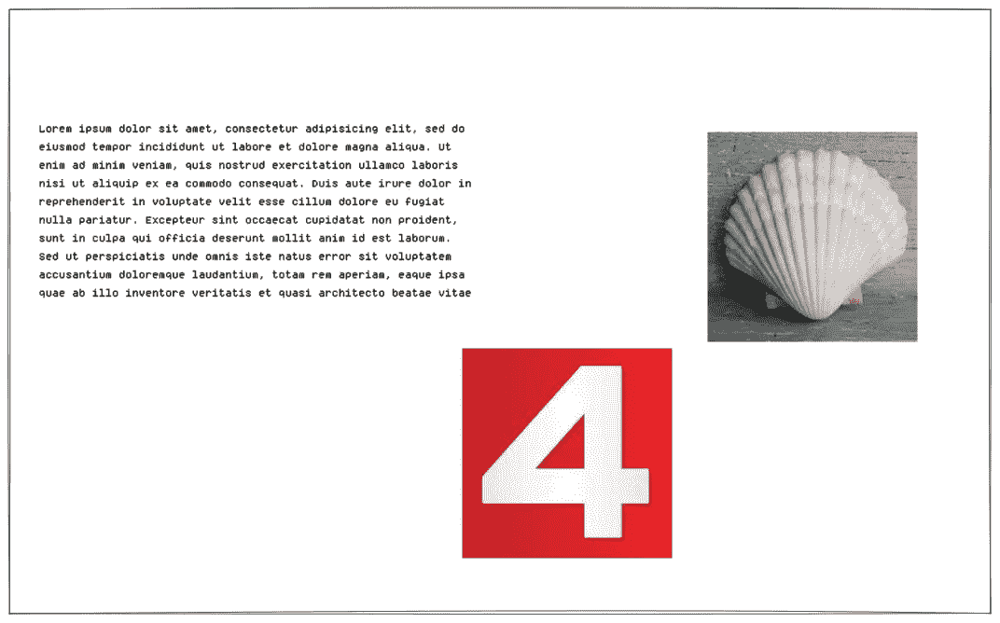

# Text4Shell 漏洞利用演练

> 原文：<https://medium.com/geekculture/text4shell-exploit-walkthrough-ebc02a01f035?source=collection_archive---------3----------------------->

## 《4Shell》续作？？？

又一个利用 Java 编程语言中不安全的字符串替换的漏洞被发现。这次**漏洞影响了 Apache 的 Commons 文本库**，它提供了字符串操作的 API。该漏洞被跟踪为[CVE-2022–42889](https://nvd.nist.gov/vuln/detail/CVE-2022-42889)，CVSS 紧急评级为 9.8。根据研究人员，的可能性…