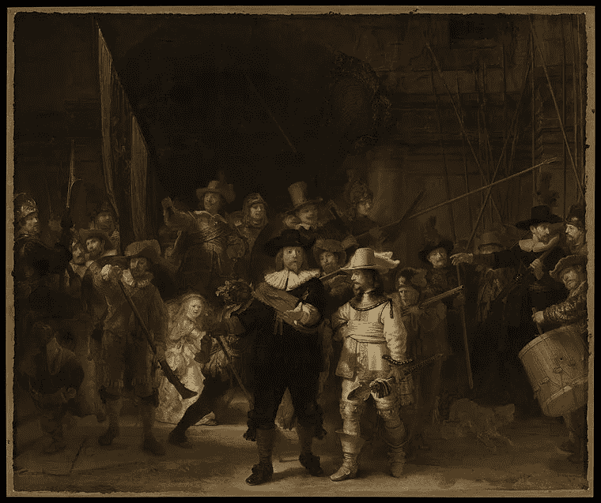
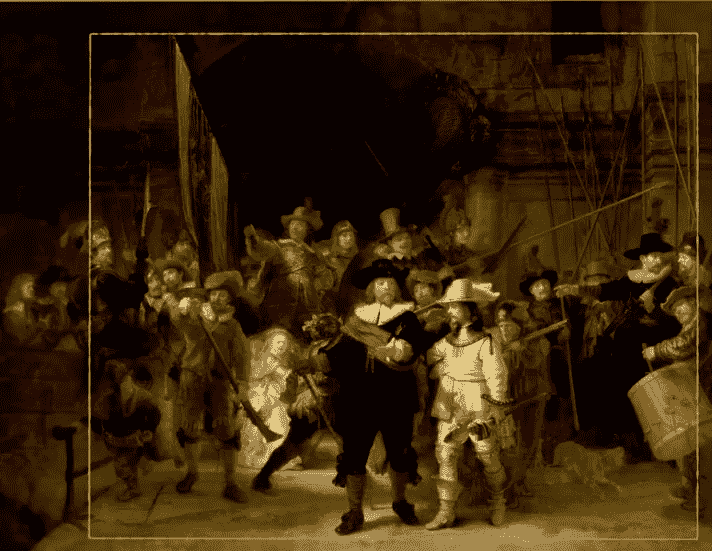
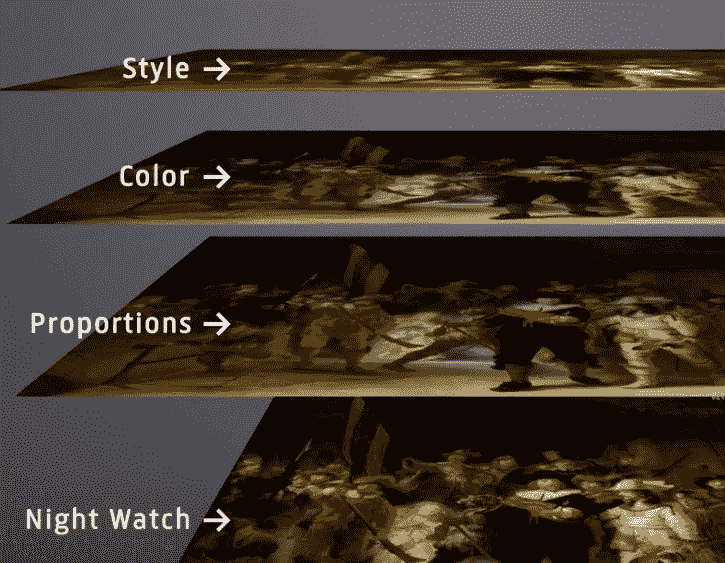
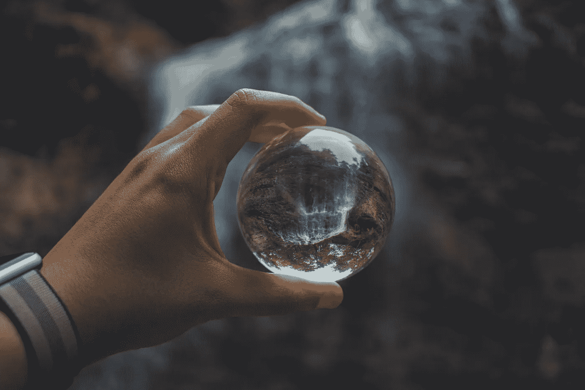

# 感谢 AI，守夜人在 300 年后完成。

> 原文：<https://medium.com/geekculture/thanks-to-ai-the-night-watch-is-complete-after-300-years-a7ec61e6f859?source=collection_archive---------31----------------------->

> “你看，伦勃朗比以前更加天才了”——博物馆馆长塔可·迪比特

自 1715 年以来，守夜人首次以伦勃朗的方式展示。

《守夜人》是伦勃朗·范·瑞恩 1642 年的一幅肖像画。这幅肖像画是荷兰黄金时代的名画之一。
夜表以其尺寸(363cm×437cm 或 11.91 ft × 14.34 ft)和光影的结合而闻名，给人一种戏剧般的效果。这幅肖像画是伦勃朗对一个包括七幅作品和六幅民兵作品的项目的贡献。

1715 年，守夜人被重新安置，在这个过程中，他们发现这幅画太大了，不适合新的地方。他们切下了一些碎片，这些碎片再也没有找到。原始肖像的确切尺寸和被移除的数量不得而知。高度在 358.7 厘米(11.7 英尺 *)* 和 420 厘米(13.77 英尺)之间，宽度在 479 厘米(15.72 英尺)和 523 厘米(17.16 英尺)之间。

# 守夜人的行动

> “我设计了一个由三个人工神经网络组成的序列，从守夜人被砍下之前制作的一个小复制品中，对守夜人缺失的部分进行计算机重建。”—罗布·埃德曼

source: Rijksmuseum, The pieces that have been cut off.

杰瑞特·鲁登斯画了较小的守夜人复制品。这个复制品用来重现守夜人遗失的部分。

神经网络通过分析大量的好样本进行学习。训练神经网络求解样本的时刻。那么神经网络就为解决类似问题做好了准备。

对于守夜人来说，这是分几个步骤完成的。第一个神经网络标记了《守夜人》和《鲁登斯》中的关键点，比如脸部和身体。守夜人和鲁登斯之间还是有区别的。这幅画的一些部分需要移动，这样所有的关键点都是相同的。在这一部分，这些画中的所有人物看起来都很相似。来完成夜行的重建。一个神经网络需要针对颜色进行训练，另一个必须针对样式进行训练。这些画被切割成几十个小块，作为问题和解决方案提供。问题永远是鲁登斯的副本，解决办法是守夜人。神经网络按照守夜人的风格重新绘制了鲁登斯的版本。

正如你在上面看到的，在它的左边有两张新面孔，那里还有一个小孩。

Source: Rijksmuseum

# 新技术被用来活着走夜路

最新的成像技术与最新的计算机技术一起使用。他们从所有不同的成像技术中收集了 51tb 的数据。下表显示了每种技术生成的捕获数量和总文件大小。由于这项技术，研究人员对这幅画的操作获得了比以往更深入的了解。

*   日光摄影(20 米):528 张照片，317GB
*   日光摄影(5 米):8.439 张照片，5.063GB
*   紫外线摄影(20 米):528 张照片，317GB
*   宏观 X 射线荧光(500 m 和 250 m): 56 次捕获，1.008GB
*   反射成像光谱-VNIR (168 m): 80 次捕获，355GB
*   反射成像光谱-SWIR (168 米):127 次捕获，1.130GB
*   光学相干断层扫描:66 次捕获，1.500GB
*   3D 扫描— Artec Spider (3D): 127 次捕获，886GB
*   3D 扫描(15 米):135.346 张照片，40.604GB

总大小:51.181GB

Source:Unsplash

夜行的整个过程揭示了更多关于夜行和伦勃朗的信息。研究人员发现了成百上千个微小的“粉刺”。这些被称为铅皂的物质会穿透油漆表面，造成微小的油漆损失。在油画中，铅皂的形成是一个众所周知的现象，它通常发生在使用了含铅底漆的时候。但是对于守夜人，伦勃朗使用了一种所谓的石英地面。

修复后的画作将于未来几个月在阿姆斯特丹国立博物馆向游客开放。这幅画给游客一种新的体验，通过人工智能，我们能够见证伦勃朗的这幅杰作。

# **我的推荐:**

我最近写了一篇符合这个主题的博客，并举办了一个虚拟活动，主题是:人工智能能创造出比人类更好的艺术吗？

我建议阅读博客并加入 meetup 群组，以便获得即将举行的虚拟活动的通知:

 [## 人工智能能创造出比人类更好的艺术吗？

### 先说什么是生成性对抗网络。生成式对抗网络是一种机器学习…

medium.com](/geekculture/can-artificial-intelligence-create-better-art-than-humans-f1517323bfc0)  [## 荷兰数据公司(荷兰阿姆斯特丹)

### 欢迎来到我们的 meetup DataML，我们在人工智能、数据科学和商业领域组织活动…

www.meetup.com](https://www.meetup.com/nl-NL/dataml-nederland/)  [## 国立歌剧院博物馆

### 守夜人行动是历史上规模最大、范围最广的研究和保护项目…

www.rijksmuseum.nl](https://www.rijksmuseum.nl/en/stories/operation-night-watch/)